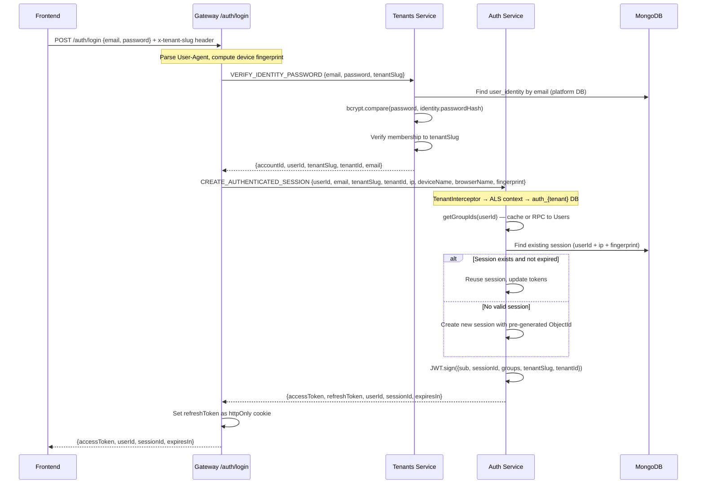
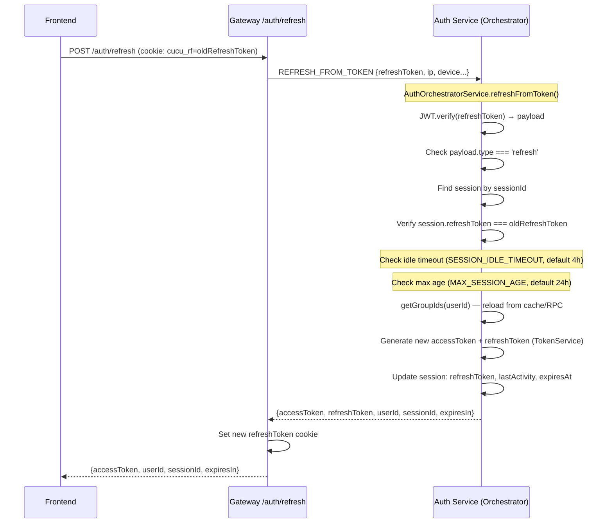
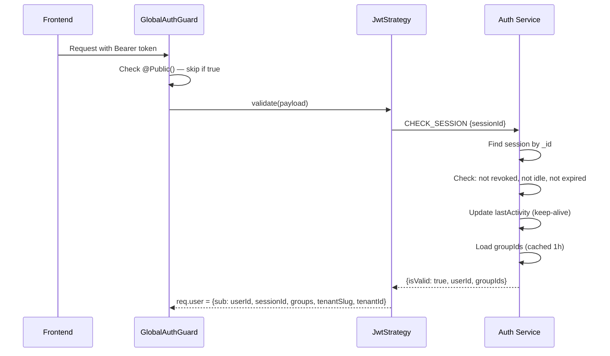
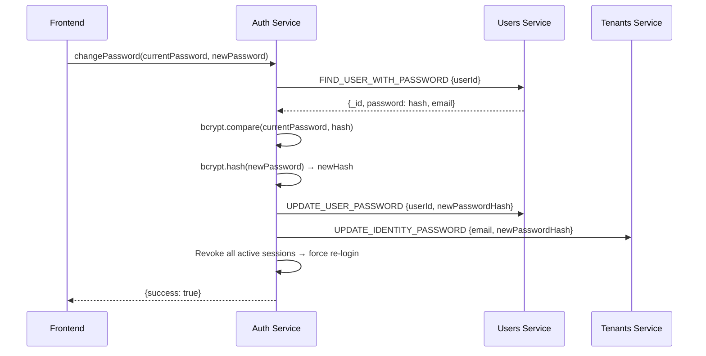

# Authentication Flow

Cucu uses a **Universal Auth** model: user credentials live in the platform database (`user_identities` collection in the tenants service), while sessions live in per-tenant databases (auth service). This allows a single identity to access multiple tenants.

## Auth Components

| Component | Location | Role |
|-----------|----------|------|
| `AuthController` (Gateway) | `gateway/src/auth/auth.controller.ts` | REST endpoints: login, refresh, logout, verify, discover, switch |
| `GlobalAuthGuard` | `gateway/src/auth/global-auth.guard.ts` | JWT validation on all requests (skips `@Public()`) |
| `JwtStrategy` | `gateway/src/auth/jwt.strategy.ts` | Passport strategy: validates JWT + CHECK_SESSION RPC |
| `AuthOrchestratorService` | `auth/src/auth-orchestrator.service.ts` | Consolidated auth flows: verify, me, refresh, switch |
| `AuthService` | `auth/src/auth.service.ts` | Session CRUD, token generation |
| `SessionService` | `auth/src/session.service.ts` | Session management (create, revoke, validate) |
| `TokenService` | `auth/src/token.service.ts` | JWT generation, refresh token rotation, group ID caching |
| `PasswordService` | `auth/src/password.service.ts` | Password verification and change |
| `AuthController` (Auth) | `auth/src/auth.controller.ts` | RPC handlers: orchestrator patterns + session patterns |
| `TenantsService` | `tenants/src/tenants.service.ts` | VERIFY_IDENTITY_PASSWORD, DISCOVER_TENANTS, SWITCH_TENANT |

## Login Flow (Current — Universal Auth)



## JWT Token Structure

### Access Token

```json
{
  "sub": "65a1b2c3d4e5f6...",
  "sessionId": "65a1b2c3d4e5f7...",
  "groups": ["SUPERADMIN", "HR", "PM"],
  "tenantSlug": "acme",
  "tenantId": "65a1b2c3d4e5f8...",
  "iat": 1710000000,
  "exp": 1710003600
}
```

- **Expiry**: Configured via `ACCESS_TOKEN_EXPIRES_IN` (default: `1h`)
- **Delivered**: In response body as `accessToken`

### Refresh Token

```json
{
  "sub": "65a1b2c3d4e5f6...",
  "sessionId": "65a1b2c3d4e5f7...",
  "type": "refresh",
  "email": "user@example.com",
  "tenantSlug": "acme",
  "tenantId": "65a1b2c3d4e5f8...",
  "iat": 1710000000,
  "exp": 1710604800
}
```

- **Expiry**: Configured via `REFRESH_EXPIRES_IN` (default: `7d`)
- **Delivered**: httpOnly cookie (`cucu_rf` dev / `__Host-rf` prod)
- **Rotation**: Every refresh generates a new refresh token (previous invalidated)

## Refresh Flow (Orchestrator Pattern)



## Session Validation (Every Request)

The `JwtStrategy` validates every authenticated request:



## Session Lifecycle

### Session Reuse Logic

Sessions are identified by `(userId, ip, deviceFingerprint)`. If a valid session exists for this triple, it's reused:

```
1. Find session: userId + ip + deviceFingerprint + !revokedAt
2. If found:
   a. Check idleTime (now - lastActivity) < SESSION_IDLE_TIMEOUT
   b. Check age (now - sessionStart) < MAX_SESSION_AGE
   c. If both pass → reuse session (update tokens)
   d. If either fails → revoke old, create new
3. If not found → create new session
```

### Session Expiry Rules

| Rule | Default | Config Key |
|------|---------|-----------|
| Access token TTL | 1 hour | `ACCESS_TOKEN_EXPIRES_IN` |
| Refresh token TTL | 7 days | `REFRESH_EXPIRES_IN` |
| Idle timeout | 4 hours | `SESSION_IDLE_TIMEOUT` |
| Max session age | 24 hours | `MAX_SESSION_AGE` |

### Session Schema

```typescript
Session {
  _id: ObjectId              // Pre-generated for JWT embedding
  userId: string             // References User._id in tenant DB
  refreshToken: string       // Current valid refresh token (NOT exposed via GraphQL)
  ip: string                 // Client IP
  deviceName: string         // Parsed from User-Agent (e.g., "macOS 14.3")
  browserName: string        // Parsed from User-Agent (e.g., "Chrome 134")
  deviceFingerprint: string  // SHA-256(ip|ua|dnt|lang)[0:32]
  expiresAt: Date            // Refresh token expiry
  sessionStart: Date         // When session was first created
  lastActivity: Date         // Updated on every CHECK_SESSION
  revokedAt?: Date           // Set when session is revoked
  tenantId?: string          // Defence-in-depth stamp
}

// Indexes:
// { userId, ip, deviceFingerprint, revokedAt } — session reuse query
// { userId, revokedAt } — session listing + revocation
```

## Device Fingerprinting

The Gateway computes a deterministic fingerprint from request headers:

```typescript
const rawString = `${ip}|${userAgentRaw}|${dnt}|${acceptLanguage}`;
const fingerprint = SHA256(rawString).substring(0, 32);
```

This enables session reuse across page reloads without requiring client-side storage (beyond the refresh cookie).

## Verify Endpoint (Orchestrator Pattern)

`GET /auth/verify` — read-only, `@Public()` — checks if the refresh cookie represents a valid session:

```
Gateway (thin proxy):
1. Read refresh token from cookie
2. VERIFY_FROM_TOKEN RPC → Auth service

Auth Orchestrator:
1. Verify JWT signature
2. CHECK_SESSION (internal)
3. CHECK_PLATFORM_ADMIN RPC → Tenants
4. GET_IDENTITY_MEMBERSHIPS RPC → Tenants
5. GET_MY_PERMISSIONS RPC → Grants (optional)
6. Return: { user, tenants, permissions, currentTenant }
```

The Gateway acts as a **thin proxy** — it doesn't perform any auth logic, just forwards to the Auth orchestrator. This pattern reduces round-trips and centralizes auth logic.

Used by the Next.js middleware on every navigation to determine auth state.

## Discover Endpoint

`POST /auth/discover` — rate limited (10/min) — given an email, returns which tenants the user belongs to:

```
1. Gateway → DISCOVER_TENANTS RPC → Tenants service
2. Tenants service → user_identities.findOne({email})
3. Return: memberships[].tenantSlug
```

Used by the login flow: user enters email first, then selects tenant, then enters password.

## Password Change



Both the tenant DB and platform DB password hashes are updated. The platform DB is the source of truth for login; the tenant DB copy is kept for backward compatibility.

## Cookie Configuration

| Setting | Dev Default | Prod Requirement |
|---------|------------|-----------------|
| Cookie name | `cucu_rf` | `__Host-rf` (via `REFRESH_COOKIE_NAME`) |
| httpOnly | `true` | `true` |
| secure | `false` | `true` (via `REFRESH_COOKIE_SECURE`) |
| sameSite | `lax` | `lax` or `strict` |
| domain | `localhost` | Set via `REFRESH_COOKIE_DOMAIN` |
| maxAge | 7 days | Set via `REFRESH_COOKIE_MAXAGE` |

## Rate Limiting

| Endpoint | Limit | Window |
|----------|-------|--------|
| `POST /auth/login` | 100 requests | 15 minutes |
| `POST /auth/discover` | 10 requests | 1 minute |
| Auth service (global) | 5 requests | 15 minutes (per-IP, `AuthThrottlerGuard`) |
| Gateway (global) | 60 requests | 1 minute |
