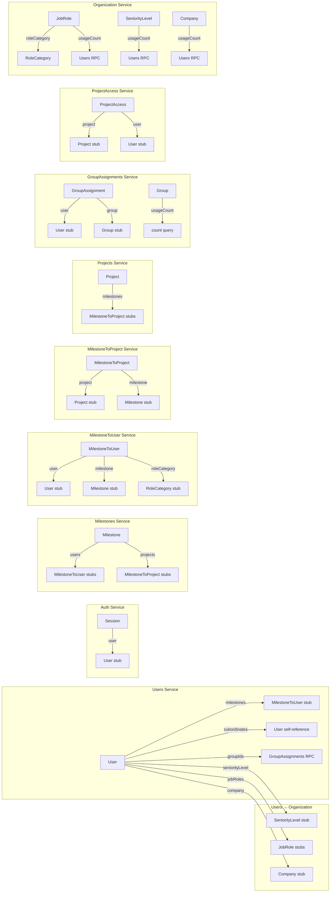
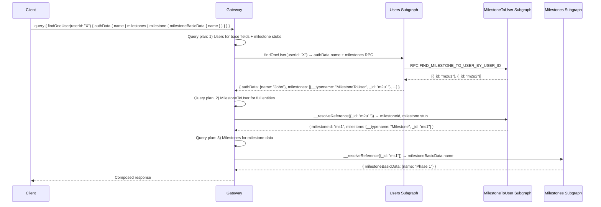

# Apollo Federation 2

Cucu uses **Apollo Federation 2** to compose a unified GraphQL schema from 13 subgraph services. The Gateway runs `IntrospectAndCompose` to dynamically discover and compose subgraph schemas.

## Gateway Composition

The Gateway configures Apollo Federation via `ApolloGatewayDriver` with `IntrospectAndCompose`:

```typescript
// gateway/src/config/subgraphs.config.ts
export function getSubgraphs(configService: ConfigService) {
  const protocol = configService.get<string>('HTTP_PROTOCOL');
  const services = [
    { nameKey: 'AUTH_SERVICE_NAME', hostKey: 'AUTH_SERVICE_HOST', portKey: 'AUTH_SERVICE_PORT' },
    { nameKey: 'USERS_SERVICE_NAME', ... },
    { nameKey: 'MILESTONES_SERVICE_NAME', ... },
    { nameKey: 'PROJECTS_SERVICE_NAME', ... },
    { nameKey: 'GRANTS_SERVICE_NAME', ... },
    { nameKey: 'GROUP_ASSIGNMENTS_SERVICE_NAME', ... },
    { nameKey: 'MILESTONE_TO_USER_SERVICE_NAME', ... },
    { nameKey: 'MILESTONE_TO_PROJECT_SERVICE_NAME', ... },
    { nameKey: 'PROJECT_ACCESS_SERVICE_NAME', ... },
    { nameKey: 'ORGANIZATION_SERVICE_NAME', ... },
    { nameKey: 'HOLIDAYS_SERVICE_NAME', ... },
    { nameKey: 'TENANTS_SERVICE_NAME', ... },
  ];
  return services.map(({ nameKey, hostKey, portKey }) => ({
    name: configService.get(nameKey),
    url: `${protocol}://${configService.get(hostKey) || configService.get(nameKey)}:${configService.get(portKey)}/graphql`,
  }));
}
```

Each subgraph uses `ApolloFederationDriver` with `autoSchemaFile` for automatic schema generation:

```typescript
GraphQLModule.forRoot<ApolloFederationDriverConfig>({
  driver: ApolloFederationDriver,
  autoSchemaFile: { path: 'schema.gql', federation: 2 },
  buildSchemaOptions: { orphanedTypes: [...] },
  fieldResolverEnhancers: ['interceptors', 'filters'],
});
```

## Entity Ownership

Each entity is owned by exactly one service (marked with `@Directive('@key(fields: "_id")')`):

| Entity | Owner Service | Key Field |
|--------|--------------|-----------|
| `User` | users | `_id` |
| `Session` | auth | `_id` |
| `Group` | grants | `_id` |
| `Permission` | grants | `_id` |
| `OperationPermission` | grants | `_id` |
| `PagePermission` | grants | `_id` |
| `GroupAssignment` | group-assignments | `_id` |
| `Milestone` | milestones | `_id` |
| `MilestoneToUser` | milestone-to-user | `_id` |
| `MilestoneToProject` | milestone-to-project | `_id` |
| `Project` | projects | `_id` |
| `ProjectTemplate` | projects | `_id` |
| `ProjectTemplatePhase` | projects | `_id` |
| `ProjectAccess` | project-access | `_id` |
| `SeniorityLevel` | organization | `_id` |
| `JobRole` | organization | `_id` |
| `Company` | organization | `_id` |
| `RoleCategory` | organization | `_id` |
| `HolidayCalendar` | holidays | `_id` |
| `CompanyClosure` | holidays | `_id` |
| `UserAbsence` | holidays | `_id` |
| `Tenant` | tenants | `_id` |
| `ResourceDailyAllocation` | milestone-to-user | `_id` |

## Entity References and Cross-Service Resolution

### The Pattern

When Service A needs to return an entity owned by Service B, it returns a **federation entity reference** — a stub with only `__typename` and the key field. Apollo's query planner then calls Service B's `resolveReference()` to fill in the full entity.

```typescript
// In Users resolver — returning Milestone entity stubs
@ResolveField(() => [MilestoneToUser], { nullable: true })
async milestones(@Parent() user: User): Promise<MilestoneToUser[]> {
  const rows = await lastValueFrom(
    this.mt2u.send('FIND_MILESTONE_TO_USER_BY_USER_ID', user._id)
  );
  // Return stubs — federation resolves the rest
  return rows.map(r => ({ __typename: 'MilestoneToUser', _id: r._id }));
}
```

```typescript
// In MilestoneToUser resolver — resolveReference fills the entity
@ResolveReference()
async resolveReference(ref: { __typename: string; _id: string }) {
  return this.milestoneToUserService.findByIdForFederation(ref._id);
}
```

### Federation Entity Stubs (orphanedTypes)

Services declare entity stubs for types they reference but don't own. These are registered as `orphanedTypes`:

```typescript
// In users module — stubs for organization entities
buildSchemaOptions: {
  orphanedTypes: [JobRoleEntity, SeniorityLevelEntity, CompanyEntity],
},

// Entity stub example:
@ObjectType()
@Directive('@key(fields: "_id")')
export class JobRole {
  @Field(() => ID)
  _id: string;
}
```

## Cross-Service Field Resolution Map



## ResolveField Details by Service

### Users → Organization (AdditionalFieldsResolver)

The `AdditionalFieldsResolver` resolves organization lookup references on the User's `additionalFieldsData`:

```typescript
@Resolver(() => AdditionalFieldsDataSchema)
export class AdditionalFieldsResolver {
  @ResolveField(() => SeniorityLevel, { nullable: true })
  async seniorityLevel(@Parent() data: AdditionalFieldsDataSchema) {
    if (!data.seniorityLevelId) return null;
    // Federation reference — resolved by Organization service
    return { __typename: 'SeniorityLevel', _id: data.seniorityLevelId };
  }

  @ResolveField(() => [JobRole], { nullable: true })
  async jobRoles(@Parent() data: AdditionalFieldsDataSchema) {
    if (!data.jobRoleIds?.length) return [];
    return data.jobRoleIds.map(id => ({ __typename: 'JobRole', _id: id }));
  }

  @ResolveField(() => Company, { nullable: true })
  async company(@Parent() data: AdditionalFieldsDataSchema) {
    if (!data.companyId) return null;
    return { __typename: 'Company', _id: data.companyId };
  }
}
```

### GroupAssignments → Group (usageCount)

The GroupAssignments service extends the `Group` entity (owned by Grants) with a `usageCount` field:

```typescript
@Resolver(() => Group)
export class GroupResolver {
  @ResolveField(() => Int, { name: 'usageCount', nullable: true })
  async resolveUsageCount(@Parent() group: Group): Promise<number> {
    return this.service.countByGroupId(group._id);
  }
}
```

## Request Flow Through Federation



## Header Propagation

The Gateway's `RemoteGraphQLDataSource.willSendRequest()` handles two scenarios:

### Authenticated User Requests

```
Bearer token → CHECK_SESSION → extract userId + groupIds
→ Strip Authorization header
→ Set: x-user-groups, x-user-id, x-tenant-slug, x-tenant-id
→ HMAC sign all headers → x-gateway-signature
```

### Internal Federation Calls

```
No Bearer token → get self-signed JWT from FederationTokenService (RS256, 60s TTL)
→ Set: Authorization: Bearer {federationToken}, x-internal-federation-call: 1
→ Propagate user context if triggered by user request (Scenario D)
→ Propagate tenant context from user JWT or request headers
→ HMAC sign all headers with INTERNAL_HEADER_SECRET → x-gateway-signature
```

See [Security](/shared/security.md) for details on `FederationTokenService` and `verifyFederationJwt`.

## Introspection Control

Production environments disable GraphQL introspection:

```typescript
// gateway/src/plugins/disable-introspection.plugin.ts
introspection: allowIntrospection, // controlled by ALLOW_INTROSPECTION env
plugins: allowIntrospection ? [] : [disableIntrospectionPlugin()],
```
