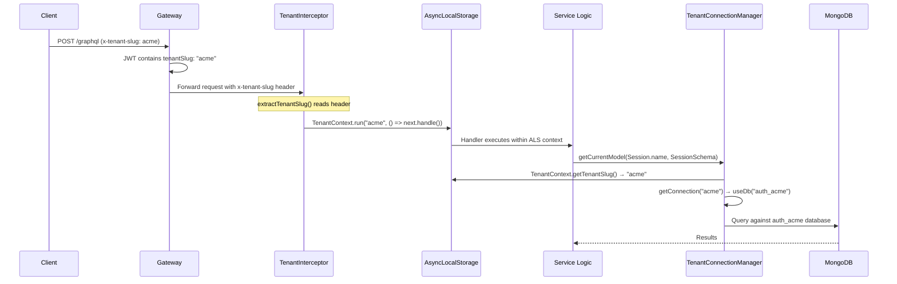
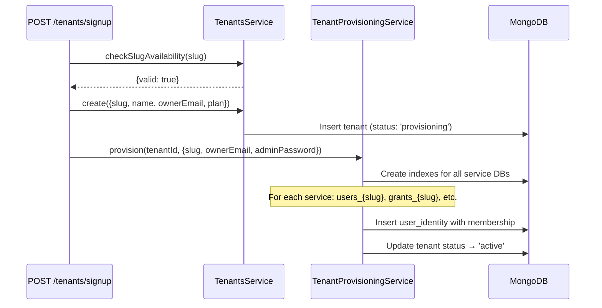
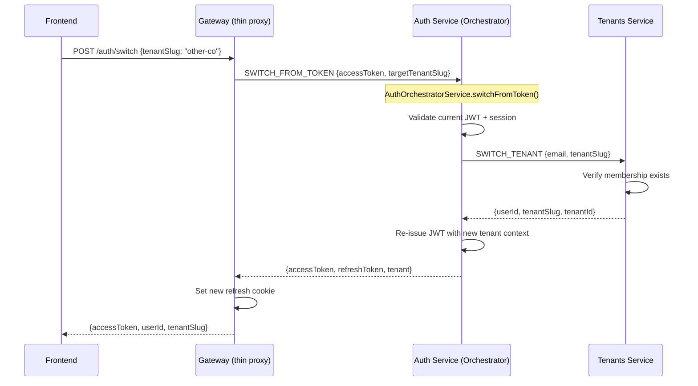

# Multi-Tenant Architecture

Cucu implements **physical database isolation** for multi-tenancy. Each tenant gets a dedicated MongoDB database per service — not a shared database with a `tenantId` filter column. This design eliminates cross-tenant data leaks by construction rather than relying on query-level filters.

## Core Components

| Component | Package | Purpose |
|-----------|---------|---------|
| `TenantContext` | `@cucu/service-common` | AsyncLocalStorage wrapper — stores `tenantSlug` for the current request |
| `TenantInterceptor` | `@cucu/service-common` | NestJS interceptor — extracts tenant slug from headers/RPC, calls `TenantContext.run()` |
| `TenantConnectionManager` | `@cucu/tenant-db` | Singleton — manages per-tenant Mongoose connections via `useDb()` |
| `TenantDatabaseModule` | `@cucu/tenant-db` | Dynamic NestJS module — registers manager for a service |
| `TenantAwareClientProxy` | `@cucu/service-common` | ClientProxy wrapper — auto-injects `_tenantSlug` and `_internalSecret` into RPC payloads |
| `TenantAwareClientsModule` | `@cucu/service-common` | Drop-in replacement for `ClientsModule.registerAsync()` with tenant injection |
| `withTenantId()` | `@cucu/tenant-db` | Mixin — stamps `tenantId` on documents as defence-in-depth |

Note: `TenantContext`, `TenantInterceptor`, and `TenantAwareClientProxy` were moved from `@cucu/tenant-db` to `@cucu/service-common` as they are infrastructure concerns, not DB concerns. The `@cucu/tenant-db` package re-exports them for backward compatibility.

## Tenant Context Flow



## TenantContext (AsyncLocalStorage)

The `TenantContext` is a pure functional wrapper around Node.js `AsyncLocalStorage`. It allows any singleton service to access the current request's tenant without being request-scoped.

```typescript
// How TenantContext works internally
const tenantStore = new AsyncLocalStorage<{ tenantSlug: string }>();

export const TenantContext = {
  // Wraps execution in a tenant context
  run<T>(tenantSlug: string, fn: () => T): T {
    return tenantStore.run({ tenantSlug }, fn);
  },

  // Gets the current tenant (throws if outside context)
  getTenantSlug(): string { /* reads from store */ },

  // Safe version (returns null outside context)
  getTenantSlugOrNull(): string | null { /* reads from store */ },
};
```

**Why AsyncLocalStorage instead of request-scoped services?**

NestJS request-scoped services force the entire dependency tree to become request-scoped. With 13 services each having multiple providers, this would create massive performance overhead. ALS gives request-scoped data access to singleton services — best of both worlds.

## TenantInterceptor

The `TenantInterceptor` runs on every request (HTTP, GraphQL, and RPC) and bridges the transport layer to the ALS context:

| Transport | Extraction Method |
|-----------|------------------|
| HTTP / GraphQL | `req.headers['x-tenant-slug']` |
| RPC (Redis) | `data._tenantSlug` from payload |

```typescript
// Simplified interceptor logic
intercept(context: ExecutionContext, next: CallHandler): Observable<any> {
  const tenantSlug = this.extractTenantSlug(context);
  if (!tenantSlug) return next.handle(); // no tenant context (health checks, etc.)
  return TenantContext.run(tenantSlug, () => next.handle());
}
```

The interceptor is registered globally via `TenantDatabaseModule.forService()` and via `app.useGlobalInterceptors()` in `createSubgraphMicroservice()`.

## TenantConnectionManager

This is the core component that manages per-tenant database connections. It uses a **single base Mongoose connection** and Mongoose's `useDb()` with `useCache: true` to create lightweight virtual connections per tenant — all sharing the same underlying socket pool.

### Connection Lifecycle


### Database Naming Convention

```
{serviceName}_{tenantSlug}
```

Examples:
- `users_acme` — Users service, "acme" tenant
- `grants_demo-corp` — Grants service, "demo-corp" tenant
- `auth_acme` — Auth service, "acme" tenant

### The Wall: Known Tenants Whitelist

The connection manager maintains a **whitelist of known tenant slugs**. Only registered slugs can get a database connection. This prevents:
- Accidental creation of databases for typos
- Denial-of-service via tenant slug enumeration
- Resource exhaustion from unlimited pool growth

```typescript
// At bootstrap: register all known tenants
manager.registerTenants(['acme', 'demo-corp', 'test-co']);

// After provisioning a new tenant:
manager.addTenant('new-tenant');

// Requesting unknown tenant → throws
manager.getConnection('unknown-slug'); // Error: unknown tenant "unknown-slug"
```

### Pool Management

| Parameter | Value | Purpose |
|-----------|-------|---------|
| `POOL_SIZE` | 100 | Max connections in the base Mongoose connection pool |
| `MAX_POOLS` | 200 | Max number of tenant virtual connections |
| `IDLE_TIMEOUT_MS` | 15 min | Idle connections removed after this time |
| `CLEANUP_INTERVAL_MS` | 5 min | Periodic cleanup of idle pools |

The cleanup timer runs every 5 minutes and removes connections that haven't been accessed in 15 minutes. On module destroy, all pools are cleaned up gracefully.

## TenantAwareClientProxy

When Service A calls Service B via Redis RPC, the tenant context must propagate. `TenantAwareClientProxy` wraps every `send()` and `emit()` call to inject `_tenantSlug` from the current ALS context:

```typescript
// Before (no tenant propagation):
this.usersClient.send('FIND_USER_BY_EMAIL', { email });

// After (TenantAwareClientProxy automatically injects):
// → { email, _tenantSlug: 'acme' }  (read from TenantContext)
```

### How It Works

```typescript
private enrich(data: any): any {
  const slug = TenantContext.getTenantSlugOrNull();
  const secret = process.env.INTERNAL_HEADER_SECRET;

  // Build metadata to inject
  const meta: Record<string, string> = {};
  if (slug) meta._tenantSlug = slug;
  if (secret) meta._internalSecret = secret;

  if (!Object.keys(meta).length) return data;

  if (data && typeof data === 'object' && !Array.isArray(data)) {
    const result = { ...data };
    for (const [key, val] of Object.entries(meta)) {
      if (!(key in result)) result[key] = val;  // Don't overwrite if present
    }
    return result;
  }

  return { _payload: data, ...meta };  // primitive → wrap
}
```

The proxy also injects `_internalSecret` for RPC authentication (see [Security](/shared/security.md)).

### TenantAwareClientsModule

Drop-in replacement for `ClientsModule.registerAsync()`. It registers raw clients with a `__RAW__` prefix, then creates wrapper providers that expose `TenantAwareClientProxy` under the original token names:

```typescript
// Drop-in replacement — services inject the same tokens
const RedisClientsModule = TenantAwareClientsModule.registerAsync([
  { name: 'USERS_SERVICE', /* ... */ },
  { name: 'GRANTS_SERVICE', /* ... */ },
]);

// Service code unchanged:
@Inject('USERS_SERVICE') private readonly usersClient: ClientProxy
// ↑ Now receives TenantAwareClientProxy instead of raw ClientProxy
```

## Tenant Slug Defence-in-Depth: `withTenantId()`

Even with physical DB isolation, documents are stamped with a passive `tenantId` field:

```typescript
const doc = withTenantId({ name: 'John' }, 'acme');
// → { name: 'John', tenantId: 'acme' }
```

This field is **NOT used for filtering** (the database itself handles isolation). It exists for:
- Backup restore integrity checks
- GDPR data export certification
- Audit trail post-mortem
- Future DB consolidation (if ever needed)

## Service Registration

Every service registers multi-tenancy via `TenantDatabaseModule.forService()`:

```typescript
@Module({
  imports: [
    TenantDatabaseModule.forService('users'),
    // This registers:
    // 1. TenantConnectionManager (singleton, configured for 'users')
    // 2. TenantInterceptor (global APP_INTERCEPTOR)
  ],
})
export class UsersModule {}
```

Services then access tenant-aware models via the connection manager:

```typescript
@Injectable()
export class UsersService {
  // Singleton getter — reads tenant from ALS
  private get userModel(): Model<UserDocument> {
    return this.connManager.getCurrentModel<UserDocument>(User.name, UserSchema);
  }
}
```

## The Tenants Service (Platform DB)

The `tenants` service is the only service that does **NOT** use `TenantDatabaseModule`. It connects to a **shared platform database** via standard `MongooseModule.forRoot()` and manages:

| Collection | Purpose |
|-----------|---------|
| `tenants` | Tenant registry (slug, name, status, plan, limits) |
| `user_identities` | Universal auth: email → password + tenant memberships |
| `platform_admins` | Legacy platform admin accounts |

### Tenant Provisioning Flow



## Tenant Context in JWT

When a user logs in, the JWT tokens include tenant context:

```json
{
  "sub": "userId",
  "sessionId": "sessionId",
  "groups": ["SUPERADMIN", "HR"],
  "tenantSlug": "acme",
  "tenantId": "65a1b2c3d4e5f6a7b8c9d0e1"
}
```

The Gateway extracts these from the JWT and sets:
- `x-tenant-slug` header for GraphQL subgraph requests
- `x-tenant-id` header for the same
- HMAC signature covering all internal headers

## Tenant Switch Flow (Orchestrator Pattern)

Users with multiple tenant memberships can switch without re-login. The Gateway acts as a **thin proxy**, delegating the logic to the Auth orchestrator:


