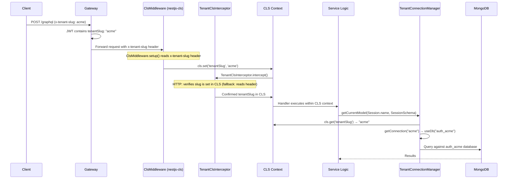
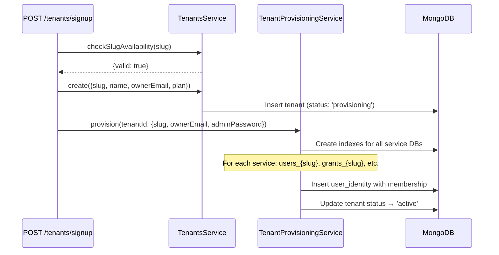
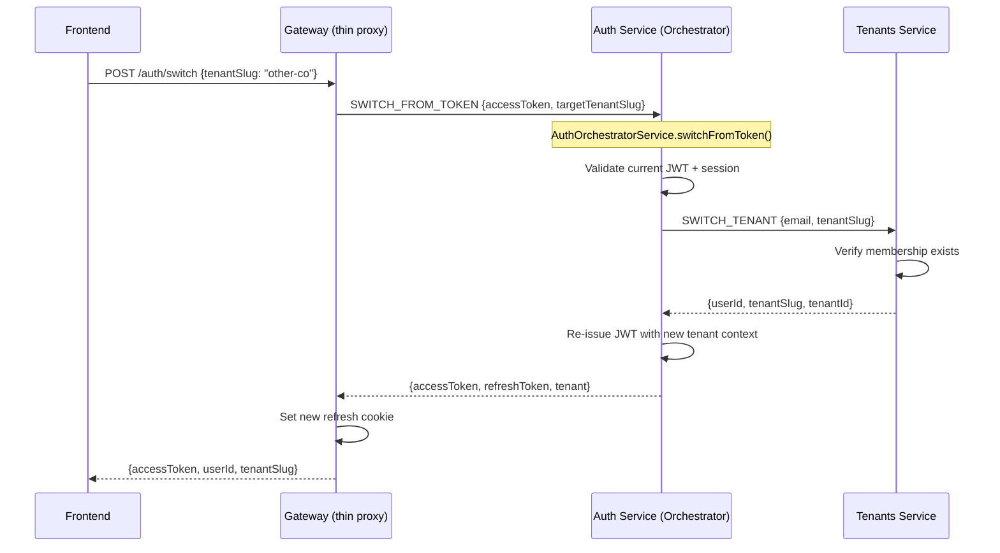

# Multi-Tenant Architecture

Cucu implements **physical database isolation** for multi-tenancy. Each tenant gets a dedicated MongoDB database per service — not a shared database with a `tenantId` filter column. This design eliminates cross-tenant data leaks by construction rather than relying on query-level filters.

## Core Components

| Component | Package | Purpose |
|-----------|---------|---------|
| `TenantClsModule` | `@cucu/service-common` | Global module — configures `nestjs-cls` with `ClsMiddleware` (HTTP) and `ClsInterceptor` (RPC) for tenant context propagation |
| `TenantContextService` | `@cucu/service-common` | Injectable wrapper around `ClsService<TenantClsStore>` — provides `getTenantSlug()`, `setTenantSlug()`, `run()` |
| `TenantClsInterceptor` | `@cucu/service-common` | NestJS interceptor — extracts tenant slug from RPC payloads into CLS, strips `_tenantSlug`/`_tenantId` from payloads before `ValidationPipe` |
| `TenantClsStore` | `@cucu/service-common` | Typed CLS store interface (`{ tenantSlug: string; tenantId?: string }`) |
| `TenantConnectionManager` | `@cucu/tenant-db` | Singleton — manages per-tenant Mongoose connections via `useDb()`, reads tenant slug from CLS |
| `TenantDatabaseModule` | `@cucu/tenant-db` | Dynamic NestJS module — registers manager for a service |
| `TenantAwareClientProxy` | `@cucu/service-common` | ClientProxy wrapper — auto-injects `_tenantSlug` (from CLS) and `_internalSecret` into RPC payloads |
| `TenantAwareClientsModule` | `@cucu/service-common` | Drop-in replacement for `ClientsModule.registerAsync()` with tenant injection via CLS |
| `withTenantId()` | `@cucu/tenant-db` | Mixin — stamps `tenantId` on documents as defence-in-depth |

::: info Migration Complete — ClsService in All Contexts
All 11 subgraph context files now inject `ClsService<TenantClsStore>` as the second constructor parameter:

```typescript
// Pattern used by all context files:
@Injectable({ scope: Scope.REQUEST })
export class XxxContext extends BaseSubgraphContext {
  constructor(
    @Optional() @Inject(REQUEST) req?: any,
    @Optional() cls?: ClsService<TenantClsStore>,
  ) {
    super(req, cls);
  }
}
```

**Context files:** `GrantsContext`, `UsersContext`, `OrganizationContext`, `TenantsContext`, `ProjectsContext`, `MilestonesContext`, `HolidaysContext`, `GroupAssignmentsContext` (`GaContext`), `MilestoneToProjectContext` (`M2pContext`), `MilestoneToUserContext` (`M2uContext`), `ProjectAccessContext`.

The old `TenantContext` (static AsyncLocalStorage wrapper), `TenantInterceptor`, and `TenantGraphqlMiddleware` have been fully replaced by `nestjs-cls`-based equivalents.
:::

## Tenant Context Flow



## Tenant Context with nestjs-cls

Cucu uses **nestjs-cls** (`ClsModule`) to propagate tenant context across the entire request lifecycle. This replaces the previous raw `AsyncLocalStorage` wrapper (`TenantContext`) with a framework-integrated solution.

### TenantClsModule

Configures `nestjs-cls` globally with two mechanisms:

- **`ClsMiddleware`** (HTTP/GraphQL): Wraps the entire request in `AsyncLocalStorage.run()`. The `setup` callback extracts `tenantSlug` from the `x-tenant-slug` header and stores it in CLS.
- **`ClsInterceptor`** (RPC): Initializes a CLS context for Redis transport messages. The `TenantClsInterceptor` then extracts `_tenantSlug` from the RPC payload and sets it in CLS.

```typescript
@Module({
  imports: [
    ClsModule.forRoot({
      global: true,
      middleware: {
        mount: true,
        setup: (cls, req) => {
          const slug = req.headers['x-tenant-slug'];
          if (slug) cls.set('tenantSlug', slug.toString());
        },
      },
      interceptor: { mount: true },
    }),
  ],
  providers: [TenantContextService],
  exports: [TenantContextService],
})
export class TenantClsModule {}
```

### TenantContextService

Injectable wrapper around `ClsService<TenantClsStore>` — the recommended way for services to access tenant context:

```typescript
@Injectable()
export class TenantContextService {
  constructor(private readonly cls: ClsService<TenantClsStore>) {}

  getTenantSlug(): string;         // Throws if not set
  getTenantSlugOrNull(): string | null;  // Returns null if not set
  setTenantSlug(slug: string): void;     // Rarely needed in service code
  run<T>(tenantSlug: string, fn: () => T): T;  // For code outside request lifecycle
}
```

### TenantClsStore

Typed interface for the CLS store:

```typescript
export interface TenantClsStore extends ClsStore {
  tenantSlug: string;
  tenantId?: string;
}
```

**Why nestjs-cls instead of raw AsyncLocalStorage?**

1. **Framework integration**: `ClsMiddleware` and `ClsInterceptor` handle context initialization for all transports (HTTP, GraphQL, RPC) automatically
2. **DI-friendly**: `TenantContextService` and `ClsService` can be injected normally — no static utilities
3. **No request-scoping penalty**: Singleton services access tenant context through CLS, avoiding the performance overhead of NestJS request-scoped providers

## TenantClsInterceptor

The `TenantClsInterceptor` runs on every request and handles RPC-specific tenant context propagation. For HTTP/GraphQL, the `ClsMiddleware` (from `TenantClsModule`) already sets the tenant slug in CLS — the interceptor only provides a fallback.

| Transport | Behavior |
|-----------|----------|
| HTTP / GraphQL | Verifies CLS has `tenantSlug` (set by `ClsMiddleware`). Fallback: reads from `x-tenant-slug` header if not set. |
| RPC (Redis) | Extracts `_tenantSlug` from payload → sets in CLS. **Strips** `_tenantSlug` and `_tenantId` from payload before `ValidationPipe`. |

```typescript
// Key difference from old TenantInterceptor: does NOT call TenantContext.run().
// CLS context is already initialized by ClsMiddleware (HTTP) or ClsInterceptor (RPC).
if (type === 'rpc') {
  const data = context.switchToRpc().getData();
  if (data?._tenantSlug) {
    this.cls.set('tenantSlug', data._tenantSlug);
  }
  this.stripTenantFields(context);
}
```

**Payload unwrapping logic:** When `TenantAwareClientProxy` wraps a primitive value (string, number), it creates `{ _payload: value, _tenantSlug: 'acme' }`. The interceptor detects this pattern and unwraps it, restoring the original payload shape before the handler sees it.

The interceptor is registered globally via `app.useGlobalInterceptors()` in `createSubgraphMicroservice()`.

## TenantConnectionManager

This is the core component that manages per-tenant database connections. It uses a **single base Mongoose connection** and Mongoose's `useDb()` with `useCache: true` to create lightweight virtual connections per tenant — all sharing the same underlying socket pool.

### Connection Lifecycle


### Database Naming Convention

```
{serviceName}_{tenantSlug}
```

Examples:
- `users_acme` — Users service, "acme" tenant
- `grants_demo-corp` — Grants service, "demo-corp" tenant
- `auth_acme` — Auth service, "acme" tenant

### The Wall: Known Tenants Whitelist

The connection manager maintains a **whitelist of known tenant slugs**. Only registered slugs can get a database connection. This prevents:
- Accidental creation of databases for typos
- Denial-of-service via tenant slug enumeration
- Resource exhaustion from unlimited pool growth

```typescript
// At bootstrap: register all known tenants
manager.registerTenants(['acme', 'demo-corp', 'test-co']);

// After provisioning a new tenant:
manager.addTenant('new-tenant');

// Requesting unknown tenant → throws
manager.getConnection('unknown-slug'); // Error: unknown tenant "unknown-slug"
```

### Pool Management

| Parameter | Value | Purpose |
|-----------|-------|---------|
| `POOL_SIZE` | 100 | Max connections in the base Mongoose connection pool |
| `MAX_POOLS` | 200 | Max number of tenant virtual connections |
| `IDLE_TIMEOUT_MS` | 15 min | Idle connections removed after this time |
| `CLEANUP_INTERVAL_MS` | 5 min | Periodic cleanup of idle pools |

The cleanup timer runs every 5 minutes and removes connections that haven't been accessed in 15 minutes. On module destroy, all pools are cleaned up gracefully.

## TenantAwareClientProxy

When Service A calls Service B via Redis RPC, the tenant context must propagate. `TenantAwareClientProxy` wraps every `send()` and `emit()` call to inject `_tenantSlug` from the current CLS context:

```typescript
// Before (no tenant propagation):
this.usersClient.send('FIND_USER_BY_EMAIL', { email });

// After (TenantAwareClientProxy automatically injects):
// → { email, _tenantSlug: 'acme' }  (read from CLS via ClsService)
```

### How It Works

The proxy receives `ClsService<TenantClsStore>` via DI (injected by `TenantAwareClientsModule`):

```typescript
private enrich(data: any): any {
  const slug = this.cls?.get('tenantSlug') ?? null;  // Read from CLS context
  const secret = process.env.INTERNAL_HEADER_SECRET;

  // Build metadata to inject
  const meta: Record<string, string> = {};
  if (slug) meta._tenantSlug = slug;
  if (secret) meta._internalSecret = secret;

  if (!Object.keys(meta).length) return data;

  if (data && typeof data === 'object' && !Array.isArray(data)) {
    const result = { ...data };
    for (const [key, val] of Object.entries(meta)) {
      if (!(key in result)) result[key] = val;  // Don't overwrite if present
    }
    return result;
  }

  return { _payload: data, ...meta };  // primitive → wrap
}
```

The proxy also injects `_internalSecret` for RPC authentication (see [Security](/shared/security.md)).

### TenantAwareClientsModule

Drop-in replacement for `ClientsModule.registerAsync()`. It registers raw clients with a `__RAW__` prefix, then creates wrapper providers that inject `ClsService` and expose `TenantAwareClientProxy` under the original token names:

```typescript
// Drop-in replacement — services inject the same tokens
const RedisClientsModule = TenantAwareClientsModule.registerAsync([
  { name: 'USERS_SERVICE', /* ... */ },
  { name: 'GRANTS_SERVICE', /* ... */ },
]);

// Service code unchanged:
@Inject('USERS_SERVICE') private readonly usersClient: ClientProxy
// ↑ Now receives TenantAwareClientProxy (backed by ClsService) instead of raw ClientProxy
```

## Tenant Slug Defence-in-Depth: `withTenantId()`

Even with physical DB isolation, documents are stamped with a passive `tenantId` field:

```typescript
const doc = withTenantId({ name: 'John' }, 'acme');
// → { name: 'John', tenantId: 'acme' }
```

This field is **NOT used for filtering** (the database itself handles isolation). It exists for:
- Backup restore integrity checks
- GDPR data export certification
- Audit trail post-mortem
- Future DB consolidation (if ever needed)

## Service Registration

Every service registers multi-tenancy via `TenantClsModule` (for CLS context) and `TenantDatabaseModule.forService()` (for DB connections):

```typescript
@Module({
  imports: [
    TenantClsModule,                                        // CLS context (nestjs-cls)
    TenantDatabaseModule.forService('users', { disableInterceptor: true }),
    // TenantDatabaseModule registers:
    // 1. TenantConnectionManager (singleton, configured for 'users')
    // Note: disableInterceptor: true prevents double-registration
    // since createSubgraphMicroservice already registers TenantClsInterceptor globally.
  ],
})
export class UsersModule {}
```

Services then access tenant-aware models via the connection manager:

```typescript
@Injectable()
export class UsersService {
  // Singleton getter — reads tenant from ALS
  private get userModel(): Model<UserDocument> {
    return this.connManager.getCurrentModel<UserDocument>(User.name, UserSchema);
  }
}
```

## The Tenants Service (Platform DB)

The `tenants` service is the only service that does **NOT** use `TenantDatabaseModule`. It connects to a **shared platform database** via standard `MongooseModule.forRoot()` and manages:

| Collection | Purpose |
|-----------|---------|
| `tenants` | Tenant registry (slug, name, status, plan, limits) |
| `user_identities` | Universal auth: email → password + tenant memberships |
| `platform_admins` | Legacy platform admin accounts |

### Tenant Provisioning Flow



## Tenant Context in JWT

When a user logs in, the JWT tokens include tenant context:

```json
{
  "sub": "userId",
  "sessionId": "sessionId",
  "groups": ["SUPERADMIN", "HR"],
  "tenantSlug": "acme",
  "tenantId": "65a1b2c3d4e5f6a7b8c9d0e1"
}
```

The Gateway extracts these from the JWT and sets:
- `x-tenant-slug` header for GraphQL subgraph requests
- `x-tenant-id` header for the same
- HMAC signature covering all internal headers

## Tenant Switch Flow (Orchestrator Pattern)

Users with multiple tenant memberships can switch without re-login. The Gateway acts as a **thin proxy**, delegating the logic to the Auth orchestrator:


