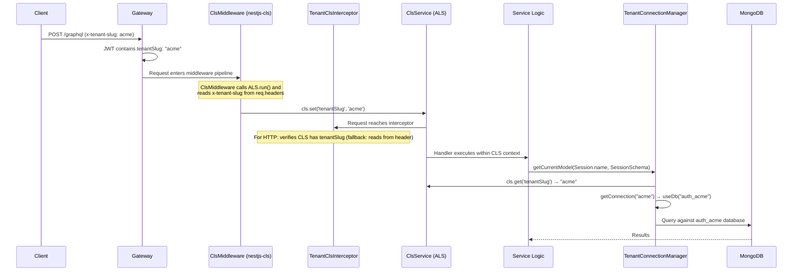
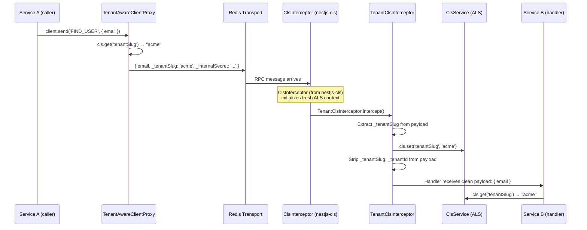
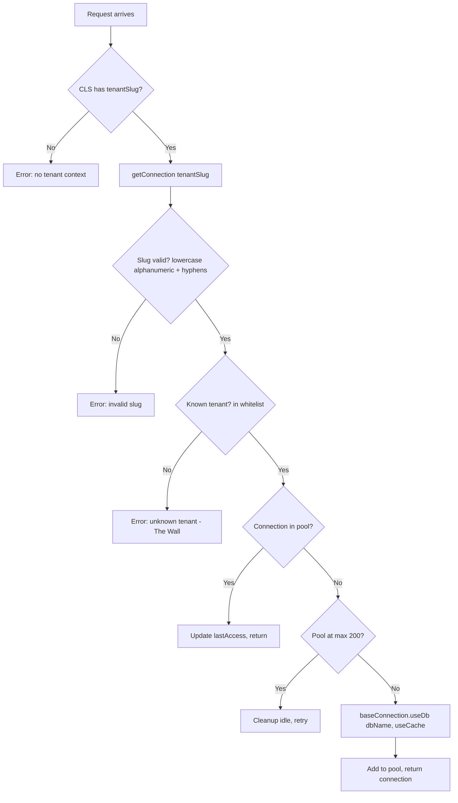
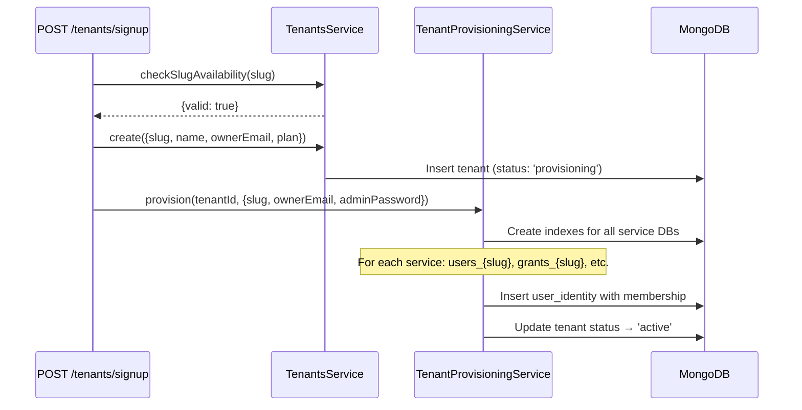

# Multi-Tenant Architecture

Cucu implements **physical database isolation** for multi-tenancy. Each tenant gets a dedicated MongoDB database per service — not a shared database with a `tenantId` filter column. This design eliminates cross-tenant data leaks by construction rather than relying on query-level filters.

## Core Components

| Component | Package | Purpose |
|-----------|---------|---------|
| `TenantClsModule` | `@cucu/service-common` | Configures `nestjs-cls` with `ClsMiddleware` (HTTP) + `ClsInterceptor` (RPC) for ALS-based tenant context |
| `TenantContextService` | `@cucu/service-common` | Injectable wrapper around `ClsService<TenantClsStore>` — the recommended way to read/write tenant slug |
| `TenantClsInterceptor` | `@cucu/service-common` | NestJS interceptor — extracts tenant slug from headers/RPC payload, sets it in CLS, strips tenant metadata from RPC payloads |
| `TenantConnectionManager` | `@cucu/tenant-db` | Singleton — manages per-tenant Mongoose connections via `useDb()`, reads tenant slug from CLS |
| `TenantDatabaseModule` | `@cucu/tenant-db` | Dynamic NestJS module — registers manager for a service |
| `TenantAwareClientProxy` | `@cucu/service-common` | ClientProxy wrapper — auto-injects `_tenantSlug` (from CLS) and `_internalSecret` into RPC payloads |
| `TenantAwareClientsModule` | `@cucu/service-common` | Drop-in replacement for `ClientsModule.registerAsync()` with tenant injection |
| `withTenantId()` | `@cucu/tenant-db` | Mixin — stamps `tenantId` on documents as defence-in-depth |

::: info Migration Note (March 2026)
The tenant context system was migrated from a custom `AsyncLocalStorage` wrapper (`TenantContext` static object + `TenantInterceptor`) to **nestjs-cls**. The old `TenantContext`, `TenantInterceptor`, and `TenantGraphqlMiddleware` are removed. The new system uses `TenantClsModule`, `TenantClsInterceptor`, and `TenantContextService` backed by `ClsService`.
:::

## Tenant Context Flow



### RPC Tenant Propagation



## TenantClsModule

The `TenantClsModule` is the root module that sets up `nestjs-cls` for tenant context propagation. It must be imported in the root module of every subgraph service.

```typescript
@Module({
  imports: [
    ClsModule.forRoot({
      global: true,
      middleware: {
        mount: true,
        setup: (cls, req) => {
          // HTTP/GraphQL: extract tenantSlug from request header
          const slug = req.headers['x-tenant-slug'];
          if (slug) cls.set('tenantSlug', slug.toString());
        },
      },
      interceptor: {
        mount: true, // RPC: initializes CLS context for Redis messages
      },
    }),
  ],
  providers: [TenantContextService],
  exports: [TenantContextService],
})
export class TenantClsModule {}
```

**Two-layer CLS initialization:**

| Transport | CLS Initialization | Tenant Slug Source |
|-----------|-------------------|-------------------|
| HTTP / GraphQL | `ClsMiddleware` (from nestjs-cls) calls `ALS.run()` and `setup` callback | `req.headers['x-tenant-slug']` |
| RPC (Redis) | `ClsInterceptor` (from nestjs-cls) creates fresh ALS context | `_tenantSlug` field in payload (set by `TenantAwareClientProxy`) |

After CLS initialization, the `TenantClsInterceptor` further processes the context (fallback reads for HTTP, payload stripping for RPC).

## TenantContextService

Injectable wrapper around `ClsService<TenantClsStore>` — the recommended replacement for the old static `TenantContext` utility.

```typescript
@Injectable()
export class TenantContextService {
  constructor(private readonly cls: ClsService<TenantClsStore>) {}

  getTenantSlug(): string;         // Throws if not set
  getTenantSlugOrNull(): string | null;  // Safe for platform-level operations
  setTenantSlug(slug: string): void;     // Rarely needed in service code
  run<T>(tenantSlug: string, fn: () => T): T;  // For code outside request lifecycle
}
```

**Why nestjs-cls instead of raw AsyncLocalStorage?**

- **DI-integrated**: `ClsService` is a regular NestJS injectable — no static singletons
- **Built-in middleware/interceptor**: Handles CLS lifecycle for HTTP and RPC transports
- **Type-safe store**: `TenantClsStore` extends `ClsStore` for typed access
- **Ecosystem support**: Integrates with NestJS lifecycle hooks without workarounds

## TenantClsInterceptor

The `TenantClsInterceptor` is registered globally by `createSubgraphMicroservice()`. It handles transport-specific tenant extraction:

| Transport | What It Does |
|-----------|-------------|
| HTTP / GraphQL | Verifies CLS has `tenantSlug` (set by `ClsMiddleware`). Fallback: reads `x-tenant-slug` header if not set. |
| RPC | Extracts `_tenantSlug` from payload → sets in CLS. **Strips** `_tenantSlug` and `_tenantId` from payload before handler runs. |

**Payload unwrapping:** When `TenantAwareClientProxy` wraps a primitive value (string, number), it creates `{ _payload: value, _tenantSlug: 'acme' }`. The interceptor detects this pattern and unwraps it, restoring the original payload shape before the handler sees it.

**Key difference from old TenantInterceptor:** The old interceptor called `TenantContext.run()` to create the ALS context. The new interceptor does NOT create the CLS context — that's handled by `ClsMiddleware` (HTTP) and `ClsInterceptor` (RPC) from the `TenantClsModule`. The interceptor only sets and reads values within the already-running CLS context.

## TenantConnectionManager

This is the core component that manages per-tenant database connections. It uses a **single base Mongoose connection** and Mongoose's `useDb()` with `useCache: true` to create lightweight virtual connections per tenant — all sharing the same underlying socket pool.

The manager reads the current tenant slug from CLS via `ClsService`:

```typescript
private getCurrentTenantSlug(): string {
  const slug = this.cls?.get('tenantSlug');
  if (!slug) {
    throw new Error('Tenant slug not available in CLS context');
  }
  return slug;
}
```

### Connection Lifecycle



### Database Naming Convention

```
{serviceName}_{tenantSlug}
```

Examples:
- `users_acme` — Users service, "acme" tenant
- `grants_demo-corp` — Grants service, "demo-corp" tenant
- `auth_acme` — Auth service, "acme" tenant

### The Wall: Known Tenants Whitelist

The connection manager maintains a **whitelist of known tenant slugs**. Only registered slugs can get a database connection. This prevents:
- Accidental creation of databases for typos
- Denial-of-service via tenant slug enumeration
- Resource exhaustion from unlimited pool growth

```typescript
// At bootstrap: register all known tenants
manager.registerTenants(['acme', 'demo-corp', 'test-co']);

// After provisioning a new tenant:
manager.addTenant('new-tenant');

// Requesting unknown tenant → throws
manager.getConnection('unknown-slug'); // Error: unknown tenant "unknown-slug"
```

### Pool Management

| Parameter | Value | Purpose |
|-----------|-------|---------|
| `POOL_SIZE` | 100 | Max connections in the base Mongoose connection pool |
| `MAX_POOLS` | 200 | Max number of tenant virtual connections |
| `IDLE_TIMEOUT_MS` | 15 min | Idle connections removed after this time |
| `CLEANUP_INTERVAL_MS` | 5 min | Periodic cleanup of idle pools |

The cleanup timer runs every 5 minutes and removes connections that haven't been accessed in 15 minutes. On module destroy, all pools are cleaned up gracefully.

## TenantAwareClientProxy

When Service A calls Service B via Redis RPC, the tenant context must propagate. `TenantAwareClientProxy` wraps every `send()` and `emit()` call to inject `_tenantSlug` from the current CLS context:

```typescript
// Before (no tenant propagation):
this.usersClient.send('FIND_USER_BY_EMAIL', { email });

// After (TenantAwareClientProxy automatically injects):
// → { email, _tenantSlug: 'acme' }  (read from ClsService)
```

### How It Works

```typescript
private enrich(data: any): any {
  const slug = this.cls?.get('tenantSlug') ?? null;
  const secret = process.env.INTERNAL_HEADER_SECRET;

  const meta: Record<string, string> = {};
  if (slug) meta._tenantSlug = slug;
  if (secret) meta._internalSecret = secret;

  if (!Object.keys(meta).length) return data;

  if (data && typeof data === 'object' && !Array.isArray(data)) {
    const result = { ...data };
    for (const [key, val] of Object.entries(meta)) {
      if (!(key in result)) result[key] = val;  // Don't overwrite if present
    }
    return result;
  }

  return { _payload: data, ...meta };  // primitive → wrap
}
```

The proxy reads tenant slug from `ClsService` (injected at construction) instead of the old static `TenantContext`.

### TenantAwareClientsModule

Drop-in replacement for `ClientsModule.registerAsync()`. It registers raw clients with a `__RAW__` prefix, then creates wrapper providers that expose `TenantAwareClientProxy` under the original token names. `ClsService` is injected from the DI container:

```typescript
const wrapperProviders: Provider[] = options.map(opt => ({
  provide: String(opt.name),
  useFactory: (rawClient: ClientProxy, cls: ClsService<TenantClsStore>) =>
    TenantAwareClientProxy.wrap(rawClient, cls),
  inject: [RAW_PREFIX + String(opt.name), ClsService],
}));
```

## Tenant Slug Defence-in-Depth: `withTenantId()`

Even with physical DB isolation, documents are stamped with a passive `tenantId` field:

```typescript
const doc = withTenantId({ name: 'John' }, 'acme');
// → { name: 'John', tenantId: 'acme' }
```

This field is **NOT used for filtering** (the database itself handles isolation). It exists for:
- Backup restore integrity checks
- GDPR data export certification
- Audit trail post-mortem
- Future DB consolidation (if ever needed)

## Service Registration

Every service registers multi-tenancy via `TenantClsModule` + `TenantDatabaseModule.forService()`:

```typescript
@Module({
  imports: [
    TenantClsModule,  // Must be first — sets up CLS context
    TenantDatabaseModule.forService('users'),
    // ... other imports
  ],
})
export class UsersModule {}
```

`TenantDatabaseModule.forService()` registers `TenantConnectionManager` as a global singleton. The manager receives `ClsService` via DI for tenant slug resolution:

```typescript
static forService(serviceName: string, options?: { mongoUri?: string }): DynamicModule {
  return {
    module: TenantDatabaseModule,
    global: true,
    providers: [{
      provide: TenantConnectionManager,
      useFactory: (cls: ClsService<TenantClsStore>) =>
        new TenantConnectionManager(serviceName, cls, options?.mongoUri),
      inject: [ClsService],
    }],
    exports: [TenantConnectionManager],
  };
}
```

Services access tenant-aware models via the connection manager:

```typescript
@Injectable()
export class UsersService {
  private get userModel(): Model<UserDocument> {
    return this.connManager.getCurrentModel<UserDocument>(User.name, UserSchema);
  }
}
```

## The Tenants Service (Platform DB)

The `tenants` service is the only service that does **NOT** use `TenantDatabaseModule`. It connects to a **shared platform database** via standard `MongooseModule.forRoot()` and manages:

| Collection | Purpose |
|-----------|---------|
| `tenants` | Tenant registry (slug, name, status, plan, limits) |
| `user_identities` | Universal auth: email → password + tenant memberships |
| `platform_admins` | Legacy platform admin accounts |

### Tenant Provisioning Flow



## Tenant Context in JWT

When a user logs in, the JWT tokens include tenant context:

```json
{
  "sub": "userId",
  "sessionId": "sessionId",
  "groups": ["SUPERADMIN", "HR"],
  "tenantSlug": "acme",
  "tenantId": "65a1b2c3d4e5f6a7b8c9d0e1"
}
```

The Gateway extracts these from the JWT and sets:
- `x-tenant-slug` header for GraphQL subgraph requests
- `x-tenant-id` header for the same
- HMAC signature covering all internal headers

## Tenant Switch Flow (Orchestrator Pattern)

Users with multiple tenant memberships can switch without re-login. The Gateway acts as a **thin proxy**, delegating the logic to the Auth orchestrator:


