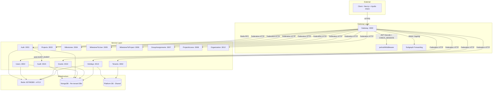
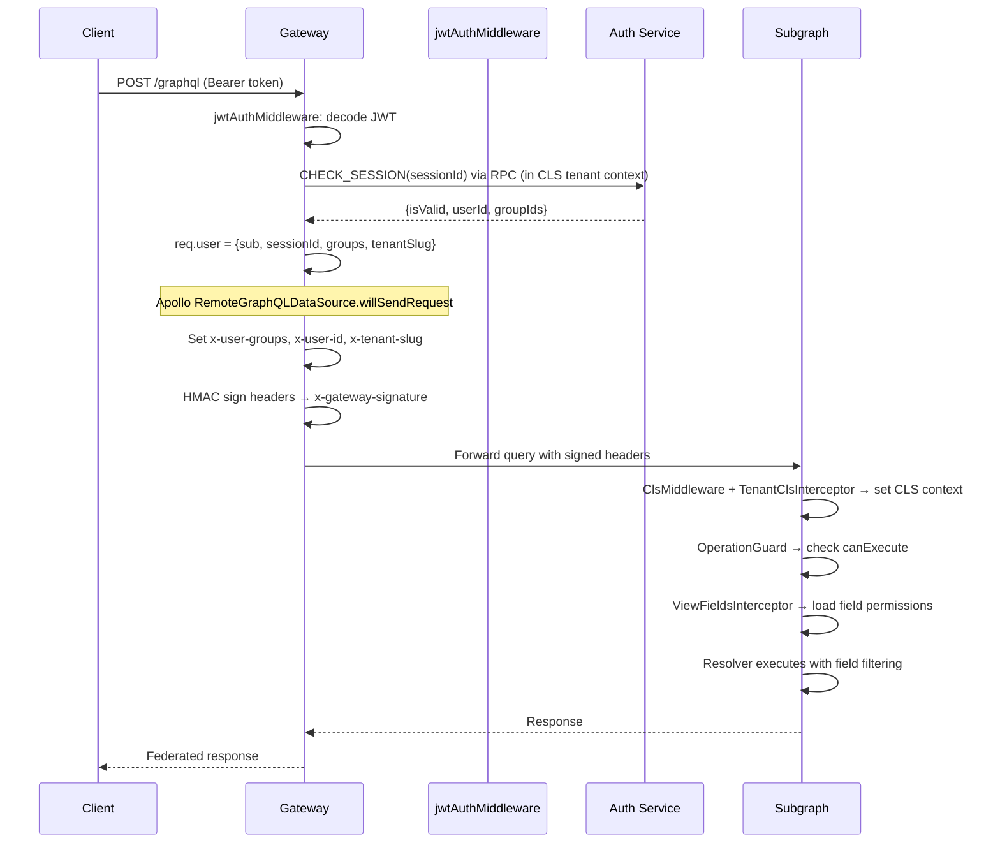
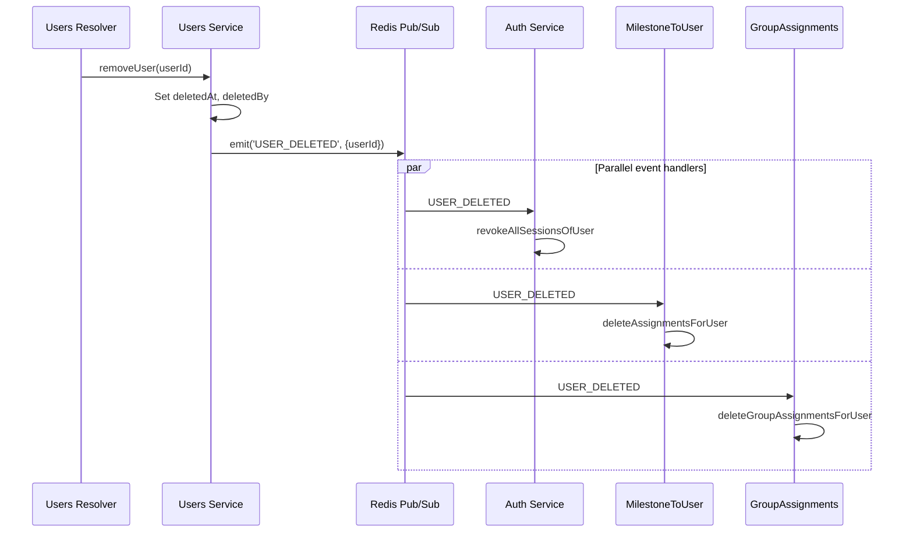
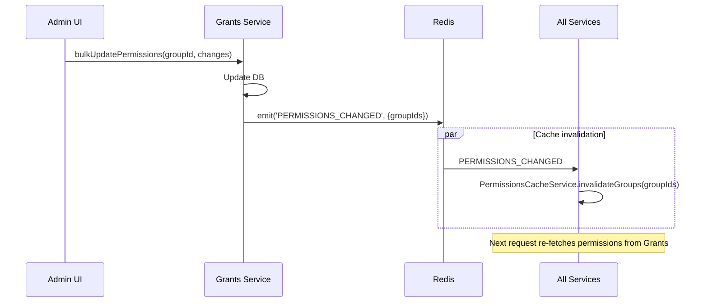
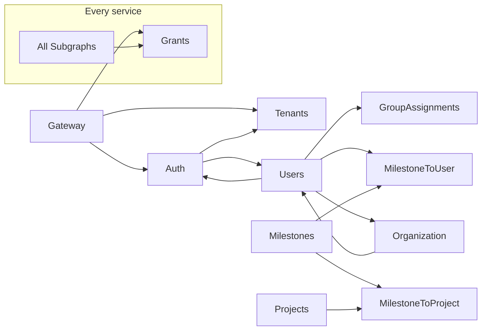

# System Architecture Overview

The Cucu platform is a **multi-tenant, distributed microservices architecture** built on NestJS with Apollo Federation 2. It implements a project management and resource allocation system with fine-grained permission control and complete tenant isolation at the database level.

## Major Phases Completed

| Phase | Date | Scope |
|-------|------|-------|
| **Phase 1: Multi-Tenant** | 15 Mar 2026 | Physical database isolation (database-per-tenant), TenantConnectionManager, The Wall whitelist, withTenantId() mixin |
| **Phase 2: Universal Auth** | 16 Mar 2026 | Atlassian-style login (email → discover tenants → select → password), tenant switch without re-login, signup multi-tenant, FE middleware + TenantProvider |
| **Phase 3: Security Audit** | 23 Mar 2026 | 7 findings fixed (F-031 to F-045), 239 new tests → ~980 total, RpcInternalGuard, MongoDB credential isolation, timing-safe verification, Gateway endpoint consolidation |
| **Phase 3.5: Service-Common Refactor** | 22 Mar 2026 | 9 sub-path exports, all tsconfig migrated to `moduleResolution: "node16"` |
| **Phase 4: nestjs-cls Migration** | 22 Mar 2026 | Root cause fix for Apollo Federation context, replaced raw AsyncLocalStorage with nestjs-cls, all 11 subgraph contexts updated |

## Design Principles

1. **Physical Database Isolation** — each tenant gets a separate MongoDB database per service (e.g., `users_acme`, `grants_acme`), not just a filter column. Implemented in Phase 1 with `TenantConnectionManager` (max 200 virtual connections, 15min idle timeout).
2. **Single Entry Point** — all client traffic flows through the Gateway, which validates JWT tokens and forwards HMAC-signed headers to subgraphs. HTTP endpoints consolidated in Phase 3.
3. **Federation over Monolith** — GraphQL schema is distributed across services via Apollo Federation 2; each service owns its domain entities. Fixed in Phase 4 via nestjs-cls to properly handle context across federation boundaries.
4. **Event-Driven Side Effects** — state changes propagate via Redis pub/sub events (fire-and-forget), while queries use request-response RPC. RPC calls are now authenticated via HMAC + `_internalSecret` (Phase 3, F-031).
5. **Permission as Data** — operation-level, field-level, and page-level permissions are stored in the Grants service and enforced at every subgraph. Protected operations require RPC auth (Phase 3).

## Service Inventory

| Service | Port | DB Convention | Domain |
|---------|------|---------------|--------|
| **gateway** | 3000 | N/A | Apollo Federation gateway, REST auth endpoints, JWT validation |
| **auth** | 3001 | `auth_{tenant}` | Session management, JWT token issuance, refresh rotation |
| **users** | 3002 | `users_{tenant}` | User CRUD, profiles (AuthData, PersonalData, EmploymentData) |
| **projects** | 3003 | `projects_{tenant}` | Project management, templates |
| **milestones** | 3004 | `milestones_{tenant}` | Milestone CRUD, status tracking, dependencies |
| **milestone-to-user** | 3005 | `milestone-to-user_{tenant}` | N:N user↔milestone assignments, resource daily allocations |
| **milestone-to-project** | 3006 | `milestone-to-project_{tenant}` | N:N project↔milestone assignments |
| **group-assignments** | 3007 | `group-assignments_{tenant}` | N:N user↔group assignments |
| **project-access** | 3008 | `project-access_{tenant}` | Project-level role-based access control |
| **grants** | 3010 | `grants_{tenant}` | Groups, Permissions, OperationPermissions, PagePermissions |
| **organization** | 3012 | `organization_{tenant}` | Lookup tables: SeniorityLevel, JobRole, Company, RoleCategory |
| **holidays** | 3013 | `holidays` (shared) + `holidays_{tenant}` | National holidays (shared), company closures, user absences |
| **tenants** | 3002 | Platform DB (shared) | Tenant registry, user identities, provisioning, `resolve/:slug` HTTP endpoint |
| **audit** | 3015 | `audit` (centralized) | Audit trail — persists security events via `AUDIT_EVENT` pattern |
| **bootstrap** | 3100 | N/A (RPC client) | Seed data initialization, multi-tenant provisioning |

## Architecture Diagram

## Data Flow Patterns

### Authenticated GraphQL Request

### Event-Driven Side Effects (User Deletion)

### Permission Change Propagation

## Service Dependencies

## Key Architectural Invariants

| Invariant | Implementation |
|-----------|---------------|
| **Signed Headers** | Gateway HMAC-signs `x-user-groups`, `x-user-id`, `x-tenant-slug`, `x-tenant-id`, `x-gateway-timestamp` with `INTERNAL_HEADER_SECRET`. Includes timestamp for anti-replay (30s window). Subgraphs verify via `verifyGatewaySignature()` |
| **Physical DB Isolation** | `TenantConnectionManager` creates per-tenant connections: `{serviceName}_{tenantSlug}`. The "Wall" rejects unknown tenant slugs |
| **Permission Cache** | 5-minute process-wide TTL with instant invalidation on `PERMISSIONS_CHANGED` events |
| **Soft Deletes** | Users use `deletedAt` timestamp; hard delete available as separate operation |
| **Session-Based Auth** | JWT access token (short-lived) + httpOnly refresh cookie (7d) + server-side session in MongoDB |
| **Tenant Context Propagation** | HTTP: `x-tenant-slug` header read by `ClsMiddleware` (from `nestjs-cls`). RPC: `_tenantSlug` field auto-injected by `TenantAwareClientProxy`, read by `TenantClsInterceptor`, stored in CLS context via `ClsService` |
| **RPC Security** | `RpcInternalGuard` validates `_internalSecret` on ALL RPC handlers (injected by `TenantAwareClientProxy`). `@SkipRpcGuard()` exempts specific handlers. |

## Test Coverage

| Repository | Tests | Scope |
|-----------|-------|-------|
| `cucu-nest` | 130 | Gateway (JWT middleware, session cache, auth controller), Auth (orchestrator, session, token), Tenants (provisioning, identity), Grants (permissions, guards) |
| `@cucu/service-common` | 63 | Redis TLS, TenantClsInterceptor, TenantAwareClientProxy, RpcInternalGuard, BaseSubgraphContext, password validators |
| `@cucu/tenant-db` | 30 | TenantConnectionManager (lifecycle, whitelist, pool, cleanup) |
| `@cucu/security` | 16 | FederationTokenService, verifyFederationJwt, verifyGatewaySignature |
| **Total** | **239** | |

## Technology Stack

| Layer | Technology |
|-------|-----------|
| Runtime | Node.js 22, NestJS 10 |
| GraphQL | Apollo Federation 2 (IntrospectAndCompose) |
| Database | MongoDB (per-tenant via Mongoose `useDb`) |
| Transport | Redis with mTLS (microservice RPC + event bus + cache) |
| Auth | Passport.js + JWT (RS256) + bcryptjs |
| Security | `@cucu/security` (RS256 federation JWTs, HMAC signature verification with anti-replay) |
| Shared Infra | `@cucu/service-common` (guards, interceptors, context, bootstrap, validators) |
| Multi-tenancy | `@cucu/tenant-db` (connection pooling) + `@cucu/service-common` (`nestjs-cls` context via `TenantClsModule`) |
| Orchestration | `@cucu/microservices-orchestrator` (dependency checking at startup) |

## Next Steps

- [Multi-Tenant Architecture](/architecture/multi-tenant) — complete DB isolation design
- [Service Communication](/architecture/communication) — RPC and event patterns
- [Apollo Federation](/architecture/federation) — entity resolution and cross-service fields
- [Authentication Flow](/architecture/auth-flow) — login, JWT, refresh, session lifecycle
- [Permission System](/architecture/permissions) — three-tier permission enforcement
- [Startup Orchestration](/architecture/startup) — service dependency checking
- [Security](/shared/security) — federation JWT signing, header verification, RPC guards
