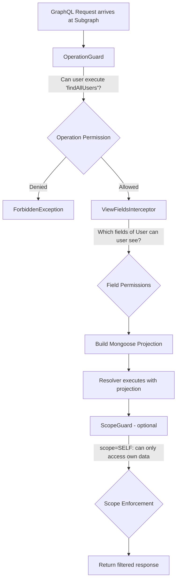
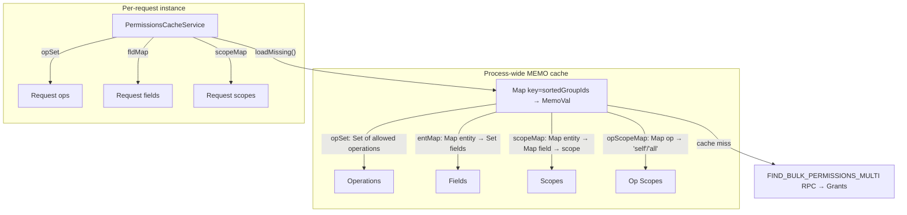

# Permission System

Cucu implements a **three-tier permission system** enforced at every subgraph. Permissions are stored in the Grants service (per-tenant), cached process-wide with 5-minute TTL, and invalidated instantly via Redis events.

## Permission Layers



### Layer 1: Operation Permissions (`OperationPermission`)

Controls **which GraphQL queries and mutations** a user's group(s) can execute.

```typescript
OperationPermission {
  _id: ObjectId
  groupId: string           // References Group._id
  operationName: string     // e.g., "findAllUsers", "createUser", "removeProject"
  canExecute: boolean       // true = allowed
  operationScope: 'self' | 'all'  // 'self' = own resources only
}

// Unique index: { groupId, operationName }
```

**Enforced by**: `OperationGuard` (registered as `APP_GUARD` on every subgraph)

**Logic**:
1. RPC calls: verify the user has groups (is authenticated). Individual RPC handlers handle fine-grained auth.
2. Internal federation calls without user context bypass
3. Extract operation name from GraphQL AST (`info.operation.selectionSet`)
4. Call `permCache.ensureOpAllowed(opName, userGroups)` → throws `ForbiddenException` if denied

**Note on RPC:** The OperationGuard does NOT check a specific `__rpc__` operation. Instead, for authenticated RPC calls (user has groups), it allows the call through. The service's own handlers are responsible for authorization.

### Layer 2: Field Permissions (`Permission`)

Controls **which fields of each entity** a user's group(s) can view or edit.

```typescript
Permission {
  _id: ObjectId
  groupId: string           // References Group._id
  entityName: string        // e.g., "User", "Project", "Milestone"
  fieldPath: string         // e.g., "authData.email", "personalData.dateOfBirth"
  canView: boolean
  canEdit: boolean
  viewScope: FieldScope[]   // ['self'] or ['all'] or ['self','all']
  editScope: FieldScope[]
}

// Unique index: { groupId, entityName, fieldPath }
```

**Enforced by**: `createViewFieldsInterceptor()` + `@ViewableFields()` decorator

**Flow**:
1. `ViewFieldsInterceptor` loads field permissions for the entity
2. Builds a `Set<string>` of viewable field paths
3. Injects the set via `@ViewableFields('User')` parameter decorator
4. Service builds a Mongoose projection from the set → only allowed fields are queried

### Layer 3: Page Permissions (`PagePermission`)

Controls **which UI pages** a user's group(s) can access. Enforced client-side by the frontend's `PageGuard`.

```typescript
PagePermission {
  _id: ObjectId
  groupId: string
  pageKey: string          // e.g., "people", "settings.seniorityLevels", "gantt"
  canAccess: boolean
}

// Unique index: { groupId, pageKey }
```

## Groups

Groups are the **permission boundary**. A user belongs to one or more groups; their effective permissions are the **union** of all group permissions (OR logic, most permissive wins).

```typescript
Group {
  _id: ObjectId
  name: string             // e.g., "SUPERADMIN", "HR", "PM", "VIEWER"
  description?: string
  deletedAt?: Date         // Soft delete support
}
```

Users are assigned to groups via the **GroupAssignments** service (N:N join table).

## PermissionsCacheService

The `PermissionsCacheService` is the central caching layer. It's **request-scoped** (one instance per request) but uses a **process-wide memo cache** with 5-minute TTL.

### Cache Architecture



### Cache Key

```
key = userGroupIds.sort().join(',')
// e.g., "65a1...,65a2...,65a3..."
```

### Cache Invalidation

When permissions change, the Grants service emits `PERMISSIONS_CHANGED` with affected `groupIds`. Every service listens:

```typescript
@EventPattern('PERMISSIONS_CHANGED')
handlePermissionsChanged(@Payload() data: { groupIds: string[] }) {
  PermissionsCacheService.invalidateGroups(data.groupIds);
}
```

`invalidateGroups()` scans the process-wide MEMO map and removes entries whose key contains any of the affected group IDs.

### Group Resolution Priority

The `PermissionsCacheService` resolves user groups from multiple sources (in order):

1. **Explicit groups** passed by the resolver
2. **`x-user-groups` header** (set by Gateway, verified via HMAC using `verifyGatewaySignature`)
3. **JWT `groups` claim** (decoded from Bearer token, verified via `verifyFederationJwt` for federation calls)
4. **CLS context** (for RPC calls — reads `cls.get('userGroups')` as fallback when no HTTP headers are available)
5. **`INTERNAL_CALL`** (for internal federation calls without user context)

**Important:** The CLS fallback (step 4) is critical for RPC flows. When a service calls another service via Redis RPC, there are no HTTP headers. The `TenantClsInterceptor` sets `userGroups` in CLS from the RPC payload, and `resolveGroups()` reads it as fallback.

See [Security](/shared/security.md) for details on header and JWT verification.
See [Communication](/architecture/communication.md) for CLS propagation in RPC flows.

## Scope Enforcement

### Operation Scope

Some operations are scope-restricted: `scope=self` means the user can only act on their own resources.

```typescript
// In resolver:
@ScopeCapable('userId')  // field name in args that contains the target userId
@UseGuards(ScopeGuard)
@Query(() => User, { name: 'findOneUser' })
async findOneUser(@Args('userId') userId: string) { ... }

// ScopeGuard checks:
// 1. Get operation scope from permCache.getOperationScope('findOneUser')
// 2. If scope === 'self', verify args.userId === currentUserId
// 3. If mismatch → ForbiddenException
```

### Field Scope

Fields can have different scopes:

| viewScope | Meaning |
|-----------|---------|
| `['all']` | Field visible on all records |
| `['self']` | Field visible only on the user's own record |
| `['self', 'all']` | Multiple groups grant different scopes — `all` wins |

```typescript
// In service:
const { allFields, selfFields } = this.permCache.getFieldsByScope('User');
// allFields: visible on any user
// selfFields: visible only when viewing own profile
```

## Introspection Integration

Each service uses `LocalSchemaFieldsService` (from `@cucu/field-level-grants`) to discover its own GraphQL schema fields at startup. This powers the grants admin UI — it can show all possible fields across all services:

```typescript
// In module onModuleInit:
this.introspectionFields.configure({
  maxDepth: 2,
  allowedTypes: ['User', 'AuthData', 'PersonalData', 'EmploymentData'],
});
this.introspectionFields.warmUpEntities(['User', 'AuthData', ...]);
```

The Grants service exposes introspection queries via `IntrospectionResolver`:
- `listFieldsFromGateway(typeName)` — list all nested fields of a type
- `listQueryFromGateway(serviceName)` — list all queries for a service
- `listMutationsFromGateway(serviceName)` — list all mutations for a service

## CheckFieldView Decorator

For `@ResolveField()` resolvers, the `@CheckFieldView` decorator + `FieldViewInterceptor` checks if the user has permission to view a specific field before the resolver executes:

```typescript
@CheckFieldView('User', 'subordinates')
@UseInterceptors(FieldViewInterceptor)
@ResolveField(() => [User], { nullable: true })
async subordinates(@Parent() user: User) { ... }
```

If the user's group doesn't have `canView: true` for `User.subordinates`, the resolver is skipped and `null` is returned.

## MyPermissions Query

The `myPermissions` query (on Grants resolver) returns the current user's effective permissions — used by the frontend to build UI controls:

```graphql
query {
  myPermissions {
    operations    # ["findAllUsers", "createUser", ...]
    fields {      # { User: ["_id", "authData.name", ...] }
      entityName
      paths
    }
    pages         # ["people", "settings", ...]
  }
}
```

This query uses `@SkipOperationGuard()` — everyone can query their own permissions.

## Bulk Permission Updates

The admin UI uses batch mutations for efficient permission management:

```graphql
mutation {
  bulkUpdatePermissions(groupId: "...", inputs: [
    { entityName: "User", fieldPath: "authData.email", canView: true, viewScope: [ALL] },
    { entityName: "User", fieldPath: "personalData.dateOfBirth", canView: true, viewScope: [SELF] },
  ]) { _id }
  
  bulkUpdateOperationPermissions(groupId: "...", inputs: [
    { operationName: "findAllUsers", canExecute: true, operationScope: ALL },
    { operationName: "removeUser", canExecute: false },
  ]) { _id }
}
```

After each bulk update, the Grants service emits `PERMISSIONS_CHANGED` to invalidate caches across all services.
