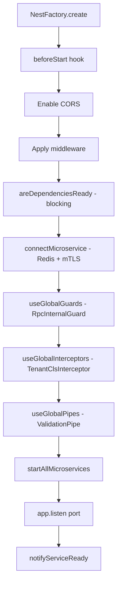
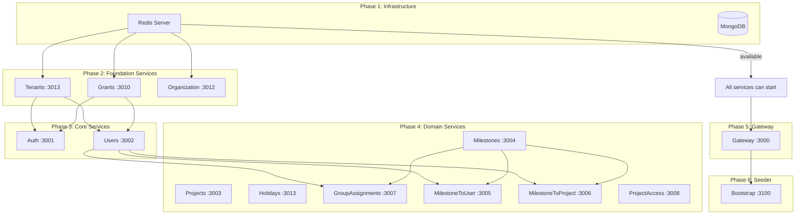
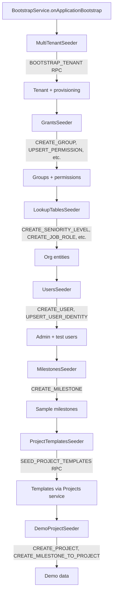

# Startup & Orchestration

Cucu uses a shared bootstrap function (`createSubgraphMicroservice`) and a dependency orchestration system (`@cucu/microservices-orchestrator`) to ensure services start in the correct order and all dependencies are available.

## Shared Bootstrap: `createSubgraphMicroservice()`

Every subgraph service (except Gateway and Bootstrap) uses the same bootstrap function:

```typescript
// Example: auth/src/main.ts
import { AuthModule } from './auth.module';
import { createSubgraphMicroservice } from '@cucu/service-common';
import * as cookieParser from 'cookie-parser';

async function bootstrap() {
  await createSubgraphMicroservice(AuthModule, 'AUTH', {
    cors: { origin: process.env.CORS_ORIGIN, credentials: true },
    beforeStart: (app) => app.use(cookieParser()),
  });
}
bootstrap();
```

### What `createSubgraphMicroservice` Does

1. **Create NestJS app** via `NestFactory.create(module)`
2. **Apply hooks** — `beforeStart` callback (e.g., cookieParser)
3. **Enable CORS** if configured
4. **Apply middleware** if provided
5. **Get ConfigService** and **MicroservicesOrchestratorService**
6. **Check dependencies** — `areDependenciesReady(serviceName, redisConfig)`
7. **Connect Redis microservice** — `Transport.REDIS` with mTLS, `inheritAppConfig: true` (overridable via `connectMicroserviceOptions`)
8. **Register global guards** — `RpcInternalGuard` (validates `_internalSecret` in RPC payloads)
9. **Register global interceptors** — `TenantClsInterceptor` (extracts tenant from headers/RPC, sets CLS context, strips metadata)
10. **Register global pipes** — `ValidationPipe` (whitelist, forbidNonWhitelisted, transform)
11. **Start microservices** — `app.startAllMicroservices()`
12. **Listen HTTP** — `app.listen(port)` from `{PREFIX}_SERVICE_PORT`
13. **Notify ready** — `orchestratorService.notifyServiceReady(serviceName, redisConfig)`

### `inheritAppConfig: true`

This is the default — it ensures that `APP_INTERCEPTOR`, `APP_GUARD`, and `APP_PIPE` registered in modules are also applied to the microservice transport (RPC handlers). The Gateway overrides this with `{ inheritAppConfig: false }` because its `APP_GUARD` providers (`GlobalAuthGuard`, `ThrottlerGuard`) are HTTP-only.

::: info
`TenantClsInterceptor` and `RpcInternalGuard` are registered via `app.useGlobalInterceptors()` / `app.useGlobalGuards()` (not as `APP_INTERCEPTOR`/`APP_GUARD`), so they apply to ALL transports regardless of `inheritAppConfig`.
:::

### Execution Order



## Dependency Orchestration

The `@cucu/microservices-orchestrator` module ensures services wait for their dependencies before accepting requests.

### How It Works

Each service:
1. **Declares dependencies** (implicit — the orchestrator checks Redis connectivity)
2. **Blocks at startup** until dependencies are ready via `areDependenciesReady()`
3. **Notifies readiness** after HTTP + microservice transport are both listening

The orchestrator uses **Redis pub/sub** for service readiness notifications:
- Each service publishes a "ready" message on a known channel
- Dependent services subscribe and wait for the message
- Configurable retry count and delay

### Configuration

```typescript
await orchestratorService.areDependenciesReady(serviceName, {
  redisServiceHost,
  redisServicePort,
  useTls: true,
  redisTlsCertPath,
  redisTlsKeyPath,
  redisTlsCaPath,
  ...orchestratorOptions, // optional retry/retryDelays overrides
});
```

## Service Startup Order

The typical startup sequence in production:



::: info
The Gateway must start after all subgraphs are available because `IntrospectAndCompose` queries each subgraph's schema at startup. If a subgraph is missing, composition fails.
:::

## Module Initialization (`onModuleInit`)

Several services perform initialization work in `onModuleInit`:

### All Services with Permissions

```typescript
async onModuleInit() {
  this.introspectionFields.configure({
    maxDepth: 2,
    debug: true,
    allowedTypes: ['User', 'AuthData', 'PersonalData', ...],
  });
  this.introspectionFields.warmUpEntities(['User', 'AuthData', ...]);
}
```

This pre-introspects the local GraphQL schema to discover all fields — required for the field-level permission system.

### Holidays Service

```typescript
async onModuleInit() {
  // ... introspection setup ...
  await this.holidayCalendarService.seedHolidays();     // Seeds national holidays (shared DB)
}
```

The Holidays service seeds national holiday data on startup. Since national holidays are stored in a shared database (not per-tenant), this seeding happens without tenant context.

### TenantDatabaseModule

```typescript
async onModuleInit() {
  await this.manager.init(); // Establishes the base MongoDB connection
}
```

## Bootstrap Service

The Bootstrap service is a **one-shot seeder** that runs after all services are available. It creates initial data via RPC calls to other services:

### Seeder Execution Order



### Key Design Decisions

1. **RPC-based seeding** — Bootstrap doesn't access databases directly; it calls services via Redis RPC. This ensures all business logic (validation, events) runs correctly.
2. **Idempotent** — Each seeder checks if data already exists before creating. Safe to run multiple times.
3. **RpcInternalGuard** — Bootstrap uses `_internalSecret` in payloads to authenticate to protected endpoints.
4. **Multi-tenant aware** — Bootstrap creates tenants first, then seeds data within each tenant's context.

## Gateway Bootstrap

The Gateway now uses `createSubgraphMicroservice()` with custom options:

```typescript
// gateway/src/main.ts
createSubgraphMicroservice(AppModule, 'GATEWAY', {
  beforeStart: async (app) => {
    app.use(cookieParser());
    
    // JWT auth middleware with CHECK_SESSION — must run before Apollo Gateway
    const authClient = app.get('AUTH_SERVICE') as ClientProxy;
    const cls = app.get(ClsService) as ClsService<TenantClsStore>;
    app.use(createJwtAuthMiddleware(authClient, cls));
  },
  middleware: [
    // Strip internal headers from external requests (prevent spoofing)
    (req, res, next) => {
      delete req.headers['x-internal-federation-call'];
      delete req.headers['x-user-groups'];
      delete req.headers['x-user-id'];
      delete req.headers['x-gateway-signature'];
      delete req.headers['x-tenant-slug'];
      delete req.headers['x-tenant-id'];
      next();
    },
  ],
  // Gateway's APP_GUARDs (GlobalAuthGuard, ThrottlerGuard) are HTTP-only.
  // inheritAppConfig: false prevents them from being applied to Redis RPC handlers.
  connectMicroserviceOptions: { inheritAppConfig: false },
  orchestratorOptions: { retry: 15, retryDelays: 6000 },
});
```

Key differences from other services:
- **JWT Auth Middleware** in `beforeStart`: Decodes JWT and validates session via `CHECK_SESSION` RPC before Apollo processes the request
- **Header sanitization** in `middleware`: Strips internal headers to prevent external spoofing
- **`inheritAppConfig: false`**: Prevents HTTP-only guards from applying to Redis transport

## Health Monitoring

The `TenantConnectionManager` exposes pool statistics:

```typescript
manager.getStats(): {
  activePools: number,           // Currently active tenant connections
  baseConnectionState: number,   // Mongoose ready state (1 = connected)
  pools: [{
    dbName: string,              // e.g., "users_acme"
    readyState: number,
    lastAccess: Date,
  }]
}
```

This can be used by health check endpoints to monitor multi-tenant connection health.
