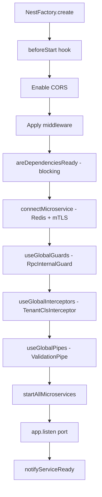
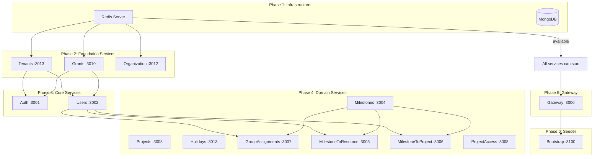
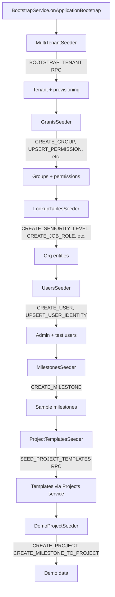

# Startup & Orchestration

## Local Kubernetes profile — 15 September 2026

The authorized local profile is now **Colima `cucu`**, not Docker Desktop:
one ARM64 VM (6 CPUs / 10 GiB), K3s 1.35.0+k3s1 and Docker 29.5.2 through
cri-dockerd. This supersedes earlier Desktop-only instructions for local work;
it does not establish remote or production readiness.

The `cucu-dev` namespace declares 19 long-running application Deployments and
20 independent datastore StatefulSets: 19 Mongo instances (including the
Holidays shared database) and one Redis. Gateway has no Mongo; Audit owns its
central Mongo and remains event-only. Bootstrap is the twentieth image but runs
as an explicit Job, not a resident service.

Applications and databases are separate Pods at the same namespace level.
The label `cucu.io/domain=projects` identifies both the Projects app and its Mongo;
it does not create an intermediate Kubernetes object.
Every app has one replica. The Colima overlay uses **Recreate**, so an update
terminates the previous app Pod before starting its replacement. This accepts
brief downtime and prevents overlapping replicas with the current Redis Pub/Sub
RPC contract. Database Pod lifecycles and retained PVCs remain independent.
Other chart overlays retain their prior RollingUpdate default.

The profile keeps owner-scoped credentials, Mongo TLS, Redis mTLS/ACL,
fail-closed Secret mount admission, namespace default-deny networking,
restricted Pod security and resource budgets. K3s Secret encryption is enabled.
CA recovery keys stay outside the VM; **Retain is not backup**. Frontend remains
on the Mac; its existing HTTP-only client/server-auth URLs still need a separate
TLS integration check. A passing authenticated backend E2E is not a frontend UI
validation. Only Gateway is forwarded locally over TLS. Headlamp runs separately
in `cucu-observe`, with read-only access. The earlier synthetic trial and its
PVCs are preserved.

The canonical backend runbook is
[`infra/kubernetes/images/COLIMA.md`](https://github.com/CucuProject/cucu-nest/blob/jarvisbotpot/cuc-429-real-app-stack/infra/kubernetes/images/COLIMA.md).
Build and proof commands explicitly select `colima-cucu` and its dedicated
kubeconfig. Images are built serially from committed allowlisted sources,
loaded once into the shared Docker/K3s image store and referenced by digest.
No Compose reset, legacy data migration, Tilt enablement or release-to-main merge
is part of this change.

The first full Colima seed exposed a transport mismatch in the default-currency
lookup: authenticated RPC enrichment wraps primitive payloads. Bootstrap now
sends an explicit `{ id }` object; Tenants accepts it and retains legacy direct
string compatibility, while rejecting malformed envelopes. Currency update
counts require a returned `defaultCurrency: EUR` postcondition, not only an
Observable completion. The failed Job and partial tenant data are retained for
recovery; no shared-library or access-control bypass was introduced.

The local checkpoint passed with19/19 apps and20/20 datastores Ready. A real
Projects image update completed in6.85s without replacing any database Pod/PVC.
ACME recovery and rerun both completed without warnings/errors and preserved
16 databases,36 collections and3,006 documents. The same totals and sentinel
values survived a VM reboot; authenticated Commercial→Projects, anonymous/revoked
denials and controlled dependency recovery passed again afterward. Historical
Auth startup restarts are retained; both E2E runs had zero restart delta.

Full-program readiness remains distinct from a passing local checkpoint:
remote deployment, backup/restore, sustained sizing and the existing upstream
shared-library dependency still have their own gates.

Cucu uses a shared bootstrap function (`createSubgraphMicroservice`) and a dependency orchestration system (`@cucu/microservices-orchestrator`) to ensure services start in the correct order and all dependencies are available.

## Shared Bootstrap: `createSubgraphMicroservice()`

Every subgraph service (except Gateway and Bootstrap) uses the same bootstrap function:

```typescript
// Example: auth/src/main.ts
import { AuthModule } from './auth.module';
import { createSubgraphMicroservice } from '@cucu/service-common';
import * as cookieParser from 'cookie-parser';

async function bootstrap() {
  await createSubgraphMicroservice(AuthModule, 'AUTH', {
    cors: { origin: process.env.CORS_ORIGIN, credentials: true },
    beforeStart: (app) => app.use(cookieParser()),
  });
}
bootstrap();
```

### What `createSubgraphMicroservice` Does

1. **Create NestJS app** via `NestFactory.create(module)`
2. **Apply hooks** — `beforeStart` callback (e.g., cookieParser)
3. **Enable CORS** if configured
4. **Apply middleware** if provided
5. **Get ConfigService** and **MicroservicesOrchestratorService**
6. **Check dependencies** — `areDependenciesReady(serviceName, redisConfig)`
7. **Connect Redis microservice** — `Transport.REDIS` with mTLS, `inheritAppConfig: true` (default, overridable)
8. **Register global guards** — `RpcInternalGuard` (fail-closed, validates `_internalSecret`)
9. **Register global interceptors** — `TenantClsInterceptor` (reads tenant from CLS for HTTP, extracts from RPC payload for Redis, strips `_tenantSlug`/`_tenantId` before ValidationPipe)
10. **Register global pipes** — `ValidationPipe` with `whitelist: true`, `forbidNonWhitelisted: true`, `transform: true`. Runs **after** interceptors strip tenant transport fields — this is critical because `_tenantSlug` and `_internalSecret` are not declared in handler DTOs and would be rejected by `forbidNonWhitelisted`
11. **Start microservices** — `app.startAllMicroservices()`
12. **Listen HTTP** — `app.listen(port)` from `{PREFIX}_SERVICE_PORT`
13. **Notify ready** — `orchestratorService.notifyServiceReady(serviceName, redisConfig)`

### `inheritAppConfig: true`

This is the default for subgraph services — it ensures that `APP_INTERCEPTOR`, `APP_GUARD`, and `APP_PIPE` registered in modules are also applied to the microservice transport (RPC handlers). Without it, module-level interceptors wouldn't run on RPC messages.

Note: The Gateway overrides this with `inheritAppConfig: false` because its `APP_GUARD`s (`GlobalAuthGuard`, `ThrottlerGuard`) are designed for HTTP/GraphQL only and should not apply to Redis RPC handlers. The `TenantClsInterceptor` still works because it's registered via `app.useGlobalInterceptors()`, which applies to all transports regardless of `inheritAppConfig`.

### Execution Order


```mermaid
flowchart TD
    A[NestFactory.create] --> B[beforeStart hook]
    B --> C[Enable CORS]
    C --> D[Apply middleware]
    D --> E[areDependenciesReady - blocking]
    E --> F[connectMicroservice - Redis + mTLS]
    F --> G1[useGlobalGuards - RpcInternalGuard]
    G1 --> G[useGlobalInterceptors - TenantClsInterceptor]
    G --> H[useGlobalPipes - ValidationPipe]
    H --> I[startAllMicroservices]
    I --> J[app.listen port]
    J --> K[notifyServiceReady]
```

## Dependency Orchestration

The `@cucu/microservices-orchestrator` module ensures services wait for their dependencies before accepting requests.

### How It Works

Each service:
1. **Declares dependencies** (implicit — the orchestrator checks Redis connectivity)
2. **Blocks at startup** until dependencies are ready via `areDependenciesReady()`
3. **Notifies readiness** after HTTP + microservice transport are both listening

The orchestrator uses **Redis pub/sub** for service readiness notifications:
- Each service publishes a "ready" message on a known channel
- Dependent services subscribe and wait for the message
- Configurable retry count and delay

### Configuration

```typescript
await orchestratorService.areDependenciesReady(serviceName, {
  redisServiceHost,
  redisServicePort,
  useTls: true,
  redisTlsCertPath,
  redisTlsKeyPath,
  redisTlsCaPath,
  ...orchestratorOptions, // optional retry/retryDelays overrides
});
```

## Service Startup Order

The typical startup sequence in production:


```mermaid
flowchart TD
    REDIS[Redis Server] --> |available| ALL[All services can start]
    
    subgraph "Phase 1: Infrastructure"
        REDIS
        MONGODB[(MongoDB)]
    end
    
    subgraph "Phase 2: Foundation Services"
        TENANTS[Tenants :3013]
        GRANTS[Grants :3010]
        ORG[Organization :3012]
    end
    
    subgraph "Phase 3: Core Services"
        AUTH[Auth :3001]
        USERS[Users :3002]
    end
    
    subgraph "Phase 4: Domain Services"
        MILESTONES[Milestones :3004]
        PROJECTS[Projects :3003]
        HOLIDAYS[Holidays :3013]
        GA[GroupAssignments :3007]
        MTR[MilestoneToResource :3005]
        M2P[MilestoneToProject :3006]
        PA[ProjectAccess :3008]
    end
    
    subgraph "Phase 5: Gateway"
        GW[Gateway :3000]
    end
    
    subgraph "Phase 6: Seeder"
        BOOTSTRAP[Bootstrap :3100]
    end
    
    REDIS --> TENANTS & GRANTS & ORG
    TENANTS & GRANTS --> AUTH & USERS
    USERS & MILESTONES --> MTR & M2P & GA
    ALL --> GW
    GW --> BOOTSTRAP
```

::: info
The Gateway must start after all subgraphs are available because `IntrospectAndCompose` queries each subgraph's schema at startup. If a subgraph is missing, composition fails.
:::

## Module Initialization (`onModuleInit`)

Several services perform initialization work in `onModuleInit`:

### All Services with Permissions

```typescript
async onModuleInit() {
  this.introspectionFields.configure({
    maxDepth: 2,
    debug: true,
    allowedTypes: ['User', 'AuthData', 'PersonalData', ...],
  });
  this.introspectionFields.warmUpEntities(['User', 'AuthData', ...]);
}
```

This pre-introspects the local GraphQL schema to discover all fields — required for the field-level permission system.

### Holidays Service

```typescript
async onModuleInit() {
  // ... introspection setup ...
  await this.holidayCalendarService.seedHolidays();     // Seeds national holidays (shared DB)
}
```

The Holidays service seeds national holiday data on startup. Since national holidays are stored in a shared database (not per-tenant), this seeding happens without tenant context.

### TenantDatabaseModule

```typescript
async onModuleInit() {
  await this.manager.init(); // Establishes the base MongoDB connection
}
```

## Bootstrap Service

The Bootstrap service is a **one-shot seeder** that runs after all services are available. It creates initial data via RPC calls to other services:

### Seeder Execution Order


```mermaid
flowchart TD
    A[BootstrapService.onApplicationBootstrap] --> B[MultiTenantSeeder]
    B --> |"BOOTSTRAP_TENANT RPC"| C[Tenant + provisioning]
    C --> D[GrantsSeeder]
    D --> |"CREATE_GROUP, UPSERT_PERMISSION, etc."| E[Groups + permissions]
    E --> F[LookupTablesSeeder]
    F --> |"CREATE_SENIORITY_LEVEL, CREATE_JOB_ROLE, etc."| G[Org entities]
    G --> H[UsersSeeder]
    H --> |"CREATE_USER, UPSERT_USER_IDENTITY"| I[Admin + test users]
    I --> J[MilestonesSeeder]
    J --> |"CREATE_MILESTONE"| K[Sample milestones]
    K --> L[ProjectTemplatesSeeder]
    L --> |"SEED_PROJECT_TEMPLATES RPC"| M[Templates via Projects service]
    M --> N[DemoProjectSeeder]
    N --> |"CREATE_PROJECT, CREATE_MILESTONE_TO_PROJECT"| O[Demo data]
```

### Key Design Decisions

1. **RPC-based seeding** — Bootstrap doesn't access databases directly; it calls services via Redis RPC. This ensures all business logic (validation, events) runs correctly.
2. **Rerun is gated, not assumed** — Seeders use a mix of lookup-before-create, upsert, and optional best-effort paths. A new explicit run is accepted only after its redacted step report, authoritative database totals, and authenticated E2E prove the selected tenant is ready and a rerun does not drift. Per-step mutation count coverage remains incomplete until CUC-251 is complete; converted steps alone are marked operation-authoritative.
3. **Internal RPC authentication** — Legacy calls still carry `_internalSecret`. On the CUC-430 Kubernetes path, allowlisted mutating RPCs also use signed envelopes derived from a dedicated owner-mounted signing file; the runtime trims mounted values and fails closed when either credential is missing.
4. **Multi-tenant aware** — Bootstrap creates tenants first, then seeds data within each tenant's context.
5. **Explicit Kubernetes runs** — The Kubernetes seeder is rendered as an immutable Job with a unique run id and applied explicitly; it is not a Helm hook.

## Gateway Bootstrap

The Gateway uses `createSubgraphMicroservice()` with custom options:

```typescript
// gateway/src/main.ts
createSubgraphMicroservice(AppModule, 'GATEWAY', {
  beforeStart: async (app) => {
    app.use(cookieParser());

    // Get DI services for the JWT auth middleware
    const authClient = app.get('AUTH_SERVICE') as ClientProxy;
    const cls = app.get(ClsService) as ClsService<TenantClsStore>;

    // JWT auth middleware with CHECK_SESSION — must run before Apollo Gateway
    // processes the request so that willSendRequest sees a validated req.user
    app.use(createJwtAuthMiddleware(authClient, cls));
  },
  // inheritAppConfig: false prevents APP_GUARDs (GlobalAuthGuard, ThrottlerGuard)
  // from applying to Redis RPC handlers (they're designed for HTTP/GraphQL only).
  connectMicroserviceOptions: { inheritAppConfig: false },
  orchestratorOptions: { retry: 15, retryDelays: 6000 },
});
```

The Gateway also strips all internal headers (`x-internal-federation-call`, `x-user-groups`, `x-user-id`, `x-gateway-signature`, `x-gateway-timestamp`, `x-tenant-slug`, `x-tenant-id`, `x-user-email`) from incoming client requests via Express middleware — preventing header spoofing.

## Health Monitoring

The `TenantConnectionManager` exposes pool statistics:

```typescript
manager.getStats(): {
  activePools: number,           // Currently active tenant connections
  baseConnectionState: number,   // Mongoose ready state (1 = connected)
  pools: [{
    dbName: string,              // e.g., "users_acme"
    readyState: number,
    lastAccess: Date,
  }]
}
```

This can be used by health check endpoints to monitor multi-tenant connection health.
