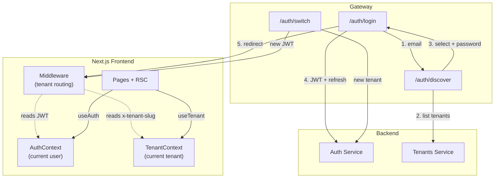
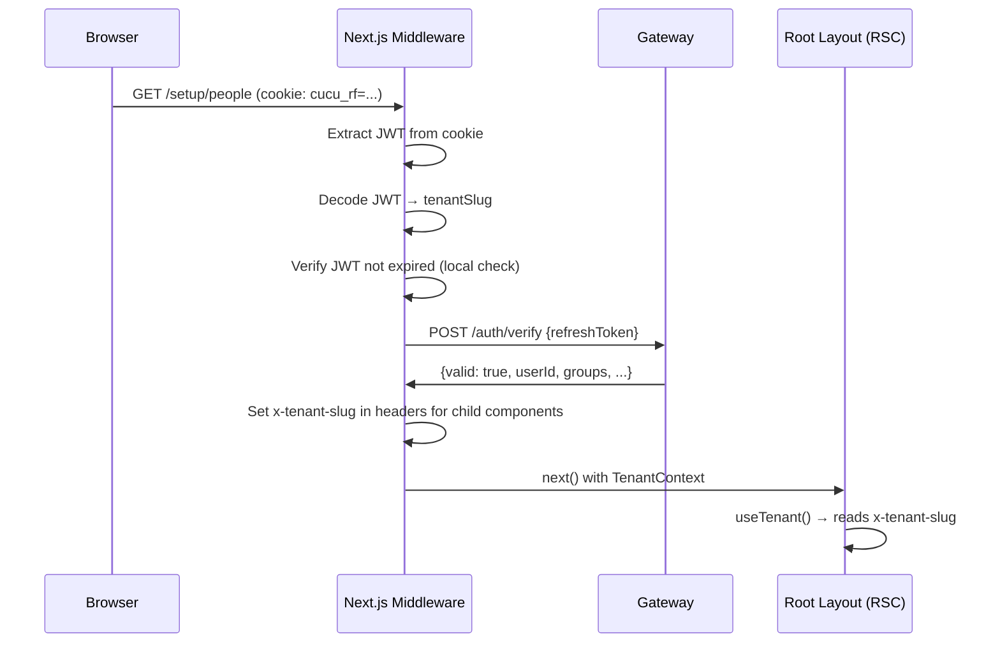
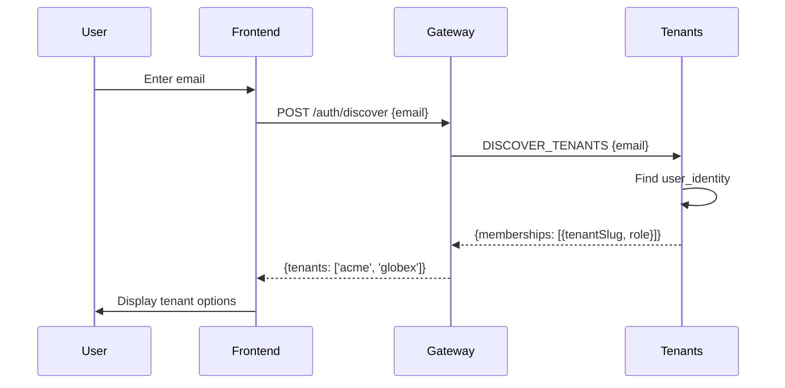
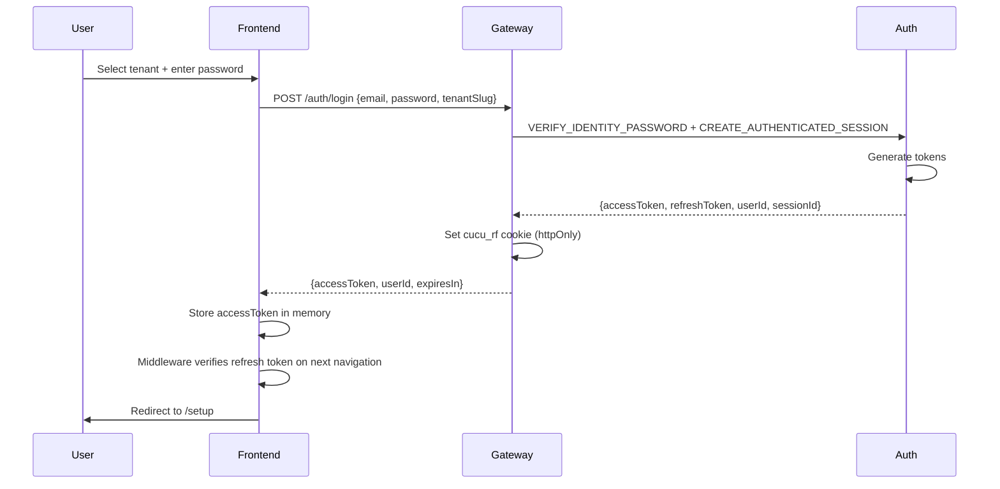
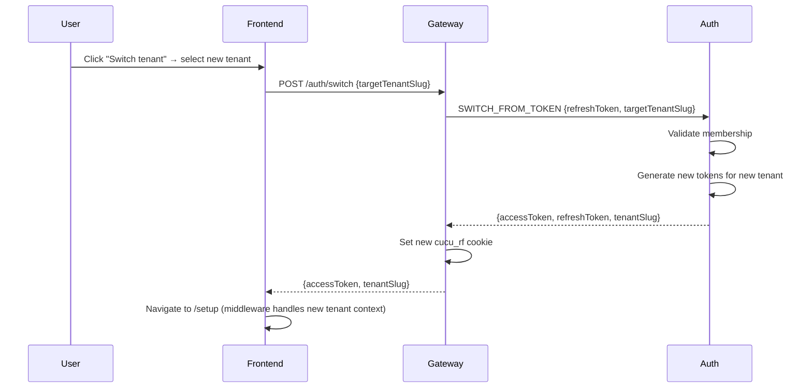
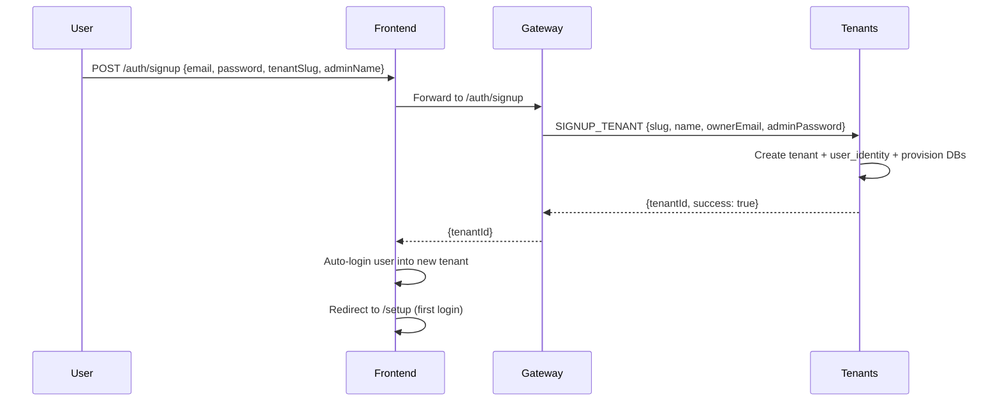

# Universal Auth — Frontend Implementation

> Completed: 16 March 2026
> Frontend PR: #308-#309, #321-#323

The Universal Auth model enables a single email address to log in to multiple tenants without re-authentication. The frontend implements tenant discovery, selection, and switching via Next.js middleware and React context.

## Architecture Overview



## Middleware (Tenant Routing)

**File:** `apps/frontend/src/middleware.ts`

The Next.js middleware runs on every request and establishes tenant context before page rendering.

### Responsibilities

1. **JWT Validation** — decode refresh token from `cucu_rf` / `__Host-rf` cookie
2. **Tenant Extraction** — read `tenantSlug` from JWT
3. **Routing Mode Detection** — determine if using path-based (`/t/{slug}`) or subdomain-based (`{slug}.cucu.io`) routing
4. **CLS Context** — inject tenant slug for downstream RPC calls
5. **Unauthorized Handling** — redirect to login if no valid JWT

### Flow



### Tenant Routing Modes

**Development (path-based):**
```
http://localhost:4000/t/acme/setup/people
                      ^
                 tenant path prefix
```

**Production (subdomain-based):**
```
https://acme.cucu.io/setup/people
       ^
   tenant subdomain
```

Both modes resolve to the same page content — the difference is only in URL structure.

### Implementation Details

```typescript
// src/middleware.ts
export async function middleware(request: NextRequest) {
  const refreshToken = request.cookies.get('cucu_rf')?.value;
  
  if (!refreshToken) {
    return NextResponse.redirect(new URL('/login', request.url));
  }

  // Decode JWT to extract tenantSlug
  const decoded = jwtDecode(refreshToken); // Local decode, no verification
  const tenantSlug = decoded.tenantSlug;

  if (!tenantSlug) {
    return NextResponse.redirect(new URL('/login', request.url));
  }

  // Verify JWT with backend (CHECK_SESSION)
  const verifyResponse = await fetch(`${GATEWAY_URL}/auth/verify`, {
    method: 'POST',
    headers: { 'Content-Type': 'application/json' },
    body: JSON.stringify({ refreshToken }),
  });

  if (!verifyResponse.ok) {
    // Invalid or expired session
    return NextResponse.redirect(new URL('/login', request.url));
  }

  const { valid, userId, groups } = await verifyResponse.json();
  
  if (!valid) {
    return NextResponse.redirect(new URL('/login', request.url));
  }

  // Set x-tenant-slug header for downstream components
  const response = NextResponse.next();
  response.headers.set('x-tenant-slug', tenantSlug);
  response.headers.set('x-user-id', userId);
  response.headers.set('x-user-groups', JSON.stringify(groups));

  return response;
}

export const config = {
  matcher: [
    // Match all routes except public ones
    '/((?!login|signup|auth|_next/static|_next/image|favicon.ico).*)',
  ],
};
```

## AuthContext (User State)

**File:** `src/contexts/auth-context.tsx`

React context that exposes current user information and authentication methods.

### Shape

```typescript
interface AuthContextType {
  user: {
    sub: string;           // userId
    sessionId: string;
    groups: string[];
    tenantSlug: string;
    tenantId: string;
  } | null;
  isAuthenticated: boolean;
  isLoading: boolean;
  login(email: string, password: string, tenantSlug?: string): Promise<void>;
  logout(): Promise<void>;
  switchTenant(tenantSlug: string): Promise<void>;
  discoverTenants(email: string): Promise<string[]>;
  refetchUser(): Promise<void>;
}
```

### Usage

```typescript
// In any component
const { user, isAuthenticated, login, logout } = useAuth();

if (!isAuthenticated) {
  return <LoginForm onSubmit={login} />;
}

return <Dashboard user={user} />;
```

## TenantContext (Tenant State)

**File:** `src/contexts/tenant-context.tsx`

React context that exposes current tenant information (from middleware).

### Shape

```typescript
interface TenantContextType {
  slug: string;           // e.g., 'acme'
  id: string;             // ObjectId from JWT
  getTenantPath(path: string): string;  // Handles routing mode
  prefixPath(pathname: string): string; // Add /t/{slug} if path-based
}
```

### Usage

```typescript
const { slug, prefixPath } = useTenant();

// Navigation
router.push(prefixPath('/setup/people'));
// → "/t/acme/setup/people" (path mode) or "/setup/people" (subdomain mode)

// Link href
<Link href={prefixPath('/projects')}>Projects</Link>
```

## Login Flow (Discover + Select)

The login flow is a two-step process: email → tenant selection → password.

### Step 1: Email Discovery



### Step 2: Password Login



### Frontend Component

```typescript
// pages/login.tsx
export default function LoginPage() {
  const [step, setStep] = useState<'email' | 'password'>('email');
  const [email, setEmail] = useState('');
  const [selectedTenant, setSelectedTenant] = useState<string | null>(null);
  const [tenants, setTenants] = useState<string[]>([]);
  const { login } = useAuth();

  const handleDiscoverEmail = async (email: string) => {
    const response = await fetch(`${GATEWAY_URL}/auth/discover`, {
      method: 'POST',
      body: JSON.stringify({ email }),
    });
    const { tenants } = await response.json();
    setEmail(email);
    setTenants(tenants);
    setStep('password');
  };

  const handleLogin = async (password: string) => {
    await login(email, password, selectedTenant!);
  };

  if (step === 'email') {
    return <EmailInput onSubmit={handleDiscoverEmail} />;
  }

  return (
    <TenantSelect
      tenants={tenants}
      onSelect={setSelectedTenant}
      onPassword={handleLogin}
    />
  );
}
```

## Tenant Switch Flow

Users with multiple tenant memberships can switch without re-logging in.



### Frontend Component

```typescript
// Header tenant switcher
export function TenantSwitcher() {
  const { user } = useAuth();
  const { slug } = useTenant();
  const [memberships, setMemberships] = useState<string[]>([]);

  useEffect(() => {
    // Load memberships from AuthContext
    setMemberships(user?.memberships?.map(m => m.tenantSlug) ?? []);
  }, [user]);

  const handleSwitch = async (newSlug: string) => {
    const response = await fetch(`${GATEWAY_URL}/auth/switch`, {
      method: 'POST',
      body: JSON.stringify({ targetTenantSlug: newSlug }),
    });
    const { accessToken } = await response.json();
    
    // Middleware will handle redirect and tenant context update
    router.push('/setup');
  };

  return (
    <Select
      value={slug}
      onChange={handleSwitch}
      options={memberships}
    />
  );
}
```

## Signup Flow (Multi-Tenant)

New users can sign up for a new tenant or join an existing one.



### Frontend Component

```typescript
// pages/signup.tsx
export default function SignupPage() {
  const { login } = useAuth();
  const [formData, setFormData] = useState({
    email: '',
    password: '',
    tenantName: '', // The company name
    tenantSlug: '', // Derived from tenantName
    adminName: '',
  });

  const handleSignup = async (e: React.FormEvent) => {
    e.preventDefault();

    const response = await fetch(`${GATEWAY_URL}/auth/signup`, {
      method: 'POST',
      body: JSON.stringify({
        email: formData.email,
        password: formData.password,
        tenantSlug: formData.tenantSlug,
        tenantName: formData.tenantName,
        adminName: formData.adminName,
      }),
    });

    if (!response.ok) {
      // Handle error
      return;
    }

    // Auto-login
    await login(formData.email, formData.password, formData.tenantSlug);
  };

  return (
    <form onSubmit={handleSignup}>
      {/* Email, password, tenant name, tenant slug, admin name inputs */}
    </form>
  );
}
```

## Root Layout & RSC Pattern

**File:** `src/app/layout.tsx`

The root layout uses React Server Components (RSC) to establish tenant context at build time, before client components render.

```typescript
// src/app/layout.tsx
import { AuthProvider } from '@/contexts/auth-context';
import { TenantProvider } from '@/contexts/tenant-context';
import { headers } from 'next/headers';

export default async function RootLayout({
  children,
}: {
  children: React.ReactNode;
}) {
  // RSC can read headers set by middleware
  const h = headers();
  const tenantSlug = h.get('x-tenant-slug');
  const userId = h.get('x-user-id');
  const groups = h.get('x-user-groups') ? JSON.parse(h.get('x-user-groups')!) : [];

  return (
    <html>
      <body>
        <AuthProvider initialUser={{ sub: userId, groups, tenantSlug }}>
          <TenantProvider initialSlug={tenantSlug}>
            {children}
          </TenantProvider>
        </AuthProvider>
      </body>
    </html>
  );
}
```

## Error & Loading Boundaries

Error handling for authentication and tenant context errors.

### Error Boundary

```typescript
// src/app/error.tsx
'use client';

import { useEffect } from 'react';

export default function Error({
  error,
  reset,
}: {
  error: Error & { digest?: string };
  reset: () => void;
}) {
  useEffect(() => {
    // Log to error reporting service
    console.error(error);
  }, [error]);

  if (error.message.includes('Unauthorized')) {
    return (
      <div>
        <p>Session expired. Please log in again.</p>
        <a href="/login">Go to login</a>
      </div>
    );
  }

  return (
    <div>
      <h2>Something went wrong!</h2>
      <button onClick={() => reset()}>Try again</button>
    </div>
  );
}
```

### Loading Boundary

```typescript
// src/app/loading.tsx
export default function Loading() {
  return (
    <div className="flex items-center justify-center min-h-screen">
      <div className="animate-spin">Loading...</div>
    </div>
  );
}
```

## Routing Helpers

Utilities to handle path-based vs subdomain-based routing transparently.

```typescript
// src/lib/routing.ts
import { useCallback } from 'react';
import { useTenant } from '@/contexts/tenant-context';

const ROUTING_MODE = process.env.NEXT_PUBLIC_ROUTING_MODE || 'path'; // 'path' | 'subdomain'

/**
 * Adds /t/{slug} prefix in path mode, no-op in subdomain mode
 */
export function prefixPath(pathname: string, slug?: string): string {
  if (ROUTING_MODE === 'subdomain') {
    return pathname;
  }
  return `/t/${slug}${pathname}`;
}

/**
 * useRouting hook for client components
 */
export function useRouting() {
  const { slug } = useTenant();

  const navigate = useCallback((path: string) => {
    const prefixed = prefixPath(path, slug);
    router.push(prefixed);
  }, [slug]);

  return { prefixPath: (p: string) => prefixPath(p, slug), navigate };
}
```

## ENV Variables

| Variable | Dev Value | Prod Value | Purpose |
|----------|-----------|-----------|---------|
| `NEXT_PUBLIC_GATEWAY_URL` | `http://localhost:3000` | `https://api.cucu.io` | Gateway base URL |
| `NEXT_PUBLIC_ROUTING_MODE` | `path` | `subdomain` | Routing mode |
| `NEXT_PUBLIC_APP_NAME` | `Cucu` | `Cucu` | Display name |

## Cookie Names

| Cookie | Env | Secure | HttpOnly | SameSite |
|--------|-----|--------|----------|----------|
| `cucu_rf` | dev | false | true | Lax |
| `__Host-rf` | prod | true | true | Strict |

The `__Host-` prefix is a security measure in production — it requires the cookie to be set on a secure HTTPS connection and restricts to the exact host.

## Checklist for New Pages

When adding a new page that requires auth:

1. **Wrap with ProtectedRoute** — verify user is authenticated
2. **Use useTenant()** — for routing and context
3. **Use prefixPath()** — for all internal navigation
4. **Add to ROUTE_PAGE_MAP** — for permission gating (if applicable)
5. **Handle loading state** — show skeleton or spinner
6. **Handle error state** — graceful fallback if tenant context missing

```typescript
'use client';

import { useAuth } from '@/contexts/auth-context';
import { useTenant } from '@/contexts/tenant-context';
import { useRouting } from '@/lib/routing';

export default function MyPage() {
  const { user } = useAuth();
  const { slug } = useTenant();
  const { prefixPath } = useRouting();

  if (!user) {
    return <div>Not authenticated</div>;
  }

  return (
    <div>
      <h1>Welcome, {user.sub}</h1>
      <p>Tenant: {slug}</p>
      <a href={prefixPath('/projects')}>Projects</a>
    </div>
  );
}
```
