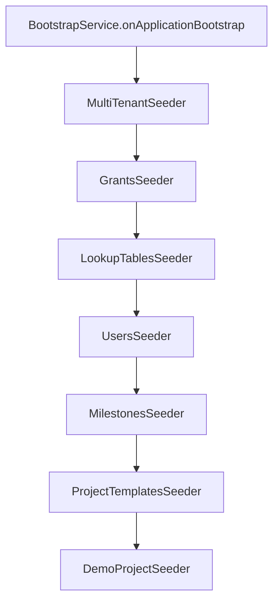

# Bootstrap Service

The Bootstrap service is a **one-shot seeder** that initializes tenant data via RPC calls to other services. It runs after all services are available and seeds groups, permissions, users, milestones, project templates, and demo data.

## Overview

| Property | Value |
|----------|-------|
| Port | 3100 |
| Database | None (RPC client only) |
| Module | `BootstrapModule` |
| Type | Non-federated (no GraphQL schema) |

The Bootstrap service does **not** expose a GraphQL schema or listen for RPC messages. It only sends RPC calls to seed data.

## Architecture

### Module Structure

```
BootstrapModule
├── ConfigModule (global)
├── MicroservicesOrchestratorModule
└── RedisClientsModule
    ├── GRANTS_SERVICE
    ├── USERS_SERVICE
    ├── MILESTONES_SERVICE
    ├── GROUP_ASSIGNMENTS_SERVICE
    ├── GATEWAY_SERVICE
    ├── ORGANIZATION_SERVICE
    ├── PROJECTS_SERVICE
    ├── MILESTONE_TO_PROJECT_SERVICE
    └── TENANTS_SERVICE

Providers:
├── BootstrapService (orchestrator)
├── MultiTenantSeeder
├── GrantsSeeder
├── LookupTablesSeeder
├── UsersSeeder
├── MilestonesSeeder
├── ProjectTemplatesSeeder
└── DemoProjectSeeder
```

## Seeder Execution Order



## Seeders

### 1. MultiTenantSeeder

Creates the default tenant(s) via `BOOTSTRAP_TENANT` RPC to Tenants service.

**Flow**: Check if tenant exists → if not, create + provision databases + create user identity.

### 2. GrantsSeeder

Seeds groups and their permissions. Uses YAML configuration files for declarative permission definitions.

**RPC calls**:
- `FIND_GROUP_BY_NAME` → check existence
- `CREATE_GROUP` (with `_internalSecret`) → create group
- `UPSERT_PERMISSION` (with `_internalSecret`) → field-level permissions
- `UPSERT_OPERATION_PERMISSION` (with `_internalSecret`) → operation permissions
- `UPSERT_PAGE_PERMISSION` (with `_internalSecret`) → page permissions

All grant-related RPC calls are protected by `RpcInternalGuard` — the seeder includes `_internalSecret` in every payload.

### 3. LookupTablesSeeder

Seeds organization lookup tables.

**RPC calls** to Organization service:
- `FIND_SENIORITY_LEVEL_BY_NAME` / `CREATE_SENIORITY_LEVEL`
- `FIND_JOB_ROLE_BY_NAME` / `CREATE_JOB_ROLE`
- `FIND_ROLE_CATEGORY_BY_NAME` / `CREATE_ROLE_CATEGORY`

### 4. UsersSeeder

Seeds admin and test users.

**RPC calls**:
- `FIND_USER_BY_EMAIL` → check if exists
- `CREATE_USER` → create user in tenant DB
- `UPSERT_USER_IDENTITY` (Tenants) → create/update identity in platform DB

### 5. MilestonesSeeder

Seeds sample milestones.

**RPC calls**:
- `FIND_MILESTONE_BY_NAME` → check existence
- `CREATE_MILESTONE` → create milestone

### 6. ProjectTemplatesSeeder

Seeds project templates with phases.

**RPC calls**:
- `FIND_PROJECT_TEMPLATE_BY_NAME` → check existence
- `CREATE_PROJECT_TEMPLATE` → create template
- `FIND_TEMPLATE_PHASES_BY_TEMPLATE_ID` → check phases
- `CREATE_PROJECT_TEMPLATE_PHASE` → create phases with roleCategoryId

### 7. DemoProjectSeeder

Seeds a demonstration project with milestone assignments.

**RPC calls**:
- `FIND_PROJECT_BY_NAME` → check existence
- `CREATE_PROJECT` → create project
- `CREATE_MILESTONE_TO_PROJECT` → link milestones to project

## Configuration

### YAML Definitions

The GrantsSeeder loads permission definitions from YAML files via `yaml-loader.ts`:

```typescript
import { loadYaml } from '../utils/yaml-loader';

const permissions = loadYaml('grants/permissions.yaml');
```

### Environment Keys

Root environment keys are defined in `constants/root-env-keys.ts` and used by all seeders to determine which data to seed.

## Key Design Decisions

### Why RPC-based Seeding?

Bootstrap doesn't access databases directly — it calls services via Redis RPC. This ensures:
1. All business logic runs (validation, events, permissions)
2. Multi-tenant routing is handled by each service's `TenantInterceptor`
3. Indexes are created by the owning service, not by Bootstrap
4. Event-driven side effects fire correctly (e.g., GroupAssignments sync on user creation)

### Idempotency

Every seeder checks for existing data before creating:

```typescript
const existing = await lastValueFrom(
  this.client.send('FIND_GROUP_BY_NAME', { name: 'SUPERADMIN' })
);
if (existing) {
  this.logger.log('SUPERADMIN group already exists, skipping');
  return existing;
}
```

This makes Bootstrap safe to run multiple times — in development, after migrations, or after adding new seed data.

### Tenant Context

The Bootstrap service ensures tenant context is propagated with every RPC call. When using `TenantAwareClientsModule`, the `_tenantSlug` is automatically injected. For the initial `BOOTSTRAP_TENANT` call (which creates the tenant), the slug is passed explicitly.
