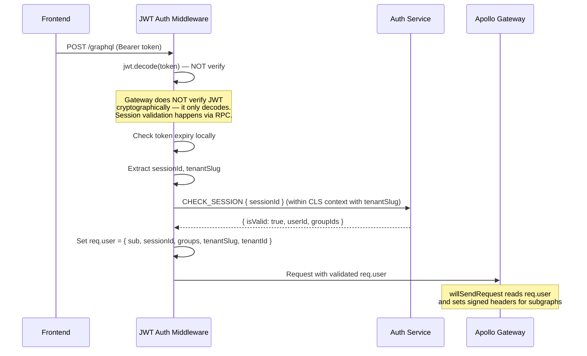

# Gateway Service

The Gateway is the **single entry point** for all client traffic. It runs Apollo Federation 2 to compose a unified GraphQL schema from 13 subgraphs, acts as a **thin proxy** for authentication (delegating logic to the Auth service), and forwards signed headers to subgraphs.

## Overview

| Property | Value |
|----------|-------|
| Port | 3000 |
| Database | None (stateless) |
| Transport | HTTP + Redis (client for RPC, with `inheritAppConfig: false`) |
| Module | `AppModule` |
| Entry | `gateway/src/main.ts` |

The Gateway now uses `createSubgraphMicroservice()` with custom options. It connects to Redis as a **client** (for `send()`/`emit()` to other services) and also has a Redis microservice transport, but with `inheritAppConfig: false` to prevent HTTP-only guards (`GlobalAuthGuard`, `ThrottlerGuard`) from being applied to RPC handlers.

## Architecture

### Module Structure

```
AppModule
├── TenantClsModule (must be first — CLS context for tenant propagation)
├── ConfigModule (global)
├── MicroservicesOrchestratorModule
├── PassportModule (defaultStrategy: 'jwt')
├── ThrottlerModule (60 req/60s global)
├── FederationModule (provides FederationTokenService from @cucu/security)
├── TenantAwareClientsModule (8 service clients)
└── GraphQLModule (ApolloGatewayDriver + IntrospectAndCompose)

Controllers:
├── AuthController (REST: thin proxy for Auth service orchestrator)
└── IntrospectionController

Providers:
├── ApolloGatewayProvider
├── JwtStrategy (Passport)
├── GlobalAuthGuard (APP_GUARD)
└── ThrottlerGuard (APP_GUARD)
```

### Bootstrap Flow

The Gateway uses `createSubgraphMicroservice` with specific customizations:

```typescript
createSubgraphMicroservice(AppModule, 'GATEWAY', {
  beforeStart: async (app) => {
    app.use(cookieParser());
    
    // JWT auth middleware — must run before Apollo Gateway
    const authClient = app.get('AUTH_SERVICE') as ClientProxy;
    const cls = app.get(ClsService) as ClsService<TenantClsStore>;
    app.use(createJwtAuthMiddleware(authClient, cls));
  },
  cors: { /* ... */ },
  middleware: [
    // Header sanitization — strip internal headers from external requests
    (req, res, next) => {
      delete req.headers['x-internal-federation-call'];
      delete req.headers['x-user-groups'];
      delete req.headers['x-user-id'];
      delete req.headers['x-gateway-signature'];
      delete req.headers['x-tenant-slug'];
      delete req.headers['x-tenant-id'];
      next();
    },
  ],
  // Prevent HTTP-only guards from applying to Redis RPC handlers
  connectMicroserviceOptions: { inheritAppConfig: false },
  orchestratorOptions: { retry: 15, retryDelays: 6000 },
});
```

### Thin Proxy Pattern

The Gateway implements a **thin proxy** pattern for authentication. Instead of containing auth logic, it:

1. Receives auth requests (login, refresh, verify, etc.)
2. Forwards them to Auth service via consolidated RPC patterns
3. Returns the orchestrated response to the client

This design:
- **Centralizes auth logic** in the Auth service
- **Simplifies Gateway** — no business logic, just routing
- **Enables single-RPC flows** — e.g., `/auth/verify` calls `VERIFY_FROM_TOKEN` which returns user + tenants + permissions in one round-trip

### Redis Clients

The Gateway registers clients for all services it needs to call via RPC:

- `AUTH_SERVICE` — session management (CHECK_SESSION, REVOKE_SESSION, etc.)
- `TENANTS_SERVICE` — identity verification, tenant discovery
- `USERS_SERVICE`, `MILESTONE_TO_USER_SERVICE`, `MILESTONES_SERVICE`, `PROJECTS_SERVICE`, `MILESTONE_TO_PROJECT_SERVICE`, `GROUP_ASSIGNMENTS_SERVICE`

## JWT Auth Middleware

The Gateway uses a custom Express middleware (`createJwtAuthMiddleware`) that performs JWT decode + `CHECK_SESSION` RPC validation on every request. This middleware runs **before** Apollo Gateway processes the request.

### Why a Custom Middleware?

Apollo Gateway bypasses NestJS guards — `GlobalAuthGuard` and `JwtStrategy` don't intercept the Apollo Gateway's `willSendRequest` hook. The Express middleware ensures every GraphQL request is validated before Apollo sees it.

### How It Works



### Key Design Decisions

1. **Decode, not verify**: The middleware uses `jwt.decode()` (not `jwt.verify()`) because cryptographic JWT verification is redundant — `CHECK_SESSION` validates the session server-side. This avoids needing `JWT_SECRET` in the middleware and simplifies key rotation.

2. **Fail-open**: If `CHECK_SESSION` RPC fails (service down, timeout), the middleware treats the request as unauthenticated rather than returning 500. This prioritizes availability.

3. **CLS context**: The middleware runs `CHECK_SESSION` inside a CLS context with `tenantSlug` so `TenantAwareClientProxy` propagates the tenant to the auth service.

4. **Registered in `beforeStart`**: The middleware is mounted via `app.use()` in the `beforeStart` hook to guarantee it runs before Apollo Gateway registers its `/graphql` route. NestJS `@Injectable` middlewares registered via `MiddlewareConsumer` sometimes miss Apollo routes.

## Header Sanitization

The Gateway strips all internal headers from incoming external requests to prevent spoofing:

```typescript
middleware: [
  (req, res, next) => {
    delete req.headers['x-internal-federation-call'];
    delete req.headers['x-user-groups'];
    delete req.headers['x-user-id'];
    delete req.headers['x-gateway-signature'];
    delete req.headers['x-tenant-slug'];
    delete req.headers['x-tenant-id'];
    next();
  },
],
```

This ensures no external client can set headers that subgraphs would trust as gateway-signed.

## REST Endpoints

| Method | Path | Auth | Rate Limit | Purpose |
|--------|------|------|-----------|---------|
| `POST` | `/auth/login` | `@Public()` | 100/15min | Login via platform DB |
| `POST` | `/auth/refresh` | `@Public()` | — | Token rotation via refresh cookie |
| `POST` | `/auth/logout` | `GlobalAuthGuard` | — | Revoke session + clear cookie |
| `GET` | `/auth/verify` | `@Public()` | — | Check refresh cookie validity |
| `POST` | `/auth/discover` | `@Public()` | 10/1min | Find tenants for an email |
| `POST` | `/auth/switch` | `GlobalAuthGuard` | — | Switch to different tenant |
| `POST` | `/auth/force-revoke` | `GlobalAuthGuard` + SUPERADMIN | — | Revoke another user's session |

## Authentication Flow

### GlobalAuthGuard

Applied globally via `APP_GUARD`. Extends Passport's `AuthGuard('jwt')`:

- Supports both HTTP and GraphQL contexts
- Skips routes decorated with `@Public()` (via `IS_PUBLIC_KEY` reflector metadata)
- On GraphQL, extracts request from `GqlExecutionContext.create(context).getContext().req`

### JwtStrategy

Passport strategy that validates authenticated requests on REST endpoints:

1. Extract Bearer token from `Authorization` header
2. Verify JWT signature using `JWT_SECRET`
3. Call `CHECK_SESSION` RPC to Auth service with `payload.sessionId`
4. Return `{ sub: userId, sessionId, groups, tenantSlug, tenantId }` as `req.user`

::: info
For GraphQL requests, the JWT auth middleware (not JwtStrategy) handles authentication because Apollo Gateway bypasses NestJS guards. JwtStrategy is used for REST endpoints like `/auth/logout` and `/auth/switch`.
:::

## Apollo Federation Configuration

### RemoteGraphQLDataSource

The Gateway's `willSendRequest()` hook handles header propagation:

**Authenticated user requests** (has `req.user` from JWT middleware):
1. Read `req.user` (already validated by middleware)
2. Strip `Authorization` header (no forwarding of user JWTs to subgraphs)
3. Set `x-user-groups`, `x-user-id`, `Content-Type`
4. Propagate tenant context (`x-tenant-slug`, `x-tenant-id`) from `req.user`

**Federation/internal calls** (no `req.user`):
1. Get self-signed federation JWT from `FederationTokenService` (RS256, 60s TTL)
2. Set `Authorization: Bearer {federationToken}`, `x-internal-federation-call: 1`
3. Propagate user context if the federation call was triggered by a user request
4. Propagate tenant context from user JWT or request headers

**All requests**:
1. Compute HMAC-SHA256 signature of all internal headers using `INTERNAL_HEADER_SECRET`
2. Set `x-gateway-signature` — subgraphs verify this before trusting any `x-*` headers

See [Security](/shared/security.md) for details on `FederationTokenService` and signature verification.

### Introspection Control

```typescript
const allowIntrospection = configService.get('ALLOW_INTROSPECTION') === 'true';
server: {
  introspection: allowIntrospection,
  plugins: allowIntrospection ? [] : [disableIntrospectionPlugin()],
}
```

## Key Design Decisions

### Why REST for Auth?

Login, refresh, and logout use REST endpoints instead of GraphQL mutations because:
1. **Cookies** — httpOnly refresh cookies must be set via HTTP response headers, not GraphQL
2. **Simplicity** — auth flows are sequential, not graph-shaped
3. **Standards** — CSRF protection patterns work better with REST

### Why Express Middleware Instead of NestJS Guards for GraphQL Auth?

Apollo Gateway processes requests outside the NestJS guard lifecycle. NestJS guards like `GlobalAuthGuard` work for REST endpoints but don't intercept Apollo's `willSendRequest` hook. The Express middleware ensures authentication runs before Apollo sees the request.

### Why CHECK_SESSION on Every Request?

Even though JWT tokens contain user claims, the Gateway validates sessions on every request via `CHECK_SESSION` RPC. This enables:
- Instant session revocation (not waiting for JWT expiry)
- Real-time group membership updates
- Session idle timeout enforcement
- `lastActivity` tracking for session keep-alive

### Why `inheritAppConfig: false`?

The Gateway's `APP_GUARD` providers (`GlobalAuthGuard`, `ThrottlerGuard`) are designed for HTTP/GraphQL only. With `inheritAppConfig: true`, they would also apply to Redis RPC handlers, causing errors. Setting `inheritAppConfig: false` prevents this. The `TenantClsInterceptor` still works because it's registered via `app.useGlobalInterceptors()` in `createSubgraphMicroservice()`, not as `APP_INTERCEPTOR`.
