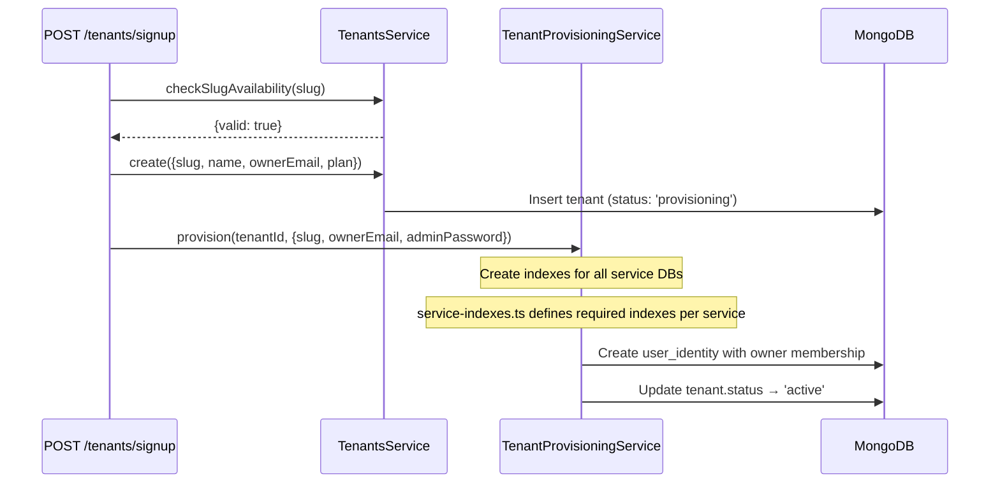

# Tenants Service

The Tenants service manages the **platform-level** database — tenant registration, provisioning, user identities (Universal Auth), and platform administration. Unlike all other services, it uses a **shared MongoDB database** (not per-tenant isolation) via standard `MongooseModule.forRoot()`.

## Overview

| Property | Value |
|----------|-------|
| Port | 3013 |
| Database | Shared platform DB (via `MONGODB_URI`) |
| Collections | `tenants`, `user_identities`, `platform_admins`, `tenantadmins` |
| Module | `TenantsModule` |
| Context | `TenantsContext` (request-scoped) |

**Key difference**: This service does NOT import `TenantDatabaseModule`. It connects to a single shared database for cross-tenant operations.

## Schemas

### Tenant

```typescript
@Directive('@key(fields: "_id")')
@Schema({ timestamps: true })
class Tenant {
  _id: string
  slug: string              // unique, regex: /^[a-z0-9][a-z0-9-]{1,28}[a-z0-9]$/
  name: string
  status: 'provisioning' | 'active' | 'trial' | 'suspended' | 'archived' | 'deleted' | 'provisioning_failed'
  plan: 'trial' | 'starter' | 'professional' | 'enterprise'
  ownerEmail: string
  primaryColor?: string
  logoUrl?: string
  settings?: string         // JSON string
  limits?: { maxUsers: number, maxProjects: number, maxStorageMb: number }
  trialExpiresAt?: Date
  billingCustomerId?: string
  billingSubscriptionId?: string
  suspendedAt?: Date
  scheduledDeletionAt?: Date
  provisioningStartedAt?: Date
  provisioningCompletedAt?: Date
  customDomain?: string     // unique, sparse
  deletedAt?: Date
}

// Indexes: slug (unique), status, customDomain (unique sparse), ownerEmail, deletedAt
```

### UserIdentity (Universal Auth)

```typescript
@Schema({ timestamps: true, collection: 'user_identities' })
class UserIdentity {
  _id: ObjectId
  email: string             // unique, lowercase, trimmed
  passwordHash: string
  name: string
  surname: string
  isPlatformAdmin: boolean  // default: false
  memberships: TenantMembership[]
}

class TenantMembership {
  tenantSlug: string
  tenantId: ObjectId
  userId: ObjectId          // → User._id in the tenant's users DB
  role: 'owner' | 'admin' | 'member'
  joinedAt: Date
}

// Index: { email: 1 } (unique)
```

### PlatformAdmin (Legacy)

```typescript
@Schema({ timestamps: true, collection: 'platform_admins' })
class PlatformAdmin {
  email: string
  password: string          // bcrypt hash
  name: string
  surname: string
}
```

## REST Endpoints

| Method | Path | Auth | Purpose |
|--------|------|------|---------|
| `GET` | `/tenants/resolve/:slug` | `x-internal-resolve` header (`TENANT_RESOLVE_SECRET`) | Resolve tenant config by slug (for FE middleware) |

::: warning Tenant Endpoints Moved to Gateway
The following endpoints were **moved to the Gateway** (`TenantsController`) as of F-043:
- `POST /tenants/signup` → Gateway proxies to `SIGNUP_TENANT` RPC
- `GET /tenants/check-slug/:slug` → Gateway proxies to `CHECK_SLUG_AVAILABILITY` RPC
- `GET /tenants/status/:id` → Gateway proxies to `GET_TENANT_STATUS` RPC

This consolidates all public-facing HTTP endpoints in the Gateway. The `resolve/:slug` endpoint remains in the Tenants subgraph because it's called server-to-server by Next.js middleware, protected by `TENANT_RESOLVE_SECRET` via timing-safe comparison of the `x-internal-resolve` header.
:::

## GraphQL Schema

### Queries

| Query | Args | Return |
|-------|------|--------|
| `findAllTenants` | `pagination?, status?` | `PaginatedTenants!` |
| `findOneTenant` | `id: ID!` | `Tenant!` |

### Mutations

| Mutation | Args | Return |
|----------|------|--------|
| `createTenant` | `input: CreateTenantInput!` | `Tenant!` |
| `updateTenant` | `input: UpdateTenantInput!` | `Tenant!` |
| `suspendTenant` | `id: ID!` | `Tenant!` |
| `reactivateTenant` | `id: ID!` | `Tenant!` |
| `extendTrial` | `id: ID!, days: Int!` | `Tenant!` |

### ResolveField

| Field | On | Returns |
|-------|-----|---------|
| `userCount` | `Tenant` | `Int` (stub — returns 0, TODO: RPC to users service) |

## RPC Patterns

### Tenant Management

| Pattern | Input | Output | Purpose |
|---------|-------|--------|---------|
| `TENANT_EXISTS` | `string` | `boolean` | Check existence |
| `FIND_TENANT_BY_ID` | `string` | `Tenant \| null` | Find by ID |
| `FIND_TENANT_BY_SLUG` | `string` | `Tenant \| null` | Find by slug |
| `RESOLVE_TENANT_BY_SLUG` | `string` | `Tenant \| null` | Resolve active tenant |
| `CHECK_SLUG_AVAILABILITY` | `string` | `{valid, error?}` | Validate slug |
| `SIGNUP_TENANT` | `SignupTenantRpcDto` | `{tenantId}` | Create tenant + provision databases (called by Gateway) |
| `GET_TENANT_STATUS` | `{id}` | `{status, loginUrl?, error?}` | Poll provisioning status (called by Gateway) |
| `BOOTSTRAP_TENANT` | `BootstrapTenantRpcDto` | `{success, tenantId, skipped?}` | Create + provision (idempotent, bootstrap only) |

### Universal Auth

| Pattern | Input | Output | Purpose |
|---------|-------|--------|---------|
| `VERIFY_IDENTITY_PASSWORD` | `VerifyIdentityPasswordRpcDto` | identity record | Verify password + check tenant membership |
| `DISCOVER_TENANTS` | `DiscoverTenantsRpcDto` | `{memberships}` | List tenants for an email |
| `SWITCH_TENANT` | `{email, tenantSlug}` | `{userId, tenantSlug, tenantId}` | Verify membership for tenant switch |
| `GET_IDENTITY_MEMBERSHIPS` | `{email}` | `{memberships, isPlatformAdmin}` | Full identity info |
| `UPDATE_IDENTITY_PASSWORD` | `UpdateIdentityPasswordRpcDto` | void | Update password hash |
| `UPSERT_USER_IDENTITY` | `UpsertUserIdentityRpcDto` | identity | Create/update identity with membership |

### Platform Admin

| Pattern | Input | Output | Purpose |
|---------|-------|--------|---------|
| `CHECK_PLATFORM_ADMIN` | `{email}` | `{isPlatformAdmin}` | Check via user_identities (primary) + platform_admins (fallback) |
| `LOGIN_PLATFORM_ADMIN` | `LoginPlatformAdminRpcDto` | admin record or null | Legacy admin login |
| `SEED_PLATFORM_ADMIN` | `{email, password, name, surname}` | admin | Bootstrap seeder |

### RPC DTO Validation

All RPC handlers use formal DTOs validated by the global `ValidationPipe`:

| DTO | Pattern | Fields |
|-----|---------|--------|
| `SignupTenantRpcDto` | `SIGNUP_TENANT` | `slug, name, ownerEmail, adminPassword, adminName, adminSurname, plan?` |
| `VerifyIdentityPasswordRpcDto` | `VERIFY_IDENTITY_PASSWORD` | `email, password, tenantSlug` |
| `LoginPlatformAdminRpcDto` | `LOGIN_PLATFORM_ADMIN` | `email, password` |
| `BootstrapTenantRpcDto` | `BOOTSTRAP_TENANT` | `slug, name, ownerEmail, adminPassword, adminName, adminSurname, plan?` |
| `DiscoverTenantsRpcDto` | `DISCOVER_TENANTS` | `email` |
| `UpdateIdentityPasswordRpcDto` | `UPDATE_IDENTITY_PASSWORD` | `email, newPasswordHash` |
| `UpsertUserIdentityRpcDto` | `UPSERT_USER_IDENTITY` | `email, passwordHash, name, surname, isPlatformAdmin?, membership?` |

## Provisioning

The `TenantProvisioningService` handles new tenant database creation:



The provisioning creates the necessary MongoDB indexes for each service's tenant database (e.g., `users_{slug}`, `grants_{slug}`, etc.) as defined in `service-indexes.ts`.

## Key Design Decisions

### Why Shared Database?

The tenants service needs to:
1. Look up tenants by slug (cross-tenant operation)
2. Verify user identities across tenants (Universal Auth)
3. Manage platform-wide admin accounts

These operations are inherently cross-tenant, so a shared database is the correct choice.

### Universal Auth Model

A single `UserIdentity` can have memberships in multiple tenants. This enables:
- Single sign-on across tenants
- Tenant switching without re-login
- Centralized password management (source of truth)
- Platform admin access to all tenants
