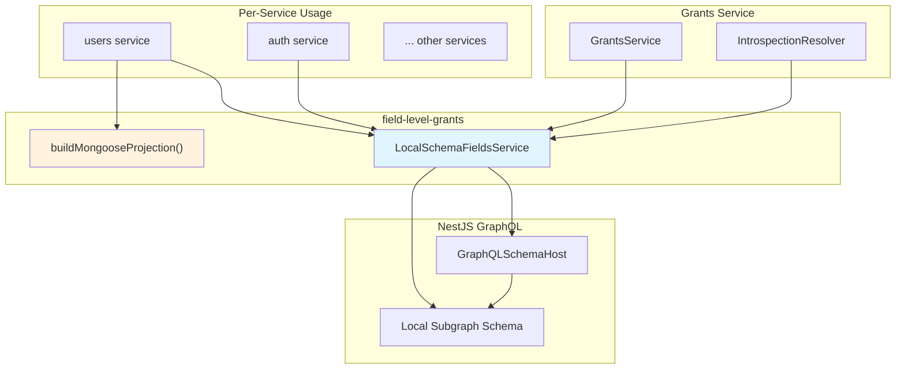
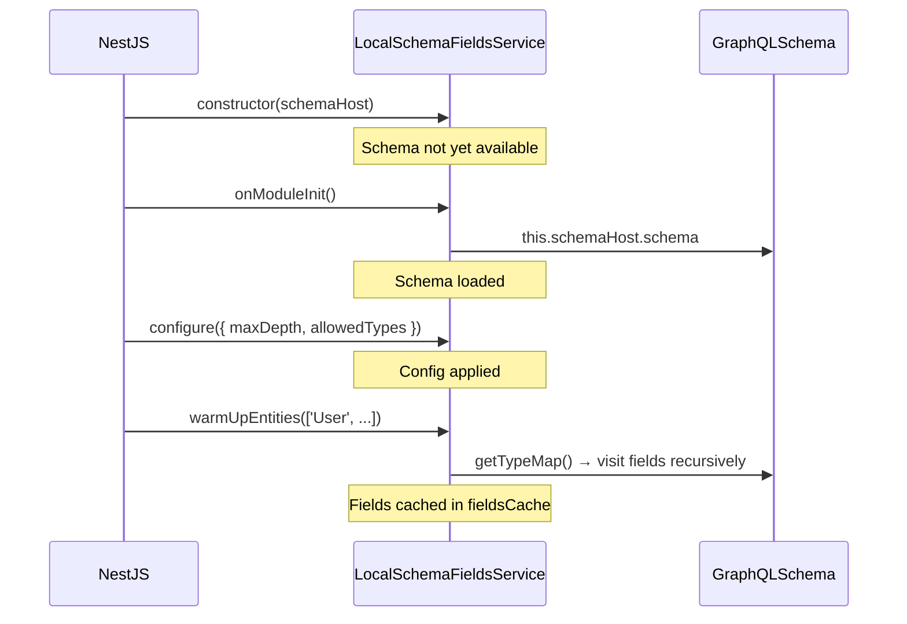
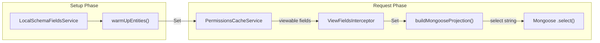
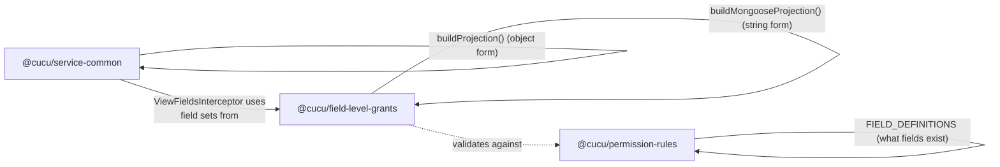

# @cucu/field-level-grants

> GraphQL schema introspection and Mongoose projection building for field-level permission enforcement. Provides local schema analysis (without contacting the gateway) and projection helpers for per-entity field filtering.

## Architecture Overview



## Module Index

| Export | Type | Purpose |
|--------|------|---------|
| `LocalSchemaFieldsService` | Injectable Service | Introspects local GraphQL schema to discover entity fields |
| `LocalIntrospectionConfig` | Interface | Configuration for the introspection service |
| `buildMongooseProjection` | Function | Converts a field set to a Mongoose projection string |

---

## LocalSchemaFieldsService

**File:** `src/introspection-fields.service.ts`

An injectable NestJS service that introspects the **local subgraph schema** (not the gateway's federated schema) to discover all field paths for an entity type. Uses `GraphQLSchemaHost` provided by `@nestjs/graphql`.

### Why Local Introspection?

In a federated GraphQL architecture, each service owns a subset of the schema. Rather than querying the gateway for field information (which introduces a circular dependency and network hop), each service introspects its own schema to determine which fields it owns.

This is used for:
1. **Grants service:** Listing available fields for the permission UI (`listFieldsFromGateway` operation)
2. **Per-service resolvers:** Determining which fields exist on an entity to validate permission configurations
3. **Warm-up at startup:** Pre-loading field paths to avoid repeated schema traversal

### Configuration

```typescript
interface LocalIntrospectionConfig {
  maxDepth?: number;       // Max recursion depth (default: 2)
  debug?: boolean;         // Enable debug logging (default: false)
  allowedTypes?: string[]; // Types to recurse into (whitelist)
}
```

**`allowedTypes`** is crucial: it prevents the service from recursing into types it doesn't own. For example, the `users` service would set:
```typescript
service.configure({
  allowedTypes: ['User', 'AuthDataSchema', 'PersonalDataSchema', 'EmploymentDataSchema', 'AdditionalFieldsSchema'],
  maxDepth: 2,
});
```

Without this whitelist, the service might try to recurse into federated reference types (like `Group` or `Project`) that belong to other subgraphs.

### Lifecycle



### Methods

#### `configure(cfg: LocalIntrospectionConfig): void`

Sets runtime configuration. Must be called **before** `warmUpEntities()`.

#### `warmUpEntities(entityNames: string[]): void`

Pre-loads field paths for the given entity names into an internal cache (`Map<string, Set<string>>`). Call this at service startup for optimal performance.

**Throws** if the schema is not yet available (i.e., if called before `onModuleInit`).

#### `getAllFieldsForEntity(entityName: string): Set<string>`

Returns all field paths for an entity. Cached after first computation.

**Example output for `'User'`:**
```
Set {
  '_id', 'authData', 'authData.name', 'authData.surname', 'authData.email',
  'authData.groupIds', 'personalData', 'personalData.dateOfBirth',
  'employmentData', 'employmentData.RAL', 'employmentData.rates', ...
}
```

### Field Path Collection Algorithm

The internal `collectAllFieldsOfEntity` method uses recursive schema traversal:

1. Look up the entity type in `schema.getTypeMap()`
2. Verify it's in `allowedTypes` (skip otherwise)
3. For each field in the type:
   a. Add the field path (e.g., `authData.name` where prefix=`authData`, fieldName=`name`)
   b. If the field's type is an `ObjectType` AND is in `allowedTypes` AND depth < maxDepth:
      - Recurse into it with incremented depth
4. `getNamedType()` is used to unwrap `NonNull` and `List` wrappers before checking type kind

**Depth control:** With `maxDepth=2`, the service collects:
- Depth 1: `authData`, `personalData`, `employmentData` (top-level fields)
- Depth 2: `authData.name`, `authData.email`, `personalData.dateOfBirth` (nested fields)
- Depth 3+: NOT collected (prevents deep nesting explosion)

---

## buildMongooseProjection

**File:** `src/grants-projection.helper.ts`

```typescript
export function buildMongooseProjection(fields: Set<string>): string;
```

Converts a set of field paths to a Mongoose `.select()` string:

```typescript
buildMongooseProjection(new Set(['authData.name', 'authData.email', 'personalData.dateOfBirth']))
// → 'authData.name authData.email personalData.dateOfBirth'
```

**Note:** This produces a space-separated string for Mongoose's `.select()` syntax, not a projection object. For projection objects (`{ field: 1 }`), use `buildProjection()` from `@cucu/service-common`.

---

## Integration with the Permission System



### Flow:

1. **At startup:** `LocalSchemaFieldsService.warmUpEntities()` discovers all field paths for the entity
2. **Per request:** `ViewFieldsInterceptor` (from `service-common`) calls `PermissionsCacheService.ensureEntityLoaded()` to get the user's viewable fields for the entity
3. The viewable fields are intersected with the known schema fields
4. `buildMongooseProjection()` converts the viewable set to a Mongoose-compatible format
5. The service uses this projection in its database queries

---

## Used By

| Service | How Used |
|---------|----------|
| **grants** | `LocalSchemaFieldsService` for `listFieldsFromGateway` introspection resolver; field discovery for permission CRUD |
| **users** | `LocalSchemaFieldsService` for User entity field introspection; `buildMongooseProjection` for query filtering |
| **auth** | `LocalSchemaFieldsService` for Session entity field discovery |
| **group-assignments** | `LocalSchemaFieldsService` for entity introspection |
| **milestones** | `LocalSchemaFieldsService` for Milestone entity fields |
| **milestone-to-project** | `LocalSchemaFieldsService` for junction entity fields |
| **milestone-to-user** | `LocalSchemaFieldsService` for junction entity fields |
| **organization** | `LocalSchemaFieldsService` for Company/JobRole/SeniorityLevel fields |
| **projects** | `LocalSchemaFieldsService` for Project/ProjectTemplate fields |
| **project-access** | `LocalSchemaFieldsService` for ProjectAccess entity fields |
| **tenants** | `LocalSchemaFieldsService` for Tenant entity fields |

---

## Relationship to Other Libraries



- **`@cucu/service-common`** provides `buildProjection()` → returns `{ field: 1 }` objects for Mongoose `.find(query, projection)`
- **`@cucu/field-level-grants`** provides `buildMongooseProjection()` → returns space-separated strings for Mongoose `.select()`
- **`@cucu/permission-rules`** defines which fields exist (`FIELD_DEFINITIONS`) — the grants service uses both libraries to validate that permission configurations reference real fields
