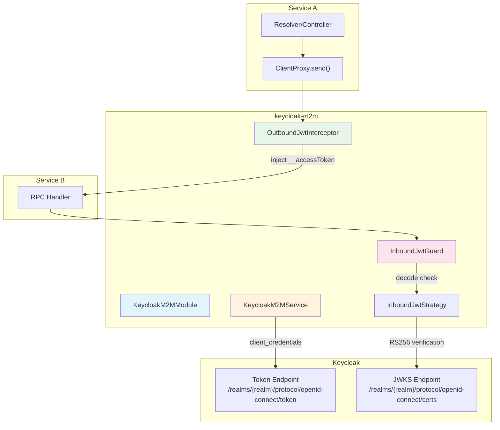
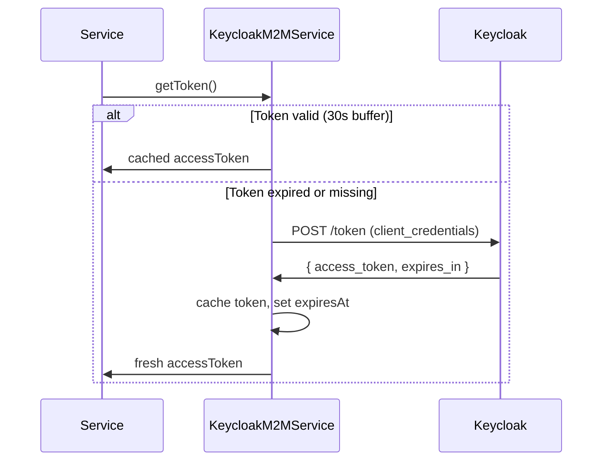
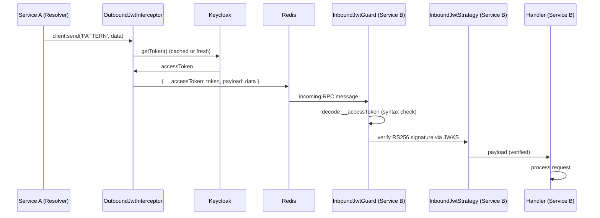

# @cucu/keycloak-m2m

> Machine-to-machine (M2M) authentication with Keycloak for service-to-service communication. Provides automatic JWT token acquisition, outbound injection, and inbound verification using RS256 + JWKS.

## Architecture Overview



## Module Index

| Export | Type | Purpose |
|--------|------|---------|
| `KeycloakM2MModule` | NestJS Global Module | Registers all M2M providers via `.forRoot()` |
| `KeycloakM2MService` | Injectable Service | Token acquisition and caching |
| `OutboundJwtInterceptor` | APP_INTERCEPTOR | Auto-injects M2M token into outgoing RPC calls |
| `InboundJwtGuard` | APP_GUARD | Validates M2M token on incoming RPC calls |
| `InboundJwtStrategy` | Passport Strategy | RS256 signature verification via JWKS |

---

## KeycloakM2MModule

**File:** `src/keycloak-m2m.module.ts`

```typescript
@Global()
@Module({})
export class KeycloakM2MModule {
  static forRoot(): DynamicModule;
}
```

Registers the following as global providers:
- `KeycloakM2MService` — singleton token manager
- `InboundJwtStrategy` — Passport strategy for RS256 verification
- `OutboundJwtInterceptor` — registered as `APP_INTERCEPTOR` (global)
- `InboundJwtGuard` — registered as `APP_GUARD` (global)

**Usage in a service module:**
```typescript
@Module({
  imports: [
    KeycloakM2MModule.forRoot(),
    // ... other imports
  ],
})
export class UsersModule {}
```

---

## KeycloakM2MService

**File:** `src/m2m.service.ts`

Singleton service (`Scope.DEFAULT`) that acquires and caches OAuth2 client credentials tokens from Keycloak.

### Token Lifecycle



### Method

```typescript
async getToken(): Promise<string>
```

1. Checks if the cached token is still valid (with a **30-second buffer** before actual expiry)
2. If valid → returns cached token immediately
3. If expired or missing → requests a new token from Keycloak using `client_credentials` grant

### Required Environment Variables

| Variable | Description | Example |
|----------|-------------|---------|
| `KC_SERVER_URL` | Keycloak base URL | `https://auth.cucu.io` |
| `KC_REALM` | Keycloak realm name | `cucu` |
| `KC_CLIENT_ID` | Service's client ID | `users-service` |
| `KC_CLIENT_SECRET` | Service's client secret | `abc123...` |

**Fail-fast:** If any of these variables is missing, `getToken()` throws `InternalServerErrorException` immediately — no silent fallbacks.

### Token Request

```
POST {KC_SERVER_URL}/realms/{KC_REALM}/protocol/openid-connect/token
Content-Type: application/x-www-form-urlencoded

grant_type=client_credentials&client_id={KC_CLIENT_ID}&client_secret={KC_CLIENT_SECRET}
```

---

## OutboundJwtInterceptor

**File:** `src/outbound.interceptor.ts`

Registered as `APP_INTERCEPTOR` (global). Automatically injects the M2M token into **outgoing RPC calls** only.

### How It Works

```typescript
async intercept(ctx: ExecutionContext, next: CallHandler) {
  if (ctx.getType() === 'rpc') {
    const token = await this.kc.getToken();
    const args = ctx.getArgs();
    const originalPayload = args[0];
    args[0] = {
      __accessToken: token,
      payload: originalPayload,
    };
  }
  return next.handle();
}
```

**Key detail:** The interceptor wraps the original payload inside `{ __accessToken, payload }`. The receiving service's `InboundJwtGuard` reads `__accessToken` for verification, and the handler receives the wrapped structure.

**Only RPC:** HTTP and GraphQL requests are untouched — M2M auth is specifically for service-to-service Redis communication.

---

## InboundJwtGuard

**File:** `src/inbound.guard.ts`

Registered as `APP_GUARD` (global). Validates the `__accessToken` field in incoming RPC payloads.

```typescript
canActivate(ctx: ExecutionContext): boolean | Promise<boolean> {
  if (ctx.getType() !== 'rpc') return true;  // Only applies to RPC

  const { __accessToken } = ctx.switchToRpc().getData();
  if (!__accessToken) throw new UnauthorizedException('Missing M2M token');

  jwt.decode(__accessToken, { complete: true });  // Syntax check only
  return true;
}
```

**Important:** This guard only performs a **syntax check** (decode, not verify). The actual cryptographic verification is handled by `InboundJwtStrategy` via Passport. The guard's role is to catch obviously invalid or missing tokens before they reach the strategy.

---

## InboundJwtStrategy

**File:** `src/inbound.strategy.ts`

Passport strategy named `'kc-m2m'` that performs full RS256 signature verification using Keycloak's JWKS endpoint.

```typescript
@Injectable()
export class InboundJwtStrategy extends PassportStrategy(Strategy, 'kc-m2m') {
  constructor(cfg: ConfigService) {
    const issuer = `${cfg.get('KC_SERVER_URL')}/realms/${cfg.get('KC_REALM')}`;
    super({
      jwtFromRequest: ExtractJwt.fromAuthHeaderAsBearerToken(),
      audience: cfg.get('KC_CLIENT_ID'),
      issuer,
      algorithms: ['RS256'],
      secretOrKeyProvider: jwksRsa.expressJwtSecret({
        jwksUri: `${issuer}/protocol/openid-connect/certs`,
        cache: true,
        cacheMaxEntries: 5,
        cacheMaxAge: 10_000,
      }),
    });
  }

  validate(payload: any) {
    return payload;  // Token valid → attach to req.user
  }
}
```

### JWKS Configuration

| Setting | Value | Purpose |
|---------|-------|---------|
| `cache` | `true` | Cache JWKS keys locally |
| `cacheMaxEntries` | 5 | Maximum cached keys |
| `cacheMaxAge` | 10,000ms | Cache TTL |
| `algorithms` | `['RS256']` | Only accept RS256 signatures |

### Verification Flow

1. Extract JWT from `Authorization: Bearer <token>` header
2. Fetch Keycloak's public keys from JWKS endpoint (cached)
3. Verify RS256 signature against the matching key
4. Validate `issuer` and `audience` claims
5. If valid → `validate()` returns the payload (attached to `req.user`)

---

## Request Flow: Service A → Service B



---

## Used By

Every backend microservice imports `KeycloakM2MModule.forRoot()`:

| Service | Usage |
|---------|-------|
| **auth** | M2M calls to users, grants services |
| **grants** | M2M calls from/to other services for permission queries |
| **users** | M2M calls to auth, grants, group-assignments |
| **group-assignments** | M2M calls to users, grants |
| **organization** | M2M calls for cross-service operations |
| **milestones** | M2M calls to projects, users |
| **milestone-to-project** | M2M calls to milestones, projects |
| **milestone-to-user** | M2M calls to milestones, users |
| **projects** | M2M calls to users, milestones |
| **project-access** | M2M calls to projects, users |
| **tenants** | M2M calls for tenant management operations |
| **bootstrap** | M2M calls during initial data seeding |
| **gateway** | M2M calls for federation queries |

---

## Relationship to HMAC Signature (service-common)

The system uses **two independent authentication mechanisms** for service-to-service communication:

| Mechanism | Library | Purpose | Transport |
|-----------|---------|---------|-----------|
| **Keycloak M2M JWT** | `@cucu/keycloak-m2m` | Authenticate the calling service identity | Redis RPC |
| **HMAC Gateway Signature** | `@cucu/service-common` | Verify that HTTP headers were set by the gateway | HTTP (federation) |

These are complementary:
- **M2M JWT** proves that Service A is really Service A (not a rogue process on the Redis bus)
- **HMAC signature** proves that HTTP headers (`x-user-groups`, etc.) came from the trusted gateway (not a direct HTTP call to a subgraph)
