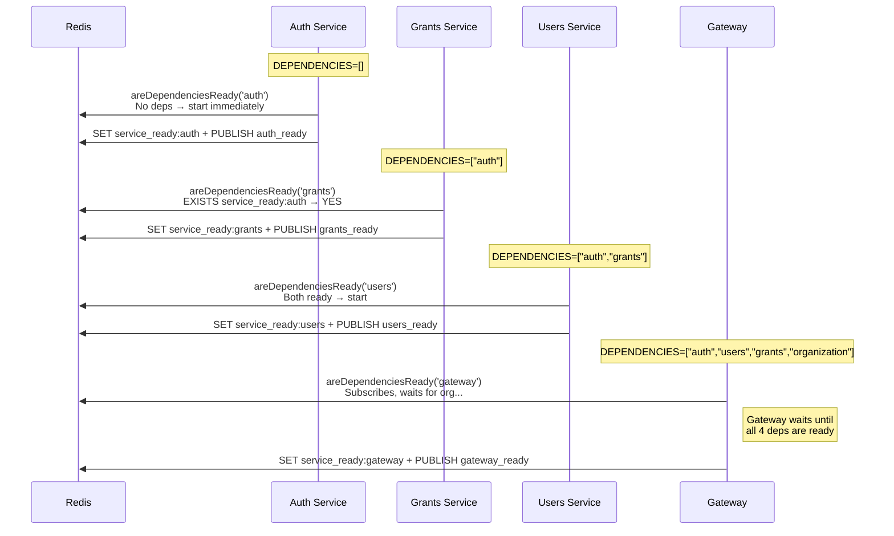

# @cucu/microservices-orchestrator

> Service dependency checking and startup sequencing via Redis pub/sub. Ensures microservices start in the correct order by blocking until declared dependencies are ready.

## Architecture Overview

```mermaid
graph TB
    subgraph "microservices-orchestrator"
        MOS["MicroservicesOrchestratorService"]
        MOM["MicroservicesOrchestratorModule"]
    end

    subgraph "Redis"
        Keys["service_ready:{name}<br>(TTL: 24h)"]
        Channel["Channel: service_ready<br>Messages: {name}_ready"]
    end

    subgraph "Service Startup"
        S1["auth-service"]
        S2["users-service"]
        S3["grants-service"]
        S4["gateway"]
    end

    subgraph "service-common"
        Bootstrap["createSubgraphMicroservice()"]
    end

    MOS -->|SET + PUBLISH| Keys
    MOS -->|SET + PUBLISH| Channel
    MOS -->|SUBSCRIBE| Channel
    MOS -->|EXISTS| Keys

    Bootstrap -->|areDependenciesReady()| MOS
    Bootstrap -->|notifyServiceReady()| MOS

    S1 --> Bootstrap
    S2 --> Bootstrap
    S3 --> Bootstrap
    S4 --> Bootstrap

    style MOS fill:#e1f5fe
    style Keys fill:#e8f5e9
    style Channel fill:#fff3e0
```

## Module Index

| Export | Type | Purpose |
|--------|------|---------|
| `MicroservicesOrchestratorService` | Injectable Service | Core orchestration logic |
| `MicroservicesOrchestratorModule` | NestJS Module | Registers the service with `ConfigModule` |

---

## MicroservicesOrchestratorModule

**File:** `src/microservices-orchestrator.module.ts`

Simple module that registers `MicroservicesOrchestratorService` and imports `ConfigModule.forRoot({ isGlobal: true })`.

```typescript
@Module({
  imports: [ConfigModule.forRoot({ isGlobal: true })],
  providers: [MicroservicesOrchestratorService],
  exports: [MicroservicesOrchestratorService],
})
export class MicroservicesOrchestratorModule {}
```

---

## MicroservicesOrchestratorService

**File:** `src/microservices-orchestrator.service.ts`

### Redis Key Convention

| Pattern | Example | Purpose |
|---------|---------|---------|
| `service_ready:{name}` | `service_ready:auth` | Key set when service is ready (TTL: 24h) |
| `service_ready` channel | Message: `auth_ready` | Pub/sub notification when a service becomes ready |

### Configuration Options

```typescript
interface ConfigOptions {
  retry?: number;               // Max retry attempts (default: 5)
  retryDelays?: number;         // Delay between retries in ms (default: 3000)
  redisServiceHost?: string;    // Redis host (default: 'redis')
  redisServicePort?: string | number;  // Redis port (default: 6379)
  persistentCheck?: boolean;    // Keep Redis connection alive after check
  useTls?: boolean;             // Enable TLS for Redis connection
  redisTlsCertPath?: string;    // Client certificate path
  redisTlsKeyPath?: string;     // Client key path
  redisTlsCaPath?: string;      // CA certificate path
}
```

### Methods

#### `areDependenciesReady(serviceName, options?): Promise<void>`

**The main method.** Called by `createSubgraphMicroservice()` during bootstrap. Blocks until all declared dependencies are ready.

**Flow:**

```mermaid
flowchart TD
    A[Start] --> B[Create Redis client]
    B --> C[Check Redis connection<br>with retries]
    C --> D{Read dependencies from<br>env: {NAME}_DEPENDENCIES}
    D -->|"[]"| E[No deps → return]
    D -->|"['auth', 'grants']"| F[Check each dep<br>via Redis EXISTS]
    F --> G{All ready?}
    G -->|Yes| H[Return immediately]
    G -->|No| I[Subscribe to<br>service_ready channel]
    I --> J[Wait for messages]
    J --> K{All deps ready?}
    K -->|Yes| L[Return]
    K -->|No| J
    J --> M{Timeout?}
    M -->|Yes| N[Reject with error]
```

**Step by step:**

1. Creates a Redis client (with or without TLS)
2. Verifies Redis connectivity with retry logic (`maxRetries × retryDelay` timeout)
3. Reads dependencies from environment variable `{SERVICE_NAME_UPPERCASE}_DEPENDENCIES` (JSON array)
4. If no dependencies → returns immediately
5. Checks which dependencies are already ready via `Redis.EXISTS(service_ready:{dep})`
6. If all ready → returns immediately
7. If some missing → subscribes to `service_ready` channel
8. Waits for `{dep}_ready` messages until all dependencies are satisfied
9. Timeout: `maxRetries × retryDelay` ms → throws error

**Example env var:**
```bash
USERS_DEPENDENCIES='["auth","grants"]'
GATEWAY_DEPENDENCIES='["auth","users","grants","organization"]'
```

#### `notifyServiceReady(serviceName, options?): Promise<void>`

Called by `createSubgraphMicroservice()` after the service starts listening. Publishes readiness to Redis.

1. Creates a new Redis client
2. Sets `service_ready:{name}` with value `'ready'` and 24-hour TTL
3. Publishes `{name}_ready` to the `service_ready` channel
4. Disconnects the Redis client

#### `areServicesReady(serviceNames, options?): Promise<Map<string, boolean>>`

Utility method that checks the readiness of multiple services without blocking. Returns a map of service name → ready status.

Useful for health checks and monitoring dashboards.

#### `resetServiceStatus(serviceName, options?): Promise<void>`

Removes the `service_ready:{name}` key from Redis. Useful for testing or forcing a service to re-announce readiness.

---

## Startup Sequencing Example



---

## Redis Connection Management

Each method creates its **own Redis client** and disconnects after use (except when `persistentCheck: true`). This prevents connection leaks and ensures clean shutdown.

### TLS Support

When `useTls: true`, the service reads certificate files from the filesystem:

```typescript
const tlsConfig = {
  cert: fs.readFileSync(options.redisTlsCertPath),
  key:  fs.readFileSync(options.redisTlsKeyPath),
  ca:   [fs.readFileSync(options.redisTlsCaPath)],
  rejectUnauthorized: true,
};
```

**Fail-fast:** If TLS is enabled but any cert path is missing, throws immediately.

---

## Integration with createSubgraphMicroservice

`@cucu/service-common`'s `createSubgraphMicroservice()` is the sole consumer of this library's core functionality:

```typescript
// In createSubgraphMicroservice():
const orchestratorService = app.get(MicroservicesOrchestratorService);

// 1. Block until dependencies are ready
await orchestratorService.areDependenciesReady(serviceName, {
  ...redisConnectionOptions,
  ...orchestratorOptions,  // Optional overrides from CreateSubgraphOptions
});

// ... start microservice, listen on port ...

// 2. Notify that this service is ready
orchestratorService.notifyServiceReady(serviceName, redisConnectionOptions);
```

The `orchestratorOptions` in `CreateSubgraphOptions` allows per-service tuning of retry count and delay:

```typescript
await createSubgraphMicroservice(AppModule, 'GATEWAY', {
  orchestratorOptions: { retry: 10, retryDelays: 5000 },  // Gateway waits longer
});
```

---

## Used By

| Consumer | How Used |
|----------|----------|
| **service-common** | `createSubgraphMicroservice()` calls `areDependenciesReady()` and `notifyServiceReady()` |
| **All BE services** | Implicitly via `createSubgraphMicroservice()` — every service depends on the orchestrator |
| **gateway** | Direct import of `MicroservicesOrchestratorModule` in AppModule |
| **bootstrap** | Direct import for service readiness checks during initial seeding |

---

## Design Decisions

1. **Redis pub/sub over HTTP health checks** — Redis is already required for RPC transport. Using it for orchestration avoids introducing HTTP polling and service discovery complexity.
2. **24-hour TTL on ready keys** — Prevents stale readiness after crashes. Services re-announce on restart.
3. **Per-method Redis clients** — Each call gets its own connection and cleans up after. This prevents the orchestrator from holding long-lived connections that block shutdown.
4. **Declarative dependencies via env vars** — No hardcoded dependency graphs. Each service declares its own dependencies in its environment, making it easy to change without code modifications.
5. **Timeout = retries × delay** — Simple, predictable. If a service doesn't come up in time, the depending service fails loudly instead of hanging forever.
