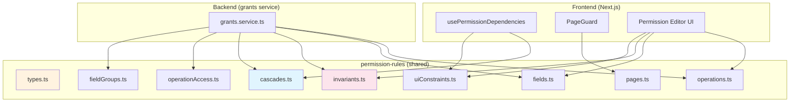

# @cucu/permission-rules

> The single source of truth for the entire Cucu permission model. Zero framework dependencies — shared between backend (NestJS) and frontend (Next.js). Defines operations, fields, invariants, cascades, pages, field groups, and UI constraints.

## Architecture Overview



**Design principle:** This library has ZERO framework dependencies. It works identically in a NestJS service and a Next.js React component. All functions are pure — no side effects, no network calls, no mutations.

## Module Index

| Module | Purpose |
|--------|---------|
| `types.ts` | All TypeScript types and interfaces |
| `operations.ts` | Operation catalog (CRUD operations) |
| `fields.ts` | Field catalog (entity field permissions) |
| `invariants.ts` | Fundamental rules that are ALWAYS true |
| `cascades.ts` | Cascade rules (automatic side-effects) |
| `pages.ts` | Page definitions (route → required operations) |
| `operationAccess.ts` | Protected operations and visibility rules |
| `fieldGroups.ts` | Logically coupled fields that must stay in sync |
| `uiConstraints.ts` | Pure functions for UI state derivation |

---

## Types

**File:** `src/types.ts`

### Core Types

```typescript
type ScopeValue = 'ALL' | 'SELF';
type EffectiveScope = ScopeValue | 'BYPASSED';

interface FieldPermissionState {
  canView: boolean;
  canEdit: boolean;
  viewScope: ScopeValue;
  editScope: ScopeValue;
}

interface EffectiveFieldPermission {
  canView: boolean;
  canEdit: boolean;
  effectiveViewScope: EffectiveScope;  // BYPASSED when canView=false
  effectiveEditScope: EffectiveScope;  // BYPASSED when canView=false OR canEdit=false
}

interface OperationPermissionState {
  canExecute: boolean;
  scope: ScopeValue;
}
```

### Operation Definition

```typescript
type OperationScopeMode =
  | 'FIXED_ALL'    // always ALL, not configurable
  | 'FIXED_SELF'   // always SELF, not configurable
  | 'VARIABLE';    // admin can choose ALL or SELF

interface OperationDefinition {
  name: string;
  scopeMode: OperationScopeMode;
  defaultScope: ScopeValue;
  description: string;
  entity: string;
}
```

### Field Definition

```typescript
type FieldSensitivity =
  | 'PUBLIC'       // safe to show by default
  | 'INTERNAL'     // internal use, hide from low-privilege groups
  | 'SENSITIVE'    // sensitive data (e.g. email, location)
  | 'RESTRICTED';  // highly sensitive (RAL, companyCosts, rates)

interface FieldDefinition {
  entityName: string;
  fieldPath: string;
  label: string;
  sensitivity: FieldSensitivity;
  description: string;
  readOnly?: boolean;           // canEdit always false
  fixedViewScope?: ScopeValue;  // viewScope locked to this value
  fixedEditScope?: ScopeValue;  // editScope locked to this value
}
```

### Cascade Rule Types

```typescript
type OpTriggerEvent =
  | 'enabled' | 'disabled'
  | 'scope:ALL_TO_SELF' | 'scope:SELF_TO_ALL';

interface CascadeRule {
  trigger: string;          // operation that triggers
  on: OpTriggerEvent;       // event type
  effects: PermEffect[];    // what happens
  feedback?: CascadeFeedback;  // user notification
}

// Effect can target operations or fields:
type PermEffect = OpPermEffect | FieldPermEffect;
```

### Page Definition

```typescript
interface PageDefinition {
  pageKey: string;
  routePrefixes: string[];
  requiredOperations: string[];
}
```

### Snapshot Types (for UI constraints)

```typescript
interface OpPermSnapshot {
  operationName: string;
  canExecute: boolean;
  operationScope: ScopeValue;
}

interface FieldPermSnapshot {
  entityName: string;
  fieldPath: string;
  canView: boolean;
  canEdit: boolean;
  viewScope: ScopeValue;
  editScope: ScopeValue;
}
```

---

## Operations Catalog

**File:** `src/operations.ts`

Defines every operation in the system. Each operation corresponds to a GraphQL query or mutation.

### All Operations

| Operation | Entity | Scope Mode | Default Scope | Description |
|-----------|--------|------------|---------------|-------------|
| `findAllUsers` | User | FIXED_ALL | ALL | Read list of all users (required for People page) |
| `findDeletedUsers` | User | FIXED_ALL | ALL | Read soft-deleted users list |
| `createUser` | User | FIXED_ALL | ALL | Create new user account |
| `updateUser` | User | VARIABLE | ALL | Update user profile data |
| `removeUser` | User | FIXED_ALL | ALL | Soft-delete user (recoverable) |
| `restoreUser` | User | FIXED_ALL | ALL | Restore soft-deleted user |
| `hardDeleteUser` | User | FIXED_ALL | ALL | Permanently delete user (irreversible) |
| `changePassword` | Session | FIXED_SELF | SELF | Change own password only |
| `findSessionsByUserId` | Session | VARIABLE | ALL | View user sessions |
| `revokeSession` | Session | VARIABLE | ALL | Revoke a single session |
| `revokeUserSessions` | Session | FIXED_ALL | ALL | Revoke all sessions for a user |

### Lookup Functions

```typescript
// Data structures
const OPERATION_DEFINITIONS: OperationDefinition[];
const OPERATION_MAP: Map<string, OperationDefinition>;

// Functions
function getOperationDefinition(name: string): OperationDefinition | undefined;
function isFixedScope(name: string): boolean;
function getFixedScope(name: string): 'ALL' | 'SELF' | undefined;
```

---

## Fields Catalog

**File:** `src/fields.ts`

Defines every field that can have permissions configured. Organized by entity and nested path.

### User Fields

| Field Path | Label | Sensitivity | Read-Only | Fixed Edit Scope |
|------------|-------|-------------|-----------|------------------|
| `authData.name` | First name | PUBLIC | — | — |
| `authData.surname` | Last name | PUBLIC | — | — |
| `authData.email` | Email | SENSITIVE | ✅ | — |
| `authData.groupIds` | Assigned groups | INTERNAL | — | ALL |
| `personalData.dateOfBirth` | Date of birth | SENSITIVE | — | ALL |
| `personalData.placeOfBirth` | Place of birth | SENSITIVE | — | ALL |
| `personalData.citizenship` | Citizenship | SENSITIVE | — | ALL |
| `personalData.languages` | Languages | INTERNAL | — | ALL |
| `employmentData.dateOfEmployment` | Employment date | INTERNAL | — | ALL |
| `employmentData.endDate` | End date | INTERNAL | — | ALL |
| `employmentData.location` | Location | INTERNAL | — | ALL |
| `employmentData.RAL` | RAL (salary) | **RESTRICTED** | — | ALL |
| `employmentData.companyCosts` | Company costs | **RESTRICTED** | — | ALL |
| `employmentData.rates` | Billing rates | **RESTRICTED** | — | ALL |
| `additionalFieldsData.active` | Active status | INTERNAL | — | ALL |
| `additionalFieldsData.seniorityLevelId` | Seniority | INTERNAL | — | ALL |
| `additionalFieldsData.jobRoleIds` | Job roles | INTERNAL | — | ALL |
| `additionalFieldsData.companyId` | Company | INTERNAL | — | ALL |
| `additionalFieldsData.supervisorIds` | Supervisors | INTERNAL | — | ALL |
| `additionalFieldsData.billable` | Billable | INTERNAL | — | ALL |

### Session Fields (all read-only)

| Field Path | Label | Sensitivity |
|------------|-------|-------------|
| `ip` | IP address | INTERNAL |
| `deviceName` | Device | INTERNAL |
| `browserName` | Browser | INTERNAL |
| `revokedAt` | Revoked at | INTERNAL |
| `expiresAt` | Expires at | INTERNAL |
| `sessionStart` | Session start | INTERNAL |
| `lastActivity` | Last activity | INTERNAL |

### Lookup Functions

```typescript
const FIELD_DEFINITIONS: FieldDefinition[];
const FIELD_MAP: Map<string, FieldDefinition>;  // key: "Entity:fieldPath"

function getFieldDefinition(entityName: string, fieldPath: string): FieldDefinition | undefined;
function getFieldsForEntity(entityName: string): FieldDefinition[];
function isReadOnlyField(entityName: string, fieldPath: string): boolean;
function getFixedViewScope(entityName: string, fieldPath: string): 'ALL' | 'SELF' | undefined;
function getFixedEditScope(entityName: string, fieldPath: string): 'ALL' | 'SELF' | undefined;
```

---

## Invariants

**File:** `src/invariants.ts`

Fundamental rules that are **ALWAYS true**, regardless of any configuration. Both FE and BE must enforce these.

### Field Invariants

| # | Rule | Rationale |
|---|------|-----------|
| 1 | `canView=false` → `canEdit` must be `false` | Can't edit what you can't see |
| 2 | `canView=false` → viewScope and editScope are `BYPASSED` | Scopes are meaningless without access |
| 3 | `canView=true, canEdit=false` → editScope is `BYPASSED` | Edit scope irrelevant without edit |
| 4 | `canEdit=true` → `canView` must be `true` | Editing implies viewing |
| 5 | editScope cannot be broader than viewScope | Can't edit ALL if you only see SELF |
| 7 | readOnly fields → `canEdit` always `false` | e.g., email can never be edited |
| 8 | fixedViewScope fields → viewScope locked | Cannot be changed by admin |
| 9 | fixedEditScope fields → editScope locked | Cannot be changed by admin |

### Operation Invariants

| # | Rule | Rationale |
|---|------|-----------|
| 6 | `updateUser.canExecute` can never be `false` | Required for core user management |

### Cross-Operation Invariants

| # | Rule | Rationale |
|---|------|-----------|
| 10 | `revokeSession.scope=SELF` → `findSessionsByUserId.scope` must be `SELF` | Can't list all sessions if can only revoke own |
| 11 | `revokeSession.scope=SELF` → all Session field viewScopes must be `SELF` | Can't see other users' session data if limited to own sessions |

### Scope Hierarchy Functions

```typescript
// ALL > SELF
function isBroader(scopeA: string, scopeB: string): boolean;
function broaderScope(a: string, b: string): string;
```

### Core Functions

#### `applyFieldInvariants(state: FieldPermissionState): EffectiveFieldPermission`

Returns the effective permission state after applying all invariants. **Use this everywhere** instead of reading raw values.

```typescript
// Example: canView=false makes everything BYPASSED
applyFieldInvariants({ canView: false, canEdit: true, viewScope: 'ALL', editScope: 'SELF' });
// → { canView: false, canEdit: false, effectiveViewScope: 'BYPASSED', effectiveEditScope: 'BYPASSED' }

// Example: editScope cannot exceed viewScope — viewScope gets upgraded
applyFieldInvariants({ canView: true, canEdit: true, viewScope: 'SELF', editScope: 'ALL' });
// → { canView: true, canEdit: true, effectiveViewScope: 'ALL', effectiveEditScope: 'ALL' }
```

#### `validateFieldPermissionInvariants(state, field?): string[]`

Returns violation messages. Used in BE mutation handlers to **reject** invalid configurations.

#### `coerceFieldPermission(state, field?): FieldPermissionState`

Returns a corrected state. Used in BE handlers to **auto-correct** before saving, and in FE toggle handlers to compute the next state.

**Coercion strategy for invariant 5:** When `editScope` is broader than `viewScope`, `viewScope` is **upgraded** to match — preserving the admin's intent of "I want to edit ALL" by making view consistent.

#### `validateOperationPermissionInvariants(opName, canExecute): string[]`

Validates operation invariants. Returns `["updateUser cannot be disabled: it is required for core user management"]` if you try to disable `updateUser`.

#### `validateCrossOperationInvariants(permissions: GroupPermissions): CrossOpViolation[]`

Validates cross-operation invariants against a full group permissions snapshot.

#### `coerceCrossOperationInvariants(permissions: GroupPermissions): GroupPermissions`

Auto-corrects cross-operation violations. When `revokeSession.scope=SELF`:
- Snaps `findSessionsByUserId.scope` to `SELF`
- Snaps all Session field viewScopes to `SELF`

### Helper Functions

```typescript
function effectiveViewScope(state): EffectiveScope;  // BYPASSED if !canView
function effectiveEditScope(state): EffectiveScope;   // BYPASSED if !canView || !canEdit
function isViewScopeRelevant(state): boolean;          // canView
function isEditScopeRelevant(state): boolean;          // canView && canEdit

const NON_DISABLEABLE_OPERATIONS: ReadonlySet<string> = new Set(['updateUser']);
```

---

## Cascade Rules

**File:** `src/cascades.ts`

Cascade rules define automatic side-effects when an operation's state changes. They encode business logic like "you can't restore users if you can't see deleted users."

### All Cascade Rules

#### User Lifecycle Cascades

| Trigger | Event | Effect | Rationale |
|---------|-------|--------|-----------|
| `findDeletedUsers` | disabled | Disable `restoreUser`, `hardDeleteUser`, `removeUser` | Can't act on deleted users if you can't see them |
| `hardDeleteUser` | enabled | Enable `findDeletedUsers` | Can't hard-delete what you can't see |
| `restoreUser` | enabled | Enable `findDeletedUsers` | Can't restore what you can't see |
| `findAllUsers` | disabled | Disable `createUser`; set `updateUser.scope=SELF`; force all User field editScopes to SELF | Without user list, creation and editing others makes no sense |
| `removeUser` | disabled | Disable `restoreUser`, `hardDeleteUser` | Can't manage deleted users without soft-delete |

#### Session Cascades

| Trigger | Event | Effect |
|---------|-------|--------|
| `findSessionsByUserId` | disabled | Disable `revokeSession`, `revokeUserSessions` |
| `findSessionsByUserId` | enabled | Enable `revokeSession` |
| `findSessionsByUserId` | scope ALL→SELF | Set `revokeSession.scope=SELF`; disable `revokeUserSessions` |
| `findSessionsByUserId` | scope SELF→ALL | Set `revokeSession.scope=ALL`; enable `revokeUserSessions` |

#### Update Scope Cascades

| Trigger | Event | Effect |
|---------|-------|--------|
| `updateUser` | scope ALL→SELF | Disable `removeUser`, `revokeUserSessions`; force User field editScopes to SELF |
| `updateUser` | scope SELF→ALL | Enable `removeUser`, `revokeUserSessions`; upgrade User field editScopes to ALL |

### Field-Level Cascade Effects

Some cascades target fields, not operations:

```typescript
{
  type: 'field',
  entityName: 'User',
  filter: { canEdit: true, editScopeContains: 'ALL' },
  apply: { editScope: ['SELF'] },
}
```

This finds all User fields where `canEdit=true` and editScope includes `ALL`, then forces editScope to `['SELF']`.

### Cascade Feedback

Each rule can include feedback shown to the admin:

```typescript
feedback: {
  level: 'info',
  message: 'Restore user and permanent delete have been automatically disabled — ...',
}
```

### Lookup Function

```typescript
function getCascadeRules(trigger: string, on: OpTriggerEvent): CascadeRule[];
```

---

## Operation Access

**File:** `src/operationAccess.ts`

Defines security boundaries for the permission system itself.

### `PROTECTED_OPERATIONS: ReadonlySet<string>`

Operations that manage the permission system. **Only SUPERADMIN can grant `canExecute` on these.** This prevents privilege escalation: a non-SUPERADMIN cannot give themselves control over groups, permissions, or operation permissions.

Includes all CRUD operations for: groups, permissions, operation permissions, page permissions, and gateway introspection (`listFieldsFromGateway`, `listOperationsFromGateway`).

### `HIDDEN_FROM_MY_PERMISSIONS: ReadonlySet<string>`

Operations filtered from the `myPermissions` API response. Prevents information disclosure about the internal grants system to non-admin users.

**Important:** `findAllGroups` and `findOneGroup` are intentionally **NOT hidden** because the FE sidebar needs them to determine which navigation items to show.

### Functions

```typescript
function isProtectedOperation(name: string): boolean;
function isHiddenFromMyPermissions(name: string): boolean;
```

---

## Field Groups

**File:** `src/fieldGroups.ts`

Logically coupled fields that must always be modified together. When one field in a group changes state (canView, canEdit, viewScope, editScope), all siblings must receive the same state.

### All Field Groups

| Field | Siblings | Reason |
|-------|----------|--------|
| `authData.name` | `authData.surname` | Name always paired with surname |
| `authData.surname` | `authData.name` | Same |
| `personalData.languages.code` | `personalData.languages.level` | Language code and level always together |
| `personalData.languages.level` | `personalData.languages.code` | Same |
| `additionalFieldsData.billable` | `employmentData.rates` | Billable status and rates always together |
| `employmentData.rates` | `additionalFieldsData.billable` | Same |
| `additionalFieldsData.seniorityLevel` | `additionalFieldsData.seniorityLevelId` | FK ↔ resolved field pair |
| `additionalFieldsData.jobRoles` | `additionalFieldsData.jobRoleIds` | FK ↔ resolved field pair |
| `additionalFieldsData.company` | `additionalFieldsData.companyId` | FK ↔ resolved field pair |
| `additionalFieldsData.supervisors` | `additionalFieldsData.supervisorIds` | FK ↔ resolved field pair |

**FK ↔ resolved field pairs:** The introspection system filters out FK IDs from the UI, but the permission DB may still contain them. This grouping ensures FK IDs stay aligned when the resolved field is toggled.

### Functions

```typescript
function getFieldSiblings(entityName: string, fieldPath: string): string[];
function hasFieldSiblings(entityName: string, fieldPath: string): boolean;
```

---

## Pages

**File:** `src/pages.ts`

Maps routes to required operations. Used by the FE `PageGuard` and BE page access validation.

### All Pages

| Page Key | Route Prefix | Required Operations |
|----------|-------------|---------------------|
| `people` | `/setup/people` | `findAllUsers` |
| `groups` | `/setup/groups` | *(none)* |
| `settings` | `/setup/settings` | *(none)* |
| `settings.seniorityLevels` | `/setup/settings/seniority` | *(none)* |
| `settings.jobRoles` | `/setup/settings/roles` | *(none)* |
| `settings.companies` | `/setup/settings/companies` | *(none)* |
| `projects` | `/setup/projects` | *(none)* |
| `milestones` | `/setup/drafts` | *(none)* |

### Functions

```typescript
function resolvePageKey(pathname: string): string | undefined;
function getPageDefinition(pageKey: string): PageDefinition | undefined;

const PAGE_MAP: Map<string, PageDefinition>;
```

`resolvePageKey` matches the most specific route prefix first (sorted by length descending).

---

## UI Constraints

**File:** `src/uiConstraints.ts`

Pure functions that derive UI state (disabled/locked/forced) from current permission configuration. Used by both FE (to render toggle states) and BE (to validate mutations).

### Operation Constraints

```typescript
// updateUser toggle is always locked to ON
function isOperationCanExecuteLocked(operationName: string): boolean;
function getOperationCanExecuteLockReason(operationName: string): string | undefined;
```

### Field Edit Scope Constraints

When `updateUser.scope = SELF`, all User field editScope toggles are **disabled and forced to SELF**.

```typescript
interface FieldEditScopeConstraint {
  disabled: boolean;
  forcedScope?: ScopeValue;
  reason?: string;
}

function getFieldEditScopeConstraint(entityName: string, opPermMap: Map<string, OpPermSnapshot>): FieldEditScopeConstraint;
function isFieldEditScopeDisabled(entityName: string, opPermMap: Map<string, OpPermSnapshot>): boolean;
function getForcedEditScope(entityName: string, opPermMap: Map<string, OpPermSnapshot>): ScopeValue | undefined;
```

### Read-Only Field Constraints

```typescript
function isFieldCanEditLocked(entityName: string, fieldPath: string): boolean;
function getFieldCanEditLockReason(entityName: string, fieldPath: string): string | undefined;
```

### Fixed Scope Constraints

```typescript
function getFieldFixedViewScope(entityName: string, fieldPath: string): 'ALL' | 'SELF' | undefined;
function getFieldFixedEditScope(entityName: string, fieldPath: string): 'ALL' | 'SELF' | undefined;
```

### RESTRICTED Field Warnings

Non-blocking awareness notifications for highly sensitive fields:

```typescript
function getRestrictedFieldWarning(entityName: string, fieldPath: string): CascadeFeedback | null;
function isRestrictedField(entityName: string, fieldPath: string): boolean;
function getBatchRestrictedFieldWarning(fields: Pick<FieldPermSnapshot, 'entityName' | 'fieldPath'>[]): CascadeFeedback | null;
```

### BE Validation Helper

```typescript
function validateFieldPermissionConstraints(
  entityName: string,
  fieldPath: string,
  incoming: { editScope?: ScopeValue },
  opPermMap: Map<string, OpPermSnapshot>,
): string[];
```

---

## How BE and FE Consume These Rules

### Backend (Grants Service)

The grants service (`cucu-nest/apps/grants/src/grants.service.ts`) imports:
- `OPERATION_DEFINITIONS` — to seed initial operations when creating a group
- `FIELD_DEFINITIONS` — to validate field paths
- `validateFieldPermissionInvariants()` — to reject invalid mutations
- `coerceFieldPermission()` — to auto-correct before saving
- `isProtectedOperation()` — to enforce SUPERADMIN-only grants
- `isHiddenFromMyPermissions()` — to filter `myPermissions` responses
- `getFieldSiblings()` — to sync coupled fields on updates
- `getCascadeRules()` — to apply cascading effects after mutations
- `validateCrossOperationInvariants()` — to validate full group snapshot

### Frontend (Next.js)

The frontend imports:
- `usePermissionDependencies` hook — reads `CASCADE_RULES` to apply cascades in real-time as admin toggles permissions
- `PageGuard` — reads `PAGE_DEFINITIONS` to control route access
- `uiConstraints` functions — to determine toggle disabled/locked states
- `OPERATION_DEFINITIONS` / `FIELD_DEFINITIONS` — to render labels and descriptions

---

## Used By

| Consumer | How Used |
|----------|----------|
| **grants service (BE)** | Invariant validation, cascade application, field groups, protected operations, scope enforcement |
| **cucu-frontend (FE)** | `usePermissionDependencies` hook, `useUpdateUserScopeHandler` hook, PageGuard, permission editor UI |

---

## Design Decisions

1. **Zero dependencies** — This library has no framework deps, making it safe to import in any context (Node, browser, tests)
2. **Single source of truth** — Adding a new operation means adding one entry to `OPERATION_DEFINITIONS`. No service or component changes needed for basic support.
3. **Cascades replace hardcoded logic** — Originally, cascade logic was scattered across FE components and BE handlers. Now it's declarative data in `CASCADE_RULES`.
4. **Invariants are separate from cascades** — Invariants are mathematical constraints (always true). Cascades are business rules (applied when events happen). This separation prevents confusion about what's enforced vs. suggested.
5. **UI constraints are pure functions** — The UI never computes toggle states itself. It calls `getFieldEditScopeConstraint()` and renders accordingly. This guarantees UI and BE agree on what's allowed.
