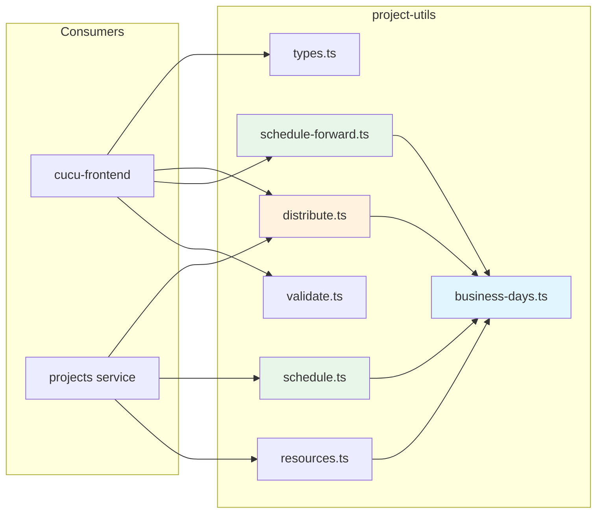
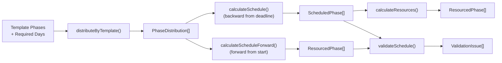

# @cucu/project-utils

> Pure utility functions for project planning: business day calculations, phase distribution, backward/forward scheduling, resource estimation, and schedule validation. Zero framework dependencies — shared between backend and frontend.

## Architecture Overview



**Design principle:** All functions are pure — no side effects, no dependencies, fully testable. Works identically in Node.js and browser environments.

## Module Index

| Export | Type | Source |
|--------|------|--------|
| `businessDaysBetween` | Function | `business-days.ts` |
| `addBusinessDays` | Function | `business-days.ts` |
| `subtractBusinessDays` | Function | `business-days.ts` |
| `distributeByTemplate` | Function | `distribute.ts` |
| `calculateSchedule` | Function | `schedule.ts` |
| `calculateScheduleForward` | Function | `schedule-forward.ts` |
| `calculateResources` | Function | `resources.ts` |
| `validateSchedule` | Function | `validate.ts` |
| `ValidationIssue` | Type | `validate.ts` |
| `TemplatePhase` | Type | `types.ts` |
| `RequiredPhaseDays` | Type | `types.ts` |
| `PhaseDistribution` | Type | `types.ts` |
| `ScheduledPhase` | Type | `types.ts` |
| `ResourcedPhase` | Type | `types.ts` |

---

## Types

**File:** `src/types.ts`

```typescript
/** A phase in a project template */
interface TemplatePhase {
  phaseId: string;           // Unique identifier
  name: string;              // Display name
  orderIndex: number;        // Sequential order (1-based)
  isRequired: boolean;       // If true, PM inputs days directly
  percentage?: number;       // % of base for derived phases (0-100)
  roleCategoryId?: string;   // Optional role category
}

/** Input: days assigned to each required phase */
type RequiredPhaseDays = Record<string, number>;  // phaseId → days

/** Output: computed days for each phase */
interface PhaseDistribution {
  phaseId: string;
  name: string;
  orderIndex: number;
  days: number;
  isRequired: boolean;
  roleCategoryId?: string;
}

/** Phase with schedule dates */
interface ScheduledPhase extends PhaseDistribution {
  startDate: Date;
  endDate: Date;
}

/** Phase with resource calculation */
interface ResourcedPhase extends ScheduledPhase {
  resources: number;              // ceil(days / businessDaysAvailable)
  businessDaysAvailable: number;  // Business days between start and end
}
```

---

## Business Day Calculations

**File:** `src/business-days.ts`

All functions exclude weekends (Saturday=6, Sunday=0) and optionally exclude holidays.

### `businessDaysBetween(start, end, holidays?): number`

Counts business days between two dates. **Start is inclusive, end is exclusive.**

```typescript
// Monday to Friday (same week) = 4 business days
businessDaysBetween(new Date('2024-01-01'), new Date('2024-01-05'));
// → 4

// With holidays
businessDaysBetween(
  new Date('2024-01-01'),
  new Date('2024-01-05'),
  [new Date('2024-01-03')],  // Wednesday is a holiday
);
// → 3
```

### `addBusinessDays(start, days, holidays?): Date`

Adds N business days to a date, skipping weekends and holidays.

```typescript
// Friday + 1 business day = Monday
addBusinessDays(new Date('2024-01-05'), 1);
// → 2024-01-08 (Monday)
```

### `subtractBusinessDays(end, days, holidays?): Date`

Subtracts N business days from a date, skipping weekends and holidays.

```typescript
// Monday - 1 business day = Friday
subtractBusinessDays(new Date('2024-01-08'), 1);
// → 2024-01-05 (Friday)
```

**Holiday matching:** Uses `YYYY-MM-DD` string keys for comparison (via internal `toDateKey` function), so time components are ignored.

---

## Phase Distribution

**File:** `src/distribute.ts`

### `distributeByTemplate(phases, requiredPhaseDays): PhaseDistribution[]`

Distributes workload days across template phases.

**Algorithm:**
1. Sort phases by `orderIndex`
2. Calculate **base** = sum of all required phase days
3. For each phase:
   - **Required phases:** Use the directly assigned days from `requiredPhaseDays`
   - **Derived phases:** Calculate as `base × (percentage / 100)`, rounded to nearest 0.5, minimum 0.5 days

**Validation:**
- Throws if a required phase is missing from `requiredPhaseDays`
- Throws if any required phase has less than 0.5 days
- Throws if base is 0
- Throws if a derived phase has no `percentage` defined

```typescript
const phases: TemplatePhase[] = [
  { phaseId: 'design', name: 'Design', orderIndex: 1, isRequired: true },
  { phaseId: 'dev', name: 'Development', orderIndex: 2, isRequired: true },
  { phaseId: 'qa', name: 'QA', orderIndex: 3, isRequired: false, percentage: 20 },
];

distributeByTemplate(phases, { design: 5, dev: 15 });
// → [
//   { phaseId: 'design', days: 5, ... },
//   { phaseId: 'dev', days: 15, ... },
//   { phaseId: 'qa', days: 4, ... },   // 20% of (5+15) = 4
// ]
```

---

## Scheduling

### Backward Scheduling: `calculateSchedule(phases, deadline, resources?, holidays?)`

**File:** `src/schedule.ts`

Works **backwards from the deadline**. The last phase ends at the deadline, each previous phase's end = next phase's start.

**Algorithm:**
1. Sort phases by `orderIndex` descending
2. For each phase:
   - `businessDaysNeeded = ceil(days / numResources)` (more resources = fewer days)
   - `endDate = currentEnd`
   - `startDate = subtractBusinessDays(endDate, businessDaysNeeded)`
   - Set `currentEnd = startDate` for the next phase
3. Reverse to restore ascending order

```typescript
calculateSchedule(
  distributedPhases,
  new Date('2024-03-31'),  // deadline
  { design: 1, dev: 2 },   // 2 devs on development
);
// Each phase gets start/end dates working back from March 31
```

### Forward Scheduling: `calculateScheduleForward(phases, startDate, deadline, holidays?)`

**File:** `src/schedule-forward.ts`

Works **forward from the start date**, distributing available business days proportionally across phases.

**Algorithm:**
1. Calculate `totalAvailableDays = businessDaysBetween(startDate, deadline)`
2. Calculate `totalPhaseDays = sum of all phase days`
3. Sort phases by `orderIndex` ascending
4. For each phase:
   - **Proportional allocation:** `allocatedDays = round((phase.days / remainingPhaseDays) × remainingBizDays)`
   - Last phase gets all remaining days (prevents rounding gaps)
   - `resources = ceil(phase.days / actualBizDays)` — automatically calculates how many parallel workers are needed
5. Returns `ResourcedPhase[]` with schedule AND resource counts

```typescript
calculateScheduleForward(
  distributedPhases,
  new Date('2024-01-15'),  // start tomorrow
  new Date('2024-03-31'),  // deadline
);
// Each phase gets proportional time allocation, resources computed automatically
```

---

## Resource Calculation

**File:** `src/resources.ts`

### `calculateResources(phases, holidays?): ResourcedPhase[]`

Calculates the number of parallel resources needed for each phase to complete its work within the scheduled timeframe.

```typescript
resources = ceil(phase.days / businessDaysAvailable)
```

If `businessDaysAvailable = 0` (degenerate case), `resources = ceil(days)`.

```typescript
// Phase with 10 days of work, 5 business days available → needs 2 resources
calculateResources([
  { days: 10, startDate: monday, endDate: friday, ... },
]);
// → [{ resources: 2, businessDaysAvailable: 5, ... }]
```

---

## Schedule Validation

**File:** `src/validate.ts`

### `validateSchedule(phases, deadline, now?): ValidationIssue[]`

Validates a scheduled project plan. Returns an array of issues (empty = valid).

```typescript
interface ValidationIssue {
  type: 'error' | 'warning';
  code: string;
  message: string;
  phaseId?: string;
}
```

**Checks performed:**

| Code | Type | Condition |
|------|------|-----------|
| `DEADLINE_IN_PAST` | error | Deadline is before today |
| `PHASE_STARTS_IN_PAST` | warning | A phase's start date is before today |

**The `now` parameter** is injectable for testing — defaults to `new Date()`.

---

## Pipeline: End-to-End Flow



**Two scheduling strategies:**
- **Backward (deadline-driven):** PM provides resources per phase, schedule works back from deadline. Used when the deadline is fixed and the team size is flexible.
- **Forward (start-driven):** Resources are computed automatically from available time. Used when the team is fixed and the PM wants to see resource requirements.

---

## Used By

| Consumer | How Used |
|----------|----------|
| **cucu-frontend** | Project planning UI: phase distribution, forward scheduling, validation |
| **projects service (BE)** | Server-side schedule computation, resource calculations |

> **Note:** At the time of writing, the FE package.json references `@cucu/project-utils` but the BE `projects` service may use it indirectly through shared computations. The library is designed to be isomorphic — identical behavior on client and server.

---

## Design Decisions

1. **Pure functions, no state** — Every function takes input and returns output. No classes, no singletons, no side effects. Maximum testability.
2. **0.5-day granularity** — The minimum allocation is 0.5 days, and derived phases are rounded to the nearest 0.5. This matches real-world project planning where half-day allocations are common.
3. **Two scheduling modes** — Backward scheduling (fixed deadline, flexible resources) and forward scheduling (fixed start, auto-computed resources) cover the two most common project planning scenarios.
4. **Holiday support everywhere** — All date functions accept an optional `holidays` array. The projects service stores holiday calendars per tenant.
5. **Validation is separate** — Scheduling functions don't validate inputs (except basic invariants). The `validateSchedule` function is called explicitly, giving the caller control over when to validate.
