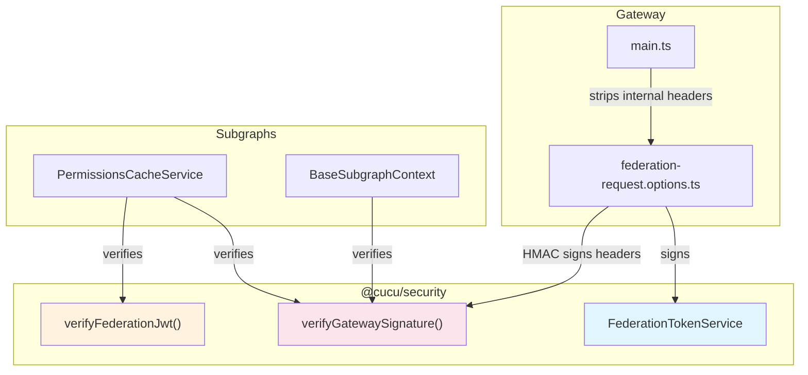
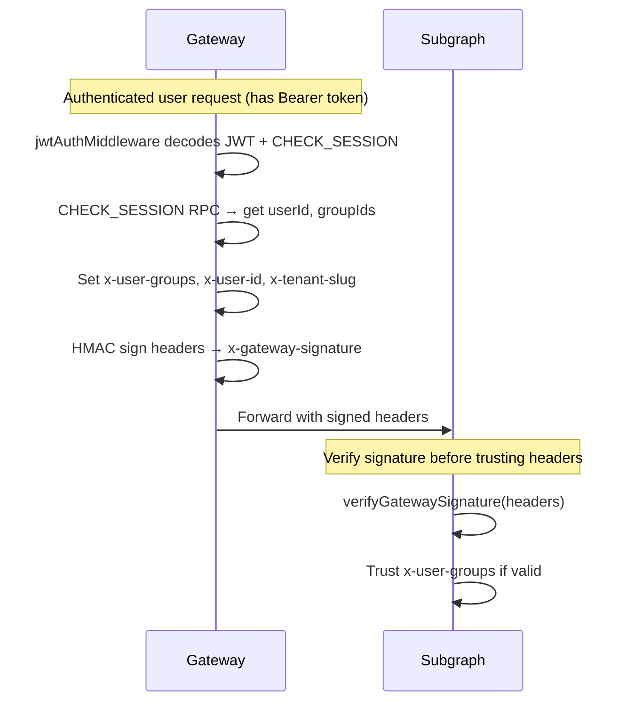
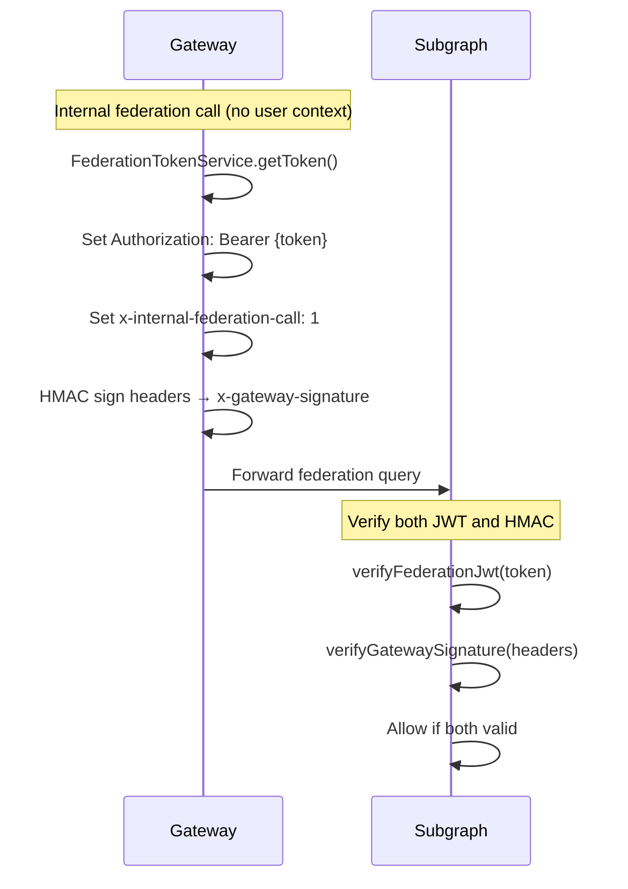
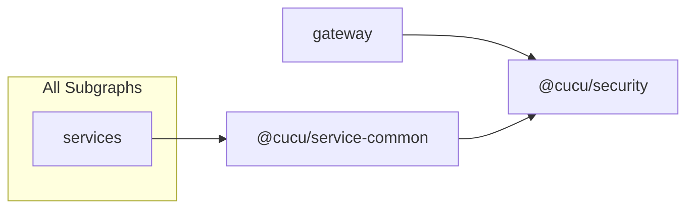

# @cucu/security

> Cryptographic security primitives for service-to-service communication. Provides federation JWT signing (RS256), gateway header HMAC verification, and federation JWT verification.

## Architecture Overview



## Module Index

| Export | Type | Purpose |
|--------|------|---------|
| `FederationTokenService` | Injectable Service | Generates self-signed RS256 JWTs for federation calls |
| `verifyGatewaySignature` | Function | HMAC-SHA256 verification of gateway-set headers |
| `verifyFederationJwt` | Function | RS256 verification of federation JWTs |

---

## FederationTokenService

**File:** `src/signing/federation-token.service.ts`

Generates self-signed RS256 JWTs for internal federation calls. Replaces the previous Keycloak M2M client_credentials flow that was removed in March 2026.

### Token Generation

```typescript
@Injectable()
export class FederationTokenService {
  async getToken(): Promise<string>;
}
```

The service:
1. Reads the RSA private key from `FEDERATION_PRIVATE_KEY_PATH` at startup
2. Caches tokens in memory, regenerating when < 10s from expiry
3. Signs JWTs with RS256 algorithm

### JWT Structure

```json
{
  "iss": "cucu-gateway",
  "sub": "federation",
  "iat": 1710000000,
  "exp": 1710000060
}
```

- **TTL**: 60 seconds (short-lived, frequently rotated)
- **Algorithm**: RS256
- **Key**: RSA private key from file

### Required Environment Variables

| Variable | Description | Example |
|----------|-------------|---------|
| `FEDERATION_PRIVATE_KEY_PATH` | Path to RSA private key file | `/certs/federation.key` |

**Fail-fast:** If the env var or file is missing, the service throws immediately at startup — no fallback.

### Usage

The Gateway uses `FederationTokenService` in `federation-request.options.ts`:

```typescript
const token = await federationTokenService.getToken();
request.http.headers.set('Authorization', `Bearer ${token}`);
request.http.headers.set('x-internal-federation-call', '1');
```

---

## verifyGatewaySignature

**File:** `src/verification/verify-gateway-signature.ts`

Verifies that internal HTTP headers were set by the gateway, not spoofed by a direct caller.

```typescript
function verifyGatewaySignature(headers: Record<string, any>): boolean
```

### Algorithm

1. Gateway computes HMAC-SHA256:
   ```
   payload = "x-user-groups|x-internal-federation-call|x-user-id|x-tenant-slug|x-tenant-id"
   signature = HMAC-SHA256(INTERNAL_HEADER_SECRET, payload)
   ```
2. Gateway sets `x-gateway-signature` header with the result
3. Subgraphs recompute and compare using `crypto.timingSafeEqual()`

### Security Properties

- **Timing-safe**: Uses `timingSafeEqual` to prevent timing attacks
- **Fail-closed**: Returns `false` if `INTERNAL_HEADER_SECRET` is not set
- **Length check**: Returns `false` if signature lengths don't match (before timing-safe comparison)

### Required Environment Variables

| Variable | Description |
|----------|-------------|
| `INTERNAL_HEADER_SECRET` | Shared secret for HMAC signing (must be same across all services) |

### Why This Matters

Without HMAC verification, any client could:
1. Send requests directly to a subgraph (bypassing the gateway)
2. Set `x-user-groups: SUPERADMIN` to gain admin access
3. Set `x-tenant-slug: other-tenant` for cross-tenant access

The signature ensures only the gateway can set these headers.

---

## verifyFederationJwt

**File:** `src/verification/verify-federation-jwt.ts`

Verifies federation JWTs signed by the gateway using RS256.

```typescript
function verifyFederationJwt(token: string): boolean
```

### Validation Steps

1. Loads public key from `FEDERATION_PUBLIC_KEY_PATH` (cached after first read)
2. Verifies RS256 signature
3. Checks `exp` (expiration)
4. Validates `iss === 'cucu-gateway'`
5. Validates `sub === 'federation'`

### Required Environment Variables

| Variable | Description | Example |
|----------|-------------|---------|
| `FEDERATION_PUBLIC_KEY_PATH` | Path to RSA public key file | `/certs/federation.pub` |

### Error Handling

Returns `false` for all error cases — does NOT throw. This is deliberate: callers check the boolean and handle invalid tokens appropriately.

---

## Security Architecture

### Two-Layer Authentication

The system uses two independent authentication mechanisms:

| Mechanism | Purpose | Transport |
|-----------|---------|-----------|
| **Federation JWT (RS256)** | Authenticate internal federation calls | HTTP (gateway → subgraph) |
| **HMAC Gateway Signature** | Verify gateway-set headers | HTTP (gateway → subgraph) |
| **RPC Internal Secret** | Authenticate service-to-service RPC | Redis (via `_internalSecret` field) |

### Request Flow





---

## Key Generation

Generate an RSA key pair for federation JWT signing:

```bash
# Generate private key (2048-bit RSA)
openssl genrsa -out federation.key 2048

# Extract public key
openssl rsa -in federation.key -pubout -out federation.pub
```

**Production Requirements:**
- Private key: Gateway only (`FEDERATION_PRIVATE_KEY_PATH`)
- Public key: All subgraphs (`FEDERATION_PUBLIC_KEY_PATH`)
- Keys should be rotated periodically
- Store securely (Kubernetes secrets, AWS Secrets Manager, etc.)

---

## Migration from Keycloak M2M

This package replaces `@cucu/keycloak-m2m` which was removed in March 2026. Key differences:

| Aspect | Old (Keycloak M2M) | New (@cucu/security) |
|--------|-------------------|---------------------|
| Token source | Keycloak server (client_credentials grant) | Self-signed (local RSA key) |
| Network dependency | Required Keycloak availability | No external dependency |
| Token TTL | Configurable (typically 5 min) | 60 seconds (hardcoded) |
| Algorithm | RS256 (JWKS from Keycloak) | RS256 (local key pair) |
| Verification | JWKS endpoint | Local public key file |

**Migration steps:**
1. Remove `KeycloakM2MModule.forRoot()` from all services
2. Add `FederationTokenService` to Gateway's `FederationModule`
3. Set `FEDERATION_PRIVATE_KEY_PATH` on Gateway
4. Set `FEDERATION_PUBLIC_KEY_PATH` on all subgraphs
5. Remove `KC_*` environment variables

---

## Used By

| Component | Package | Usage |
|-----------|---------|-------|
| `federation-request.options.ts` | Gateway | Signs federation calls with `FederationTokenService` |
| `PermissionsCacheService` | service-common | Verifies headers with `verifyGatewaySignature`, `verifyFederationJwt` |
| `BaseSubgraphContext` | service-common | Verifies headers with `verifyGatewaySignature` |
| `RpcInternalGuard` | service-common | Uses `INTERNAL_HEADER_SECRET` for RPC auth (same secret) |

---

## Dependency Graph


