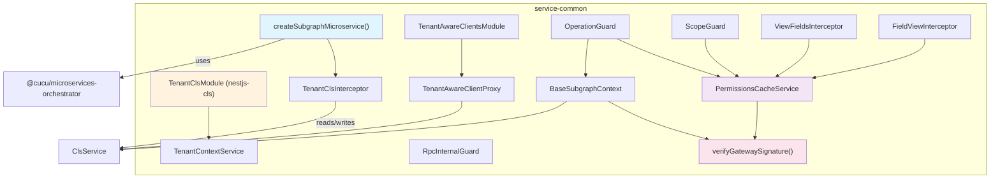
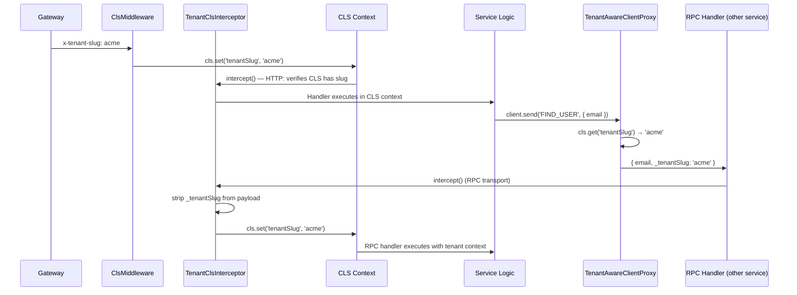
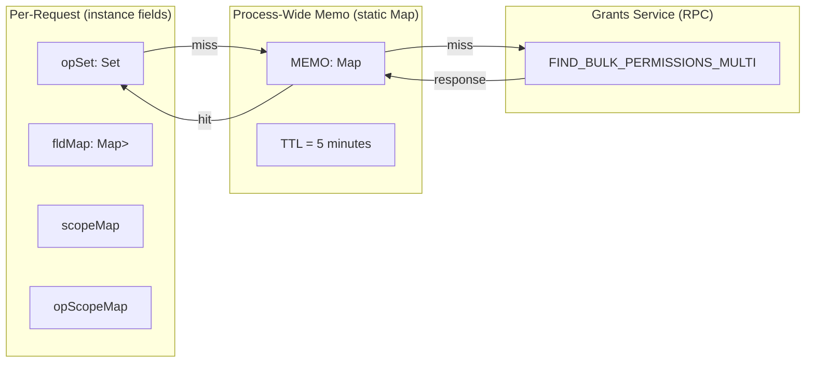
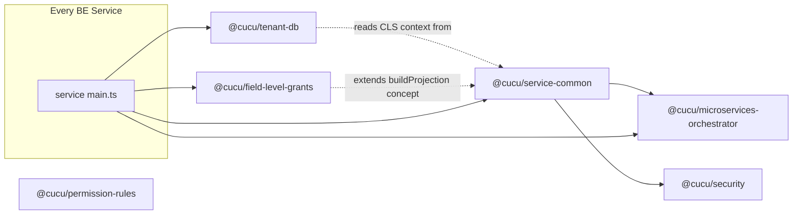

# @cucu/service-common

> The foundational shared library for all Cucu backend microservices. Provides the bootstrap system, tenant context propagation, permission enforcement, security verification, and common utilities.

## Architecture Overview



## Module Index

| Export | Type | Purpose |
|--------|------|---------|
| `createSubgraphMicroservice` | Function | Shared bootstrap for all subgraph microservices |
| `CreateSubgraphOptions` | Interface | Options for `createSubgraphMicroservice` |
| `TenantClsModule` | NestJS Module | Configures `nestjs-cls` for tenant context propagation (ClsMiddleware + ClsInterceptor) |
| `TenantContextService` | Injectable Service | DI-friendly wrapper around `ClsService<TenantClsStore>` for tenant slug access |
| `TenantClsInterceptor` | NestJS Interceptor | Extracts tenant slug from RPC payloads into CLS, strips transport fields |
| `TenantClsStore` | Interface | Typed CLS store: `{ tenantSlug: string; tenantId?: string }` |
| `TenantAwareClientProxy` | Class | Wraps `ClientProxy` to auto-inject `_tenantSlug` from CLS |
| `TenantAwareClientsModule` | NestJS Module | Drop-in replacement for `ClientsModule.registerAsync()` with CLS-based tenant injection |
| `BaseSubgraphContext` | Class | Request-scoped context with user/tenant info extraction (uses CLS for tenant slug) |
| `ISubgraphContext` | Interface | Contract for subgraph context classes |
| `PermissionsCacheService` | Service | Lazy-loaded, memoized permission cache per request |
| `OperationGuard` | Guard | Validates operation-level permissions on GraphQL resolvers |
| `ScopeGuard` | Guard | Enforces `self` vs `all` scope on operations |
| `RpcInternalGuard` | Guard | Protects sensitive RPC handlers with `_internalSecret` |
| `PlatformAdminGuard` | Guard | Restricts access to platform administrators only |
| `createViewFieldsInterceptor` | Factory | Creates entity-specific field-level permission interceptor |
| `FieldViewInterceptor` | Interceptor | Per-resolver field visibility check |
| `CheckFieldView` | Decorator | Marks a resolver with entity/field metadata for `FieldViewInterceptor` |
| `ViewableFields` | Param Decorator | Extracts viewable field set from `req.__fieldSec` |
| `ScopeCapable` | Decorator | Marks a resolver as scope-aware for `ScopeGuard` |
| `verifyGatewaySignature` | Function | HMAC-SHA256 verification of gateway headers (re-exported from @cucu/security) |
| `verifyFederationJwt` | Function | RS256 federation JWT verification (re-exported from @cucu/security) |
| `FederationTokenService` | Service | RS256 federation JWT signing (re-exported from @cucu/security) |
| `buildProjection` | Function | Converts viewable field set to Mongoose projection |
| `PaginationInput` | GraphQL InputType | Standardized pagination (page, limit) |
| `SortInput` | GraphQL InputType | Standardized sorting (field, order) |
| `SortOrder` | Enum | `ASC` / `DESC` |
| `buildSortObject` | Function | Converts `SortInput` to Mongoose sort object |
| `ParseMongoIdPipe` | Pipe | Validates MongoDB ObjectId strings |
| `assertObjectId` | Function | Throws `BadRequestException` for invalid ObjectIds |
| `buildRedisTlsOptions` | Function | Builds Redis connection config with optional TLS |

---

## Bootstrap System

### `createSubgraphMicroservice(module, envPrefix, options?)`

**File:** `src/bootstrap/create-subgraph-microservice.ts`

The single entry point for bootstrapping every Cucu microservice. Every service's `main.ts` calls this function — it handles the entire NestJS application lifecycle.

```typescript
export interface CreateSubgraphOptions {
  cors?: Record<string, any>;
  middleware?: Array<(req: any, res: any, next: any) => void>;
  beforeStart?: (app: any) => void | Promise<void>;
  connectMicroserviceOptions?: Record<string, any>;
  orchestratorOptions?: Partial<{ retry: number; retryDelays: number }>;
}
```

#### What it does (in order):

1. **Creates NestJS application** via `NestFactory.create(module)`
2. **Calls `beforeStart` hook** — used by services that need early setup (e.g., `cookieParser()` in the auth service)
3. **Enables CORS** if `cors` option provided
4. **Applies Express middleware** in order
5. **Reads environment variables** using `envPrefix`:
   - `{PREFIX}_SERVICE_NAME` — service identity for orchestrator
   - `{PREFIX}_SERVICE_PORT` — HTTP listen port
   - `{PREFIX}_REDIS_TLS_CLIENT_CERT` / `KEY` — per-service Redis TLS certs
   - `REDIS_SERVICE_HOST`, `REDIS_SERVICE_TLS_PORT`, `REDIS_TLS_CA_CERT` — shared Redis config
6. **Checks dependencies** via `MicroservicesOrchestratorService.areDependenciesReady()` — blocks until all declared dependencies are ready in Redis
7. **Connects Redis microservice transport** with `inheritAppConfig: true` (default, overridable via `connectMicroserviceOptions`) — this ensures `APP_INTERCEPTOR`, `APP_GUARD`, and `APP_PIPE` registered in modules also apply to RPC handlers
8. **Registers global `RpcInternalGuard`** via `useGlobalGuards` — fail-closed guard that validates `_internalSecret` in RPC payloads (see [Security](/shared/security.md)). Applies to ALL transports regardless of `inheritAppConfig`.
9. **Registers global `TenantClsInterceptor`** via `useGlobalInterceptors` — extracts tenant slug from RPC payloads into CLS context, strips tenant metadata from payloads before `ValidationPipe` sees them. For HTTP/GraphQL, the `ClsMiddleware` (from `TenantClsModule`) handles initial context setup. Applies to ALL transports regardless of `inheritAppConfig`.
10. **Registers global `ValidationPipe`** with `whitelist: true`, `forbidNonWhitelisted: true`, `transform: true` — runs *after* interceptors strip tenant fields
11. **Starts all microservices** (Redis transport)
12. **Listens on HTTP port**
13. **Notifies orchestrator** via `notifyServiceReady()` — publishes readiness to Redis

#### Why `inheritAppConfig: true` matters

This flag ensures that `APP_INTERCEPTOR`, `APP_GUARD`, and `APP_PIPE` registered in modules also apply to RPC handlers. However, `TenantClsInterceptor` and `RpcInternalGuard` are registered via `useGlobalInterceptors`/`useGlobalGuards` (which apply to ALL transports regardless of this flag).

The Gateway overrides with `inheritAppConfig: false` to prevent its HTTP-only guards (`GlobalAuthGuard`, `ThrottlerGuard`) from applying to Redis RPC handlers.

#### Example usage (from a service `main.ts`):

```typescript
import { AppModule } from './app.module';
import { createSubgraphMicroservice } from '@cucu/service-common';

async function bootstrap() {
  await createSubgraphMicroservice(AppModule, 'USERS');
}
bootstrap();
```

---

## Tenant System

The tenant system enables multi-tenancy across all microservices using **nestjs-cls** for context propagation:



### `TenantClsModule`

**File:** `src/tenant/tenant-cls.module.ts`

Global module that configures `nestjs-cls` for tenant context propagation:

- **`ClsMiddleware`** (HTTP/GraphQL): Mounted automatically. The `setup` callback reads `x-tenant-slug` from the request header and stores it in CLS.
- **`ClsInterceptor`** (RPC): Mounted automatically. Initializes a CLS context for Redis transport messages.

Must be imported in the root module of every subgraph service.

### `TenantContextService`

**File:** `src/tenant/tenant-context-service.ts`

Injectable wrapper around `ClsService<TenantClsStore>`. Provides a familiar API for services that need tenant context:

```typescript
@Injectable()
export class TenantContextService {
  getTenantSlug(): string;                    // Throws if no CLS context
  getTenantSlugOrNull(): string | null;       // Returns null outside context
  setTenantSlug(slug: string): void;          // Rarely needed in service code
  run<T>(tenantSlug: string, fn: () => T): T; // For code outside request lifecycle
}
```

### `TenantClsStore`

**File:** `src/tenant/tenant-cls-store.ts`

Typed CLS store interface:

```typescript
export interface TenantClsStore extends ClsStore {
  tenantSlug: string;
  tenantId?: string;
}
```

**Why nestjs-cls:** Framework-integrated CLS eliminates the need for manual `AsyncLocalStorage.run()` calls. `ClsMiddleware` and `ClsInterceptor` handle context initialization for all transports automatically, while `ClsService` provides DI-friendly access.

### `TenantClsInterceptor`

**File:** `src/tenant/tenant-cls.interceptor.ts`

Registered globally by `createSubgraphMicroservice()`. Works with `ClsService` instead of raw `AsyncLocalStorage`:

| Transport | Behavior |
|-----------|----------|
| HTTP / GraphQL | Verifies CLS has `tenantSlug` (set by `ClsMiddleware`). Fallback: reads from `x-tenant-slug` header. |
| RPC | Extracts `_tenantSlug` from payload → `cls.set('tenantSlug', slug)`. **Strips** `_tenantSlug` and `_tenantId` from payload. |

Unlike the old `TenantInterceptor`, this does **NOT** call `TenantContext.run()` — the CLS context is already initialized by `ClsMiddleware` (HTTP) or `ClsInterceptor` (RPC) from `TenantClsModule`.

**Payload unwrapping logic:** When `TenantAwareClientProxy` wraps a primitive value (string, number), it creates `{ _payload: value, _tenantSlug: 'acme' }`. The interceptor detects this pattern and unwraps it, restoring the original payload shape before the handler sees it.

### `TenantAwareClientProxy`

**File:** `src/tenant/tenant-aware-client.proxy.ts`

Wraps a standard NestJS `ClientProxy` to automatically inject `_tenantSlug` (from CLS) into every `send()` and `emit()` call.

```typescript
class TenantAwareClientProxy extends ClientProxy {
  static wrap(client: ClientProxy, cls?: ClsService<TenantClsStore>): TenantAwareClientProxy;
  send<TResult, TInput>(pattern: any, data: TInput): Observable<TResult>;
  emit<TResult, TInput>(pattern: any, data: TInput): Observable<TResult>;
}
```

**Enrichment rules:**
1. Reads tenant slug via `this.cls?.get('tenantSlug')` (CLS context)
2. If no tenant context is active → payload unchanged (platform-level calls)
3. If payload already has `_tenantSlug` → don't overwrite
4. If payload is an object → spread `_tenantSlug` into it
5. If payload is a primitive → wrap: `{ _payload: data, _tenantSlug: slug }`

### `TenantAwareClientsModule`

**File:** `src/tenant/tenant-aware-clients.module.ts`

A drop-in replacement for `ClientsModule.registerAsync()`. Services use the same injection tokens (e.g., `'USERS_SERVICE'`) but receive a `TenantAwareClientProxy` instead of a raw `ClientProxy`.

**How it works internally:**
1. Renames each client registration to `__RAW__USERS_SERVICE`
2. Registers the raw clients via `ClientsModule.registerAsync()`
3. Creates wrapper providers that inject both `__RAW__USERS_SERVICE` and `ClsService`
4. Returns `TenantAwareClientProxy.wrap(rawClient, clsService)` — the proxy reads tenant slug from CLS
5. Exports the original token names pointing to the wrapped proxies

**Before (manual wrapping):**
```typescript
const RedisClientsModule = ClientsModule.registerAsync([...]);
```

**After (automatic wrapping):**
```typescript
const RedisClientsModule = TenantAwareClientsModule.registerAsync([...]);
```

---

## Permission Enforcement

### `PermissionsCacheService`

**File:** `src/permissions/permissions-cache.service.ts`

The centerpiece of the permission system on the service side. Request-scoped (`Scope.REQUEST`), with a process-wide in-memory memoization layer (TTL = 5 minutes).

```typescript
@Injectable({ scope: Scope.REQUEST })
export class PermissionsCacheService {
  // Static cache management
  static invalidateGroups(groupIds: string[]): void;
  static invalidateAll(): void;

  // Public API
  async ensureOpAllowed(op: string, explicit: string[]): Promise<void>;
  async ensureEntityLoaded(entity: string, explicit: string[]): Promise<void>;
  getViewableFieldsForEntity(ent: string): Set<string>;
  getScopeMapForEntity(ent: string): Map<string, string>;
  getFieldsByScope(ent: string): { allFields: Set<string>; selfFields: Set<string> };
  getOperationScope(opName: string): 'self' | 'all' | null;
}
```

#### Two-level caching architecture



**Key = sorted group IDs joined by comma.** This means users in the same groups share the same memo slot.

#### Group resolution priority

1. **Explicit groups** passed by the caller (deduped)
2. **`x-user-groups` header** — only if HMAC signature is valid (`verifyGatewaySignature`)
3. **Bearer JWT** — decoded (not verified — verification happens at the gateway) to extract `groups` claim
4. **`INTERNAL_CALL` override** — only when there's no `x-user-groups` header AND (`x-internal-federation-call=1` OR `Bot` auth scheme), AND HMAC signature is valid

#### Scope hierarchy

Scope merging uses an "only upgrade, never downgrade" strategy:
- `'all'` beats `'self'`
- If a field has `scope='all'` from any group, it stays `'all'`

#### Cache invalidation

When a `PERMISSIONS_CHANGED` event is received, services call `PermissionsCacheService.invalidateGroups(groupIds)`. This removes all memo entries whose key contains any of the affected group IDs.

### `OperationGuard`

**File:** `src/guards/operation.guard.ts`

Request-scoped guard that checks whether the current user can execute a GraphQL operation.

**Bypass conditions (in order):**
1. RPC calls → always pass (service-to-service trust)
2. Missing `permCache` or `sctx` → pass (safe fallback during init)
3. Internal federation calls without user context → pass (schema stitching, introspection)
4. Normal requests → extract operation name from GraphQL `info`, call `permCache.ensureOpAllowed()`

**Operation name extraction:** Takes the first selection from the operation's selection set and strips any Apollo suffixes (regex: `/__\w+__\d+$/`).

### `ScopeGuard`

**File:** `src/permissions/scope.guard.ts`

Works in tandem with the `@ScopeCapable(idParamName)` decorator. Enforces operation-level scope (`'self'` vs `'all'`).

**Flow:**
1. No `@ScopeCapable` metadata → allow (not scope-aware)
2. Extract operation name from GQL info
3. Look up scope via `PermissionsCacheService.getOperationScope()`
4. If `null` or `'all'` → allow
5. If `'self'` → compare `args[idParamName]` with `currentUserId()` from headers
6. Mismatch → `403 Forbidden`

**Important:** If `idParamName` doesn't exist in the GQL args, the guard logs a warning but **allows** the request (passthrough). This is deliberate — some operations (like "me" queries) don't take an ID parameter.

### `RpcInternalGuard`

**File:** `src/guards/rpc-internal.guard.ts`

Protects sensitive RPC mutation handlers from unauthorized Redis callers. Used selectively — only on RPC endpoints that modify critical data.

**Security properties:**
- **Fail-closed:** If `INTERNAL_HEADER_SECRET` env var is not set, ALL requests are rejected
- **Timing-safe:** Uses `crypto.timingSafeEqual()` to prevent timing attacks
- **Clean-up:** Strips `_internalSecret` from payload before the handler sees it

### `PlatformAdminGuard`

**File:** `src/guards/platform-admin.guard.ts`

Restricts GraphQL mutations to platform-level administrators only. Unlike `RpcInternalGuard` (which protects RPC endpoints), this guard is for HTTP/GraphQL endpoints that should only be accessible to platform admins.

**How it works:**
1. Reads `x-user-email` from gateway-propagated headers
2. Calls `CHECK_PLATFORM_ADMIN` RPC on the Tenants service
3. Throws `ForbiddenException` if user is not a platform admin

**Requirements for consuming services:**
- Register `TENANTS_SERVICE` as an RPC client in the module
- Gateway must propagate `x-user-email` header from JWT payload

**Usage:**
```typescript
@UseGuards(PlatformAdminGuard)
@Mutation(() => HolidayCalendar)
async upsertHolidayCalendar(@Args('input') input: UpsertHolidayCalendarInput) { ... }
```

**Use case:** The Holidays service uses this guard to restrict national holiday calendar mutations (which affect all tenants) to platform administrators.

### `createViewFieldsInterceptor(entities: string[])`

**File:** `src/permissions/load-fields.interceptor.ts`

Factory function that creates a request-scoped interceptor for field-level permission enforcement. Each service creates one for its entities.

**What it does:**
1. Bypasses for RPC calls and internal federation calls without user context
2. For each entity in the list, loads viewable fields via `PermissionsCacheService`
3. Splits fields by scope (`allFields` vs `selfFields`) using `getFieldsByScope()`
4. Builds Mongoose projections using `buildProjection()`
5. Stores results on `req.__fieldSec[entityName]` with structure:
   ```typescript
   {
     set: Set<string>,        // all viewable fields
     proj: Record<string, 1>, // Mongoose projection for all viewable
     projOthers: Record<string, 1>, // projection excluding self-only fields
     selfFields: Set<string>  // fields only visible on own records
   }
   ```
6. Throws `ForbiddenException` if user has zero viewable fields on ALL entities

### `FieldViewInterceptor` + `@CheckFieldView(entity, field)`

**File:** `src/permissions/check-field-view.interceptor.ts`

Per-resolver interceptor for checking access to a specific field. Used on GraphQL field resolvers (e.g., resolved references, computed fields).

If the field is not in the viewable set, returns `null` (for scalars) or `[]` (for arrays) based on the return type in the GraphQL schema — without throwing an error.

### `@ViewableFields(entity)`

**File:** `src/permissions/viewable-fields.decorator.ts`

Parameter decorator that extracts the `Set<string>` of viewable field paths from `req.__fieldSec[entity].set`. Used in resolver methods to build dynamic queries.

```typescript
@Query(() => [User])
async findAllUsers(
  @ViewableFields('User') viewable: Set<string>,
) {
  // viewable contains the field paths this user can see
}
```

### `@ScopeCapable(idParamName = 'id')`

**File:** `src/permissions/scope-capable.decorator.ts`

Metadata decorator that tells `ScopeGuard` which GQL argument holds the target resource ID.

```typescript
@ScopeCapable('id')
@Query(() => User)
findUserById(@Args('id') id: string) { ... }
```

---

## Security

Security verification functions are now provided by `@cucu/security` and re-exported from `service-common` for backward compatibility:

### `verifyGatewaySignature(headers)`

Re-exported from `@cucu/security`. Verifies that internal HTTP headers (`x-user-groups`, `x-internal-federation-call`, `x-user-id`, `x-tenant-slug`, `x-tenant-id`) were set by the gateway and not spoofed by a direct caller.

**Algorithm:**
1. Gateway computes: `HMAC-SHA256(secret, "x-user-groups|x-internal-federation-call|x-user-id|x-tenant-slug|x-tenant-id")`
2. Sends result as `x-gateway-signature` header
3. Each service recomputes and compares using `crypto.timingSafeEqual()`

**Secret:** `process.env.INTERNAL_HEADER_SECRET` (fails closed if not set).

### `verifyFederationJwt(token)`

Re-exported from `@cucu/security`. Verifies RS256-signed federation JWTs issued by `FederationTokenService`. Used by `PermissionsCacheService` to validate internal federation calls.

### `FederationTokenService`

Re-exported from `@cucu/security`. Generates self-signed RS256 JWTs for federation calls. Used by the Gateway. See [Security](/shared/security.md) for full documentation.

**Why this matters:** Without HMAC verification, any client could send `x-user-groups: SUPERADMIN` directly to a subgraph service (bypassing the gateway) and gain full access. The signature ensures only the gateway can set these headers.

---

## Context System

### `ISubgraphContext` (Interface)

**File:** `src/context/subgraph-context.interface.ts`

```typescript
export interface ISubgraphContext {
  userGroups(): string[];
  isInternalCall(): boolean;
  hasUserContext(): boolean;
  currentUserId(): string | undefined;
  tenantSlug(): string | undefined;
  tenantId(): string | undefined;
}
```

Every service implements this interface in its own context class (e.g., `AuthContext`, `UsersContext`, `GrantsContext`). Guards and interceptors depend on this interface via the `'SUBGRAPH_CONTEXT'` injection token.

### `BaseSubgraphContext`

**File:** `src/context/base-subgraph-context.ts`

Request-scoped base implementation that extracts information from HTTP headers and CLS context:

| Method | Source | Notes |
|--------|--------|-------|
| `userGroups()` | `req.user.groups` | Set by JWT middleware (gateway) |
| `isInternalCall()` | `x-internal-federation-call` header | Only trusted if HMAC valid |
| `hasUserContext()` | `x-user-groups` header presence | Only trusted if HMAC valid |
| `currentUserId()` | `x-user-id` header | Only trusted if HMAC valid |
| `tenantSlug()` | CLS context → `x-tenant-slug` header fallback | CLS preferred (set by `ClsMiddleware`/`TenantClsInterceptor`), then HTTP header |
| `tenantId()` | `x-tenant-id` header | HTTP only (not propagated in RPC) |

**Important:** `tenantSlug()` now prioritizes CLS context over HTTP headers. For RPC contexts, `_tenantSlug` is no longer available on the request object because `TenantClsInterceptor` strips it — the slug is preserved in CLS instead.

**Header extraction handles two patterns:**
- Direct HTTP: `req.headers`
- GraphQL context: `req.req.headers` (because NestJS GraphQL wraps the request)

---

## DTOs

### `PaginationInput`

```typescript
@InputType()
class PaginationInput {
  page: number;   // default: 1, min: 1
  limit: number;  // default: 20, min: 1, max: 100
}
```

### `SortInput`

```typescript
@InputType()
class SortInput {
  field?: string;        // default: 'createdAt', max 100 chars
  order: SortOrder;      // default: ASC
}

enum SortOrder { ASC = 'ASC', DESC = 'DESC' }
```

---

## Utilities

### `buildProjection(viewable: Set<string>): Record<string, 1>`

Converts a set of viewable field paths to a Mongoose inclusion projection. **Handles parent-child deduplication:** if both `authData` and `authData.email` are present, only the children are included (the parent is discarded to avoid over-exposing data).

### `buildSortObject(sort?, defaultSort?): Record<string, 1 | -1>`

Converts a `SortInput` DTO to a Mongoose-compatible sort object. Defaults to `{ createdAt: -1 }`.

### `buildRedisTlsOptions(cfg, envPrefix)`

Reads Redis connection config from `ConfigService`. If TLS certs are available (`{PREFIX}_REDIS_TLS_CLIENT_CERT`, `{PREFIX}_REDIS_TLS_CLIENT_KEY`, `REDIS_TLS_CA_CERT`), returns TLS-enabled config. Otherwise falls back to plain connection with a console warning.

### `ParseMongoIdPipe`

NestJS pipe that validates a string is a valid MongoDB ObjectId. Throws `BadRequestException` with the invalid value in the message.

### `assertObjectId(id, fieldName?)`

Imperative version of `ParseMongoIdPipe` — call it directly in service methods.

---

## Used By

Every backend microservice depends on `@cucu/service-common`. Here's how each service uses it:

| Service | Key Imports | How Used |
|---------|-------------|----------|
| **gateway** | `createSubgraphMicroservice`, `verifyGatewaySignature`, `buildRedisTlsOptions`, `TenantClsStore`, `TenantContextService` | Bootstrap, HMAC signature computation, Redis transport, CLS tenant context for auth RPC calls |
| **auth** | `createSubgraphMicroservice`, `BaseSubgraphContext`, `TenantAwareClientsModule`, `OperationGuard`, `PermissionsCacheService` | Bootstrap, auth context, tenant-aware RPC to users/grants |
| **users** | `createSubgraphMicroservice`, `BaseSubgraphContext`, `OperationGuard`, `ScopeGuard`, `createViewFieldsInterceptor`, `ViewableFields`, `TenantAwareClientsModule`, `PaginationInput`, `SortInput` | Full permission enforcement with field-level filtering |
| **grants** | `createSubgraphMicroservice`, `BaseSubgraphContext`, `OperationGuard`, `PermissionsCacheService`, `RpcInternalGuard`, `buildProjection` | Permission management, internal RPC protection |
| **group-assignments** | `createSubgraphMicroservice`, `BaseSubgraphContext`, `TenantAwareClientsModule`, `OperationGuard`, `RpcInternalGuard` | Group management, protected RPC mutations |
| **organization** | `createSubgraphMicroservice`, `BaseSubgraphContext`, `TenantAwareClientsModule`, `OperationGuard` | CRUD for companies, job roles, seniority levels |
| **tenants** | `createSubgraphMicroservice`, `BaseSubgraphContext`, `TenantAwareClientsModule` | Tenant management (platform-level) |
| **bootstrap** | `TenantAwareClientsModule`, `buildRedisTlsOptions` | Initial data seeding across tenants |
| **projects** | `createSubgraphMicroservice`, `BaseSubgraphContext`, `TenantAwareClientsModule`, `OperationGuard` | Project management |
| **milestones** | `createSubgraphMicroservice`, `BaseSubgraphContext`, `TenantAwareClientsModule`, `OperationGuard` | Milestone management |
| **milestone-to-project** | `createSubgraphMicroservice`, `BaseSubgraphContext`, `TenantAwareClientsModule`, `OperationGuard`, `RpcInternalGuard` | Junction service: milestone ↔ project |
| **milestone-to-user** | `createSubgraphMicroservice`, `BaseSubgraphContext`, `TenantAwareClientsModule`, `OperationGuard`, `RpcInternalGuard` | Junction service: milestone ↔ user |
| **project-access** | `createSubgraphMicroservice`, `BaseSubgraphContext`, `TenantAwareClientsModule`, `OperationGuard` | Project access control |
| **holidays** | `createSubgraphMicroservice`, `BaseSubgraphContext`, `TenantAwareClientsModule`, `OperationGuard`, `PlatformAdminGuard` | Holiday calendars, company closures, user absences |

---

## Dependency Graph



> **Note:** `service-common` imports `@cucu/microservices-orchestrator` for bootstrap and re-exports security functions from `@cucu/security`. All other libraries are peers — services import them independently.
