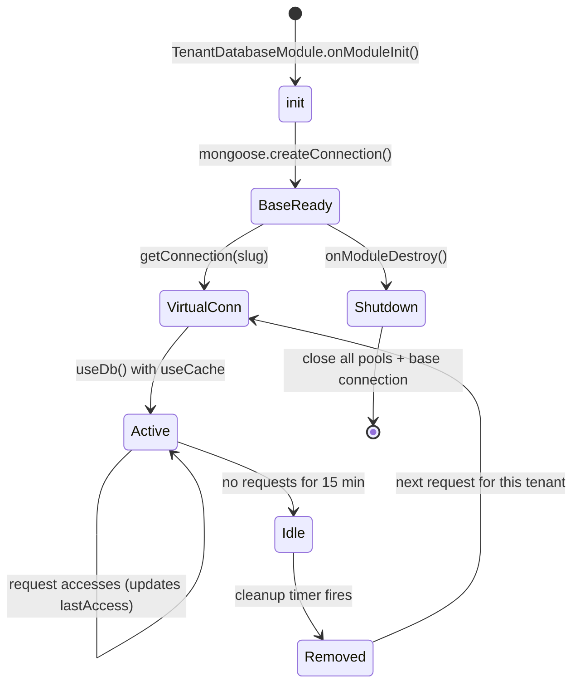
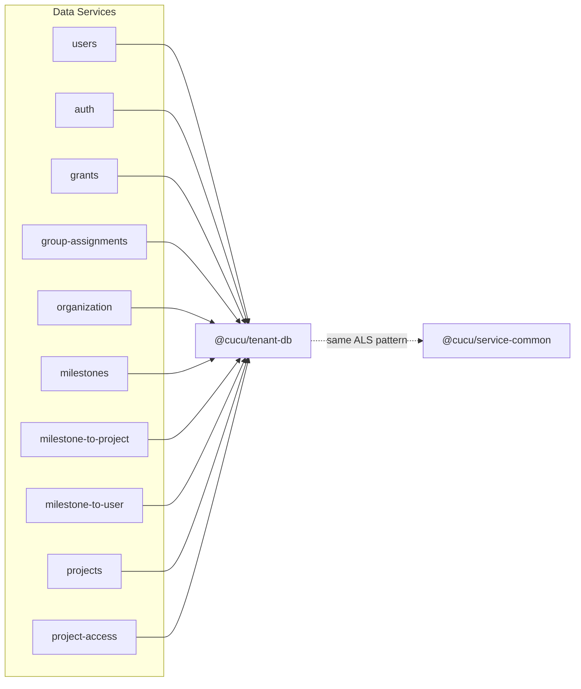

# @cucu/tenant-db

> Multi-tenant MongoDB connection management via Mongoose `useDb()`. Provides physical database isolation per tenant with shared connection pooling, idle cleanup, and a tenant whitelist ("The Wall").

## Architecture Overview

```mermaid
graph TB
    subgraph "tenant-db"
        TCM["TenantConnectionManager"]
        TDM["TenantDatabaseModule"]
        TC["TenantContext (ALS)"]
        TI["TenantInterceptor"]
        TAP["TenantAwareClientProxy"]
        WTI["withTenantId()"]
        Helper["getTenantDbName()"]
    end

    subgraph "MongoDB"
        BaseConn["Base Connection<br>(single socket pool)"]
        DB1["users_acme"]
        DB2["users_globex"]
        DB3["grants_acme"]
        DB4["grants_globex"]
    end

    subgraph "service-common"
        SC_TC["TenantContext (ALS)"]
        SC_TI["TenantInterceptor"]
    end

    TDM --> TCM
    TCM --> BaseConn
    BaseConn -->|useDb()| DB1
    BaseConn -->|useDb()| DB2
    BaseConn -->|useDb()| DB3
    BaseConn -->|useDb()| DB4
    TCM --> TC
    TC -.->|same pattern as| SC_TC

    style TCM fill:#e1f5fe
    style TDM fill:#fff3e0
    style BaseConn fill:#e8f5e9
```

## Relationship with service-common

`@cucu/tenant-db` **re-exports** `TenantClsStore`, `TenantClsModule`, `TenantContextService`, `TenantClsInterceptor`, and `TenantAwareClientProxy` from `@cucu/service-common` for convenience.

**Current architecture:**
- All tenant context components (`TenantClsModule`, `TenantContextService`, `TenantClsInterceptor`, `TenantAwareClientProxy`) are defined in `@cucu/service-common`
- `@cucu/tenant-db` re-exports them so they can be imported from either package
- `TenantConnectionManager` and `TenantDatabaseModule` remain in `@cucu/tenant-db` (database-specific)
- `TenantConnectionManager` reads tenant slug from `ClsService` (injected via DI)

> **Note:** `TenantDatabaseModule.forService()` no longer registers an interceptor. Tenant context setup is handled by `TenantClsModule` (imported in the root module) and `TenantClsInterceptor` (registered globally by `createSubgraphMicroservice`).

## Module Index

| Export | Type | Purpose |
|--------|------|---------|
| `TenantConnectionManager` | Injectable Service | Singleton connection pool manager |
| `TenantDatabaseModule` | NestJS Dynamic Module | `forService()` registration |
| `TenantClsStore` | Interface | Re-exported from `@cucu/service-common` |
| `TenantClsModule` | NestJS Module | Re-exported from `@cucu/service-common` |
| `TenantContextService` | Injectable Service | Re-exported from `@cucu/service-common` |
| `TenantClsInterceptor` | NestJS Interceptor | Re-exported from `@cucu/service-common` |
| `TenantAwareClientProxy` | Class | Re-exported from `@cucu/service-common` |
| `withTenantId` | Function | Mixin to add `tenantId` to documents |
| `getTenantDbName` | Function | Computes DB name from service + slug |

---

## Database Naming Convention

```
{serviceName}_{tenantSlug}
```

| Service | Tenant | Database Name |
|---------|--------|---------------|
| `users` | `acme` | `users_acme` |
| `grants` | `acme` | `grants_acme` |
| `users` | `globex-corp` | `users_globex-corp` |
| `milestones` | `acme` | `milestones_acme` |

This convention provides **physical database isolation** — each tenant's data lives in a completely separate MongoDB database. There is no risk of cross-tenant data leakage at the query level because tenants literally have different databases.

**Helper function:**

```typescript
// src/helpers.ts
export function getTenantDbName(serviceName: string, tenantSlug: string): string {
  return `${serviceName}_${tenantSlug}`;
}
```

---

## TenantConnectionManager

**File:** `src/tenant-connection-manager.ts`

The core singleton that manages all tenant database connections. Uses a single Mongoose base connection with `useDb()` to create lightweight virtual connections per tenant.

### Connection Pool Architecture

```mermaid
graph TB
    subgraph "TenantConnectionManager"
        Pools["pools: Map<dbName, TenantPool>"]
        Known["knownTenants: Set<string>"]
        Base["baseConnection (Mongoose)"]
        Timer["cleanupTimer (5 min interval)"]
    end

    subgraph "MongoDB"
        Socket["Shared Socket Pool<br>maxPoolSize: 100"]
    end

    Base --> Socket
    Pools -->|useDb() with useCache| Socket

    style Base fill:#e8f5e9
    style Pools fill:#e1f5fe
    style Known fill:#fce4ec
```

### Configuration Constants

| Constant | Value | Purpose |
|----------|-------|---------|
| `POOL_SIZE` | 100 | `maxPoolSize` for the base Mongoose connection |
| `MAX_POOLS` | 200 | Hard cap on total virtual connections |
| `IDLE_TIMEOUT_MS` | 15 minutes | Idle connections are removed after this |
| `CLEANUP_INTERVAL_MS` | 5 minutes | How often the cleanup timer runs |
| `serverSelectionTimeoutMS` | 5000ms | MongoDB server selection timeout |
| `socketTimeoutMS` | 45000ms | MongoDB socket timeout |

### Methods

#### `async init(): Promise<void>`

Initializes the base Mongoose connection. **Must be called before any tenant operation** — handled automatically by `TenantDatabaseModule`'s `onModuleInit`.

```typescript
// Uses MONGODB_URI env var or defaults to 'mongodb://localhost:27017'
const uri = this.mongoUri || process.env.MONGODB_URI || 'mongodb://localhost:27017';
this.baseConnection = mongoose.createConnection(uri, {
  maxPoolSize: 100,
  minPoolSize: 1,
  serverSelectionTimeoutMS: 5000,
  socketTimeoutMS: 45000,
});
```

Starts the periodic cleanup timer after connection is established.

#### `registerTenants(slugs: string[]): void`

Registers the whitelist of known tenant slugs. Only registered tenants can get a connection. Call this at service bootstrap after loading tenants from the platform database.

```typescript
// Typical bootstrap flow:
const tenants = await platformService.getAllTenants();
connectionManager.registerTenants(tenants.map(t => t.slug));
```

#### `addTenant(slug: string): void` / `removeTenant(slug: string): void`

Dynamic whitelist management for runtime tenant provisioning/deprovisioning.

#### `getConnection(tenantSlug: string): Connection`

Returns a Mongoose connection for the given tenant. **Synchronous** once the base connection is established (Mongoose's `useDb` is sync).

**Validation chain:**
1. **Slug format:** Must match `/^[a-z0-9][a-z0-9-]*$/` — rejects invalid slugs before they become database names
2. **The Wall:** If `knownTenants` is populated, rejects any slug not in the set
3. **Pool cap:** If `pools.size >= MAX_POOLS`, triggers cleanup. If still at cap, throws
4. **Cache hit:** If connection exists in `pools`, update `lastAccess` and return it
5. **Cache miss:** Create via `baseConnection.useDb(dbName, { useCache: true })`

#### `getCurrentConnection(): Connection`

Shortcut that reads `tenantSlug` from `TenantContext` (AsyncLocalStorage) and calls `getConnection()`.

#### `getModel<T>(tenantSlug, modelName, schema): Model<T>`

Returns a Mongoose Model for the given tenant. Registers the schema on the connection if not already present. Models are cached natively by Mongoose per connection.

#### `getCurrentModel<T>(modelName, schema): Model<T>`

Shortcut combining `getCurrentConnection` + `getModel`. This is the most commonly used method in service code:

```typescript
// In a service method:
const UserModel = this.connectionManager.getCurrentModel<User>('User', UserSchema);
const users = await UserModel.find({}).lean();
```

#### `getStats(): TenantStats`

Returns monitoring data about active pools:

```typescript
interface TenantStats {
  activePools: number;
  baseConnectionState: number;  // Mongoose readyState
  pools: Array<{
    dbName: string;
    readyState: number;
    lastAccess: Date;
  }>;
}
```

### Connection Lifecycle



### Idle Cleanup

Every 5 minutes, the cleanup timer scans all pools and removes connections idle for more than 15 minutes. Removed connections are also evicted from Mongoose's internal `useDb` cache (via `removeDb()` if available in the Mongoose version).

### Graceful Shutdown

On `onModuleDestroy`:
1. Clears the cleanup timer
2. Removes all virtual connections from Mongoose cache
3. Clears the pools map
4. Closes the base connection (which closes the shared socket pool)

---

## TenantDatabaseModule

**File:** `src/tenant-database.module.ts`

NestJS dynamic module that wires up `TenantConnectionManager` for a specific service.

```typescript
@Module({})
export class TenantDatabaseModule implements OnModuleInit {
  static forService(
    serviceName: string,
    options?: {
      mongoUri?: string;
    },
  ): DynamicModule;
}
```

**What `forService()` does:**
1. Creates a `TenantConnectionManager` instance with the service name, injecting `ClsService` from DI
2. Marks the module as `global: true` so `TenantConnectionManager` is available everywhere
3. On module init, calls `manager.init()` to establish the base connection

```typescript
static forService(serviceName: string, options?: { mongoUri?: string }): DynamicModule {
  return {
    module: TenantDatabaseModule,
    global: true,
    providers: [{
      provide: TenantConnectionManager,
      useFactory: (cls: ClsService<TenantClsStore>) =>
        new TenantConnectionManager(serviceName, cls, options?.mongoUri),
      inject: [ClsService],
    }],
    exports: [TenantConnectionManager],
  };
}
```

**Usage in a service module:**
```typescript
@Module({
  imports: [
    TenantClsModule,  // Must be imported — provides ClsService
    TenantDatabaseModule.forService('users'),
    // ... other imports
  ],
})
export class UsersModule {}
```

---

## withTenantId Mixin

**File:** `src/tenant-id.mixin.ts`

Adds a passive `tenantId` field to documents before creation.

```typescript
export function withTenantId<T extends Record<string, any>>(
  doc: T,
  tenantSlug: string,
): T & { tenantId: string }
```

**Why it exists:** The `tenantId` is a **defence-in-depth** measure. It is NOT used for query filtering (physical DB isolation handles that). It serves as a safety net for:

- **Backup restore integrity checks** — verify documents ended up in the right database
- **GDPR data export certification** — prove which tenant owns which data
- **Audit trail post-mortem** — trace data provenance after incidents
- **Future DB consolidation** — if the system ever moves to logical isolation

---

## Used By

Every microservice that stores data in MongoDB imports `@cucu/tenant-db`:

| Service | How Used |
|---------|----------|
| **users** | `TenantDatabaseModule.forService('users')`, `getCurrentModel()` for User documents |
| **auth** | `TenantDatabaseModule.forService('auth')`, session storage per tenant |
| **grants** | `TenantDatabaseModule.forService('grants')`, permission/group/operation-permission storage |
| **group-assignments** | `TenantDatabaseModule.forService('group-assignments')` |
| **organization** | `TenantDatabaseModule.forService('organization')`, companies/roles/seniority per tenant |
| **milestones** | `TenantDatabaseModule.forService('milestones')` |
| **milestone-to-project** | `TenantDatabaseModule.forService('milestone-to-project')` |
| **milestone-to-user** | `TenantDatabaseModule.forService('milestone-to-user')` |
| **projects** | `TenantDatabaseModule.forService('projects')`, project/template/holiday data |
| **project-access** | `TenantDatabaseModule.forService('project-access')` |

**Not used by:**
- **gateway** — no direct DB access (federation only)
- **tenants** — manages platform-level tenant data, uses a single shared database
- **bootstrap** — uses RPC to seed data via other services

---

## Dependency Graph


